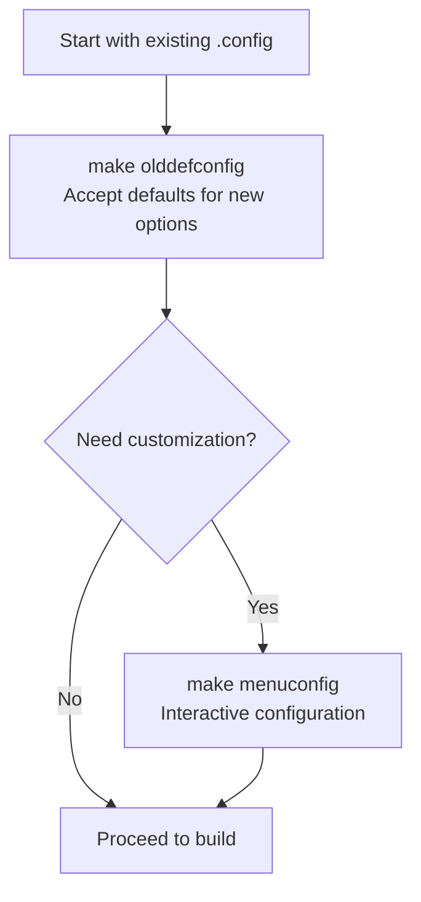

# How to Build and Install a Custom Kernel on RHEL

Author: [nawazdhandala](https://www.github.com/nawazdhandala)

Tags: RHEL, Custom Kernel, Build, Linux

Description: A step-by-step guide to downloading, configuring, building, and installing a custom Linux kernel on RHEL, including tips on kernel configuration, building RPM packages, and managing custom kernels.

---

## When You Need a Custom Kernel

The stock RHEL kernel works for the vast majority of workloads. But there are situations where you need to build your own:

- You need a kernel feature that is disabled in the default configuration
- You need a specific upstream kernel version for hardware support
- You are developing or testing kernel modules
- Your organization requires a hardened kernel with specific options enabled or disabled
- You need to apply a custom patch

Building a custom kernel is straightforward but it takes time, both in CPU cycles and in the testing you should do afterward.

## Installing Build Dependencies

```bash
# Install the development tools group
sudo dnf groupinstall "Development Tools" -y

# Install kernel-specific build dependencies
sudo dnf install ncurses-devel openssl-devel elfutils-libelf-devel \
    bc bison flex perl dwarves rpm-build -y

# Install additional tools for the menu configuration interface
sudo dnf install ncurses-devel -y
```

## Getting the Kernel Source

You have two options: use the RHEL kernel source RPM or download upstream from kernel.org.

### Option 1: RHEL Kernel Source RPM

```bash
# Download the RHEL kernel source RPM
sudo dnf install yum-utils -y
dnf download --source kernel

# Install the source RPM
rpm -ivh kernel-*.src.rpm

# The source will be in ~/rpmbuild/SOURCES/
ls ~/rpmbuild/SOURCES/
```

### Option 2: Upstream Kernel from kernel.org

```bash
# Download a specific kernel version
cd /usr/src
sudo wget https://cdn.kernel.org/pub/linux/kernel/v6.x/linux-6.6.10.tar.xz

# Extract the archive
sudo tar -xf linux-6.6.10.tar.xz
cd linux-6.6.10
```

## Configuring the Kernel

Start with the current running kernel configuration as a base.

```bash
# Copy the running kernel's config as a starting point
cp /boot/config-$(uname -r) .config

# Update the config for the new kernel version (accept defaults for new options)
make olddefconfig

# Or use the interactive menu to customize options
make menuconfig
```

The `make menuconfig` command opens an ncurses-based menu where you can enable, disable, or modularize features.



### Key Configuration Decisions

| Option | Path in menuconfig | Notes |
|--------|-------------------|-------|
| Preemption model | General Setup > Preemption | Server vs Desktop behavior |
| CPU type | Processor > Processor family | Match your hardware |
| File systems | File systems > ... | Enable the ones you need |
| Network protocols | Networking support > ... | Include required protocols |
| Virtualization | Virtualization > KVM | If running VMs |

## Building the Kernel

### Building as RPM Packages (Recommended)

Building RPM packages makes installation and removal clean and manageable.

```bash
# Build the kernel as RPM packages
make rpm-pkg -j$(nproc)

# The RPMs will be in ~/rpmbuild/RPMS/x86_64/
ls ~/rpmbuild/RPMS/x86_64/
```

### Building Without RPMs

```bash
# Compile the kernel (use all available CPU cores)
make -j$(nproc)

# Build the kernel modules
make modules -j$(nproc)
```

The build can take 30 minutes to over an hour depending on your hardware and configuration. Using `-j$(nproc)` runs parallel jobs to speed things up.

## Installing the Custom Kernel

### Installing from RPM (Preferred)

```bash
# Install the kernel RPMs
sudo dnf install ~/rpmbuild/RPMS/x86_64/kernel-*.rpm
```

### Installing Without RPMs

```bash
# Install the kernel modules
sudo make modules_install

# Install the kernel image and related files
sudo make install
```

This copies the kernel image to `/boot`, generates an initramfs, and updates the GRUB configuration.

## Post-Installation Steps

```bash
# Verify the new kernel is in the GRUB menu
sudo grubby --info=ALL | grep -E "^kernel|^title"

# Set the new kernel as default (if not done automatically)
sudo grubby --set-default=/boot/vmlinuz-<your-custom-version>

# Verify the default
sudo grubby --default-kernel

# Generate a new initramfs if needed
sudo dracut --force /boot/initramfs-<your-custom-version>.img <your-custom-version>
```

## Booting the Custom Kernel

```bash
# Reboot into the new kernel
sudo systemctl reboot
```

After reboot:

```bash
# Verify the running kernel
uname -r

# Check for any issues in the boot log
sudo journalctl -b --priority=warning

# Verify that critical modules are loaded
lsmod | wc -l
```

## Managing Custom Kernels

### Keeping the Stock Kernel

Always keep at least one stock RHEL kernel installed as a fallback.

```bash
# List all installed kernels
rpm -qa kernel-core | sort

# Make sure you have a working stock kernel to fall back to
sudo grubby --info=ALL
```

### Removing a Custom Kernel

If you built with RPMs:

```bash
# Remove the custom kernel packages
sudo dnf remove kernel-<custom-version>
```

If you built without RPMs:

```bash
# Remove kernel files manually
sudo rm /boot/vmlinuz-<custom-version>
sudo rm /boot/initramfs-<custom-version>.img
sudo rm /boot/System.map-<custom-version>
sudo rm -rf /lib/modules/<custom-version>

# Update GRUB
sudo grub2-mkconfig -o /boot/grub2/grub.cfg
```

## Building from RHEL Source with Patches

If you need to apply patches to the RHEL kernel specifically:

```bash
# Install the source RPM
rpm -ivh kernel-*.src.rpm
cd ~/rpmbuild

# Apply your custom patch
cp /path/to/your-fix.patch SOURCES/

# Edit the spec file to include your patch
vi SPECS/kernel.spec
# Add: Patch9999: your-fix.patch
# And in the %prep section: %patch9999 -p1

# Build the patched kernel as RPM
rpmbuild -bb SPECS/kernel.spec
```

## Testing Your Custom Kernel

Before deploying a custom kernel to production, run through a basic validation:

```bash
# Check that the system boots cleanly
sudo journalctl -b --priority=err

# Verify network connectivity
ip addr show
ping -c 3 8.8.8.8

# Check filesystem mounts
mount | column -t

# Run a stress test
sudo dnf install stress-ng -y
stress-ng --cpu $(nproc) --vm 2 --vm-bytes 1G --timeout 60s

# Verify critical services are running
systemctl --failed
```

## Wrapping Up

Building a custom kernel on RHEL is a power-user task that follows a predictable workflow: get the source, configure it, build it, install it, and test it. The RPM-based build approach is strongly recommended because it makes installation and cleanup much cleaner. Always keep a stock RHEL kernel around as your safety net, and test your custom kernel thoroughly before putting it anywhere near production. If you only need to change a few kernel parameters, consider sysctl or kernel command-line arguments first, as they are much simpler than maintaining a custom kernel.
