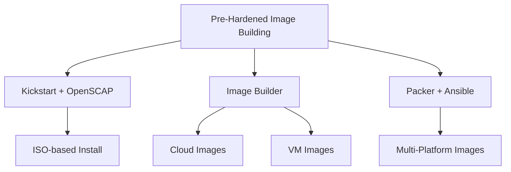

# How to Build Pre-Hardened RHEL Images with OpenSCAP Integration

Author: [nawazdhandala](https://www.github.com/nawazdhandala)

Tags: RHEL, OpenSCAP, Pre-Hardened Images, Security, Linux

Description: Build pre-hardened RHEL images for cloud and on-premises deployment using OpenSCAP integration, ensuring every instance starts in a compliant state.

---

Building a hardened image once and deploying it everywhere is the most efficient approach to security compliance at scale. Instead of hardening each server individually after deployment, you bake the security configuration into the image itself. RHEL gives you several tools to do this, and OpenSCAP ties them all together.

## Image Building Approaches



## Method 1: RHEL Image Builder with OpenSCAP

Image Builder (composer-cli) is RHEL's native tool for creating system images:

```bash
# Install Image Builder
dnf install -y osbuild-composer composer-cli
systemctl enable --now osbuild-composer.socket

# Verify the service is running
composer-cli status show
```

### Create a blueprint with security hardening

```bash
# Create a hardened blueprint
cat > /tmp/hardened-rhel9.toml << 'EOF'
name = "hardened-rhel9"
description = "Pre-hardened RHEL image with STIG compliance"
version = "1.0.0"
distro = "rhel-9"

# Include security packages
[[packages]]
name = "openscap-scanner"
version = "*"

[[packages]]
name = "scap-security-guide"
version = "*"

[[packages]]
name = "aide"
version = "*"

[[packages]]
name = "audit"
version = "*"

[[packages]]
name = "rsyslog"
version = "*"

[[packages]]
name = "chrony"
version = "*"

[[packages]]
name = "libpwquality"
version = "*"

# Remove unnecessary packages
[[packages]]
name = "cups"
version = "*"

# Security customizations
[customizations]
hostname = "hardened-rhel9"

[customizations.kernel]
append = "fips=1"

[customizations.services]
enabled = ["sshd", "firewalld", "auditd", "chronyd", "rsyslog"]
disabled = ["cups", "avahi-daemon", "bluetooth"]

[[customizations.firewall.services]]
enabled = ["ssh"]

[[customizations.user]]
name = "sysadmin"
groups = ["wheel"]
EOF

# Push the blueprint
composer-cli blueprints push /tmp/hardened-rhel9.toml

# Verify it was added
composer-cli blueprints list
composer-cli blueprints show hardened-rhel9
```

### Build the image

```bash
# Start the image build (QCOW2 format for VMs)
composer-cli compose start hardened-rhel9 qcow2

# Check build status
composer-cli compose status

# Download the completed image
composer-cli compose image <UUID>
```

## Method 2: Packer with Ansible and OpenSCAP

For multi-platform image building, use HashiCorp Packer with Ansible provisioning:

```bash
# Install Packer (from HashiCorp repository)
dnf install -y packer

# Create a Packer template
cat > /tmp/rhel9-hardened.pkr.hcl << 'EOF'
source "qemu" "rhel9" {
  iso_url          = "/path/to/rhel-9-x86_64-dvd.iso"
  iso_checksum     = "sha256:abc123..."
  output_directory = "output-rhel9-hardened"
  disk_size        = "40960"
  format           = "qcow2"
  headless         = true
  http_directory   = "http"
  ssh_username     = "root"
  ssh_password     = "temporary"
  ssh_timeout      = "30m"
  shutdown_command  = "shutdown -P now"
  boot_command     = [
    "<tab> inst.ks=http://{{ .HTTPIP }}:{{ .HTTPPort }}/ks.cfg<enter>"
  ]
}

build {
  sources = ["source.qemu.rhel9"]

  provisioner "ansible" {
    playbook_file = "ansible/harden.yml"
    extra_arguments = [
      "--extra-vars", "compliance_profile=stig"
    ]
  }

  provisioner "shell" {
    inline = [
      "oscap xccdf eval --profile xccdf_org.ssgproject.content_profile_stig --results /root/build-scan.xml /usr/share/xml/scap/ssg/content/ssg-rhel9-ds.xml || true",
      "aide --init",
      "mv /var/lib/aide/aide.db.new.gz /var/lib/aide/aide.db.gz"
    ]
  }
}
EOF
```

## Post-Build Hardening Script

Regardless of your image building method, include a post-build hardening script:

```bash
cat > /tmp/post-build-harden.sh << 'SCRIPT'
#!/bin/bash
# Post-build hardening for RHEL images

echo "Applying security hardening..."

# Apply STIG settings using SSG Ansible playbook
ansible-playbook -i localhost, -c local \
  /usr/share/scap-security-guide/ansible/rhel9-playbook-stig.yml

# Set kernel parameters
cat > /etc/sysctl.d/99-hardened.conf << 'SYSCTL'
kernel.randomize_va_space = 2
kernel.dmesg_restrict = 1
kernel.kptr_restrict = 2
net.ipv4.ip_forward = 0
net.ipv4.conf.all.accept_redirects = 0
net.ipv4.conf.default.accept_redirects = 0
net.ipv4.conf.all.send_redirects = 0
net.ipv4.conf.default.send_redirects = 0
net.ipv4.tcp_syncookies = 1
SYSCTL

# Disable unnecessary services
for svc in cups avahi-daemon bluetooth rpcbind; do
    systemctl disable "$svc" 2>/dev/null
    systemctl mask "$svc" 2>/dev/null
done

# Set file permissions
chmod 644 /etc/passwd
chmod 000 /etc/shadow
chmod 644 /etc/group
chmod 000 /etc/gshadow

# Configure audit rules
cat > /etc/audit/rules.d/hardened.rules << 'AUDIT'
-w /etc/passwd -p wa -k identity
-w /etc/group -p wa -k identity
-w /etc/shadow -p wa -k identity
-w /etc/sudoers -p wa -k actions
-w /etc/ssh/sshd_config -p wa -k sshd_config
AUDIT

# Initialize AIDE
aide --init
mv /var/lib/aide/aide.db.new.gz /var/lib/aide/aide.db.gz

# Run compliance scan for build verification
mkdir -p /var/log/compliance
oscap xccdf eval \
  --profile xccdf_org.ssgproject.content_profile_stig \
  --results /var/log/compliance/build-scan.xml \
  --report /var/log/compliance/build-scan.html \
  /usr/share/xml/scap/ssg/content/ssg-rhel9-ds.xml || true

PASS=$(grep -c 'result="pass"' /var/log/compliance/build-scan.xml)
FAIL=$(grep -c 'result="fail"' /var/log/compliance/build-scan.xml)
echo "Build scan: $PASS passed, $FAIL failed"

# Clean up for image distribution
dnf clean all
rm -f /etc/ssh/ssh_host_*   # Will be regenerated on first boot
truncate -s 0 /var/log/messages
truncate -s 0 /var/log/secure

echo "Hardening complete."
SCRIPT
chmod +x /tmp/post-build-harden.sh
```

## First-Boot Configuration

Some things need to happen on first boot, not in the image:

```bash
# Create a first-boot script
cat > /etc/systemd/system/first-boot-harden.service << 'EOF'
[Unit]
Description=First boot security hardening
ConditionPathExists=!/var/lib/first-boot-done
After=network-online.target

[Service]
Type=oneshot
ExecStart=/usr/local/bin/first-boot-harden.sh
RemainAfterExit=yes

[Install]
WantedBy=multi-user.target
EOF

cat > /usr/local/bin/first-boot-harden.sh << 'SCRIPT'
#!/bin/bash
# Regenerate SSH host keys
ssh-keygen -A

# Regenerate AIDE database with current system state
aide --init
mv /var/lib/aide/aide.db.new.gz /var/lib/aide/aide.db.gz

# Run initial compliance scan
oscap xccdf eval \
  --profile xccdf_org.ssgproject.content_profile_stig \
  --results /var/log/compliance/first-boot-scan.xml \
  --report /var/log/compliance/first-boot-scan.html \
  /usr/share/xml/scap/ssg/content/ssg-rhel9-ds.xml || true

# Mark first boot as complete
touch /var/lib/first-boot-done
SCRIPT
chmod +x /usr/local/bin/first-boot-harden.sh

systemctl enable first-boot-harden.service
```

## Validate the Image

Before distributing the image, verify compliance:

```bash
# Boot the image in a test environment
# Run a compliance scan
oscap xccdf eval \
  --profile xccdf_org.ssgproject.content_profile_stig \
  --results /tmp/image-validation.xml \
  --report /tmp/image-validation.html \
  /usr/share/xml/scap/ssg/content/ssg-rhel9-ds.xml || true

# Check the results
echo "Pass: $(grep -c 'result="pass"' /tmp/image-validation.xml)"
echo "Fail: $(grep -c 'result="fail"' /tmp/image-validation.xml)"
```

Pre-hardened images are the gold standard for security compliance at scale. Build the image once, validate it thoroughly, and deploy it everywhere. Every server that boots from your hardened image starts its life in a compliant state, and you have the scan reports to prove it.
