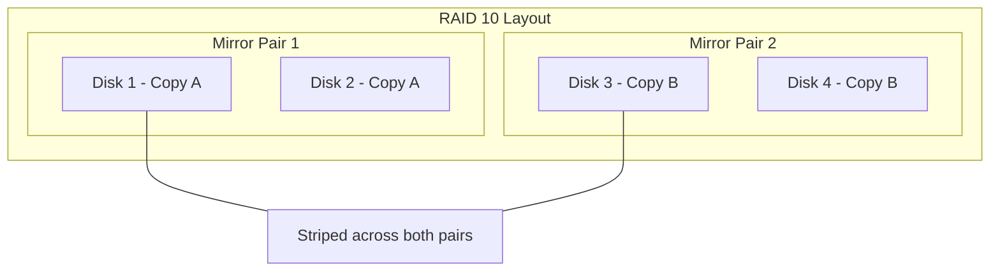

# How to Build a RAID 10 Array with mdadm on RHEL 9

Author: [nawazdhandala](https://www.github.com/nawazdhandala)

Tags: RHEL, RAID 10, mdadm, Storage, Linux

Description: Build a RAID 10 array on RHEL 9 using mdadm to combine the speed of striping with the safety of mirroring for demanding workloads.

---

## What Makes RAID 10 Special

RAID 10 combines RAID 1 (mirroring) and RAID 0 (striping). Data gets mirrored first, then the mirrors are striped. This gives you both redundancy and performance. Each mirrored pair can lose one disk without data loss, and the striping across pairs delivers serious throughput.

For databases, virtualization hosts, and anything with heavy mixed read/write workloads, RAID 10 is usually the best choice. You sacrifice 50% of your raw capacity, but you get fast rebuilds and excellent I/O performance.

## Prerequisites

- RHEL 9 with root access
- At least four disks (must be an even number)
- mdadm installed

## Step 1 - Install and Prepare

```bash
# Install mdadm
sudo dnf install -y mdadm

# Wipe all four disks
for d in sdb sdc sdd sde; do
    sudo wipefs -a /dev/$d
done
```

## Step 2 - Create the RAID 10 Array

mdadm supports RAID 10 natively with the `--level=10` flag.

```bash
# Create a four-disk RAID 10 array
sudo mdadm --create /dev/md10 --level=10 --raid-devices=4 /dev/sdb /dev/sdc /dev/sdd /dev/sde
```

By default, mdadm uses a "near" layout for RAID 10, which places mirrored copies at nearly the same offset on different disks. This is the most common layout and works well for most workloads.

```bash
# Verify the array
cat /proc/mdstat
sudo mdadm --detail /dev/md10
```

## Step 3 - Understanding the Layout



Data is split into stripes, and each stripe is mirrored across a pair of disks. You can lose one disk from each pair and the array keeps running.

## Step 4 - Format and Mount

```bash
# Create XFS filesystem
sudo mkfs.xfs /dev/md10

# Mount the array
sudo mkdir -p /mnt/raid10
sudo mount /dev/md10 /mnt/raid10

# Check space (should be roughly 50% of total raw capacity)
df -h /mnt/raid10
```

## Step 5 - Save and Persist

```bash
# Save array configuration
sudo mdadm --detail --scan | sudo tee -a /etc/mdadm.conf

# Rebuild initramfs
sudo dracut --regenerate-all --force

# Add fstab entry
R10_UUID=$(sudo blkid -s UUID -o value /dev/md10)
echo "UUID=${R10_UUID}  /mnt/raid10  xfs  defaults  0 0" | sudo tee -a /etc/fstab
```

## RAID 10 Layout Options

mdadm supports three RAID 10 layouts. You can specify them at creation time:

```bash
# Near layout (default) - mirrors are at nearby offsets
sudo mdadm --create /dev/md10 --level=10 --layout=n2 --raid-devices=4 /dev/sdb /dev/sdc /dev/sdd /dev/sde

# Far layout - mirrors are at distant offsets (better sequential reads)
sudo mdadm --create /dev/md10 --level=10 --layout=f2 --raid-devices=4 /dev/sdb /dev/sdc /dev/sdd /dev/sde

# Offset layout - hybrid approach
sudo mdadm --create /dev/md10 --level=10 --layout=o2 --raid-devices=4 /dev/sdb /dev/sdc /dev/sdd /dev/sde
```

The `n2` means "near, 2 copies." For most database and VM workloads, the default near layout is best.

## Failure Handling

```bash
# Simulate a disk failure
sudo mdadm --manage /dev/md10 --fail /dev/sdc

# The array continues to run with one mirror degraded
cat /proc/mdstat

# Replace the failed disk
sudo mdadm --manage /dev/md10 --remove /dev/sdc
sudo mdadm --manage /dev/md10 --add /dev/sdc

# Rebuild happens automatically
watch cat /proc/mdstat
```

Rebuild times for RAID 10 are much faster than RAID 5 or RAID 6 because only the mirror partner needs to be copied, not the entire array recalculated.

## Performance Comparison

| Metric | RAID 10 | RAID 5 | RAID 6 |
|--------|---------|--------|--------|
| Read Speed | Excellent | Good | Good |
| Write Speed | Very Good | Moderate | Lower |
| Rebuild Time | Fast | Slow | Very Slow |
| Capacity Efficiency | 50% | (N-1)/N | (N-2)/N |
| Min Disks | 4 | 3 | 4 |

## Scaling Beyond Four Disks

You can create RAID 10 with 6, 8, or more disks (always even numbers):

```bash
# Six-disk RAID 10
sudo mdadm --create /dev/md10 --level=10 --raid-devices=6 \
    /dev/sdb /dev/sdc /dev/sdd /dev/sde /dev/sdf /dev/sdg
```

More disks means more stripe width and higher throughput.

## Wrap-Up

RAID 10 is the go-to for performance-sensitive workloads on RHEL 9. It combines mirroring and striping to deliver high throughput with fast rebuilds. The 50% capacity cost is the price you pay, but for databases, virtualization, and heavy I/O workloads, it is worth every gigabyte.
