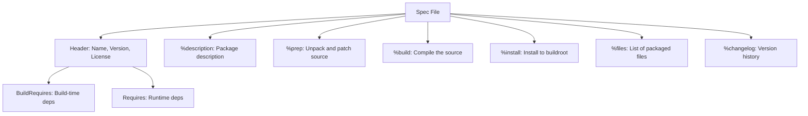

# How to Build RPM Packages from Source on RHEL

Author: [nawazdhandala](https://www.github.com/nawazdhandala)

Tags: RHEL, RPM, rpmbuild, Package Building, Linux

Description: A practical walkthrough of building RPM packages from source on RHEL, covering spec files, rpmbuild, source RPMs, and using mock for clean build environments.

---

At some point, you will need software that is not in any repository. Maybe it is an internal tool, a patched version of an open-source project, or something compiled with specific flags. Building an RPM package is the right way to handle this on RHEL. It gives you proper dependency tracking, clean installs and uninstalls, and something you can distribute across your fleet. This guide walks through the process from start to finish.

## Setting Up the Build Environment

Never build RPMs as root. Ever. A buggy spec file running as root can do serious damage. Set up a dedicated build environment as a regular user.

### Install Build Tools

```bash
# Install the core RPM build tools
sudo dnf install -y rpm-build rpmdevtools

# Install development tools for compiling source code
sudo dnf group install -y "Development Tools"
```

### Create the Build Directory Structure

The `rpmdev-setuptree` command creates the standard directory layout in your home directory:

```bash
# Set up the rpmbuild directory tree
rpmdev-setuptree
```

This creates the following structure:

```
~/rpmbuild/
  BUILD/      - Where source code gets unpacked and compiled
  RPMS/       - Where finished binary RPMs land
  SOURCES/    - Where you put source tarballs and patches
  SPECS/      - Where spec files live
  SRPMS/      - Where source RPMs are created
```

## Anatomy of a Spec File

The spec file is the recipe for building your RPM. It tells rpmbuild where to get the source, how to compile it, what files to package, and what dependencies are needed.

Here is a complete spec file for a simple C application:

```bash
# Create the spec file
cat > ~/rpmbuild/SPECS/hello.spec << 'SPECEOF'
Name:           hello
Version:        1.0.0
Release:        1%{?dist}
Summary:        A simple hello world application

License:        MIT
URL:            https://example.com/hello
Source0:        %{name}-%{version}.tar.gz

BuildRequires:  gcc
BuildRequires:  make

%description
A simple hello world application used to demonstrate
RPM package building on RHEL.

%prep
%setup -q

%build
make %{?_smp_mflags}

%install
rm -rf %{buildroot}
mkdir -p %{buildroot}%{_bindir}
install -m 0755 hello %{buildroot}%{_bindir}/hello

%files
%{_bindir}/hello

%changelog
* Tue Mar 04 2026 Your Name <you@example.com> - 1.0.0-1
- Initial package
SPECEOF
```

### Spec File Sections Explained



Key sections:

- **Header** - Package metadata: name, version, release, license, source URL
- **BuildRequires** - Packages needed to compile (not installed on the target system)
- **Requires** - Runtime dependencies (installed automatically when the RPM is installed)
- **%prep** - Unpacks source archives and applies patches
- **%build** - Runs the compilation commands (make, cmake, configure, etc.)
- **%install** - Copies built files into a fake root directory (buildroot)
- **%files** - Declares which files from the buildroot go into the RPM
- **%changelog** - Human-readable version history

## Building an RPM from a Spec File

### Prepare the Source

Put your source tarball in the SOURCES directory. The tarball name must match what `Source0` in the spec file expects:

```bash
# Place your source archive in the SOURCES directory
cp hello-1.0.0.tar.gz ~/rpmbuild/SOURCES/
```

### Build the RPM

```bash
# Build both binary and source RPMs
rpmbuild -ba ~/rpmbuild/SPECS/hello.spec
```

The flags:
- `-ba` builds both binary and source RPMs
- `-bb` builds only the binary RPM
- `-bs` builds only the source RPM

If the build succeeds, you will find:
- Binary RPM in `~/rpmbuild/RPMS/x86_64/`
- Source RPM in `~/rpmbuild/SRPMS/`

### Install and Test

```bash
# Install the freshly built RPM
sudo dnf install ~/rpmbuild/RPMS/x86_64/hello-1.0.0-1.el9.x86_64.rpm

# Verify the installation
rpm -qi hello
rpm -ql hello
```

## Rebuilding Source RPMs

Sometimes you have a source RPM (.src.rpm) and want to rebuild it, possibly with modifications. This is common when backporting patches or changing compile options.

### Install a Source RPM

```bash
# Install the source RPM (unpacks into ~/rpmbuild/)
rpm -ivh some-package-1.0.0-1.el9.src.rpm
```

This places the source tarball in `SOURCES/` and the spec file in `SPECS/`.

### Modify and Rebuild

```bash
# Edit the spec file if needed
vi ~/rpmbuild/SPECS/some-package.spec

# Rebuild the binary RPM
rpmbuild -bb ~/rpmbuild/SPECS/some-package.spec
```

### Download and Rebuild in One Step

If the source RPM is in a repository:

```bash
# Download the source RPM
dnf download --source httpd

# Rebuild it
rpmbuild --rebuild httpd-*.src.rpm
```

## Using Mock for Clean Builds

The problem with building in your home directory is dependency bleed. Libraries installed on your workstation might satisfy build requirements that would fail on a clean system. Mock solves this by building inside a clean chroot environment.

### Install and Configure Mock

```bash
# Install mock
sudo dnf install -y mock

# Add your user to the mock group
sudo usermod -aG mock $(whoami)

# Log out and back in for the group change to take effect
```

### Build with Mock

```bash
# Build a source RPM in a clean RHEL chroot
mock -r rhel-9-x86_64 --rebuild ~/rpmbuild/SRPMS/hello-1.0.0-1.el9.src.rpm
```

Mock will:
1. Create a minimal chroot with only the base system
2. Install the BuildRequires from the spec file
3. Build the package
4. Place the results in `/var/lib/mock/rhel-9-x86_64/result/`

### Benefits of Mock

- Catches missing BuildRequires that your workstation happens to have installed
- Produces builds that are reproducible on any machine
- Keeps your workstation clean of build dependencies
- Can build for different RHEL versions and architectures

## Handling Dependencies

### Build Dependencies

List every library and tool needed to compile in the `BuildRequires` field:

```spec
# Common build dependencies
BuildRequires:  gcc
BuildRequires:  make
BuildRequires:  openssl-devel
BuildRequires:  zlib-devel
```

If you are not sure what you need, try building, see what fails, and add the missing `-devel` package.

### Runtime Dependencies

DNF automatically detects many runtime dependencies (shared libraries), but you should explicitly list anything that auto-detection might miss:

```spec
# Runtime dependencies
Requires:       openssl
Requires:       python3 >= 3.9
```

### Finding Build Dependencies for Existing Packages

```bash
# See what a package needed to build
rpm -qp --requires some-package.src.rpm

# Or check the spec file directly
grep BuildRequires ~/rpmbuild/SPECS/some-package.spec
```

## Common Spec File Macros

RHEL defines many useful macros that keep your spec files portable:

| Macro | Expands To | Example |
|-------|-----------|---------|
| `%{_bindir}` | `/usr/bin` | Binary executables |
| `%{_sbindir}` | `/usr/sbin` | System binaries |
| `%{_libdir}` | `/usr/lib64` | Libraries |
| `%{_sysconfdir}` | `/etc` | Configuration files |
| `%{_datadir}` | `/usr/share` | Architecture-independent data |
| `%{_mandir}` | `/usr/share/man` | Man pages |
| `%{?dist}` | `.el9` | Distribution tag |

To see what a macro expands to:

```bash
# Check the value of a macro
rpm --eval '%{_libdir}'
```

## Tips for Building RPMs

1. **Start with `rpmdev-newspec`.** It generates a template spec file that covers the common sections:

```bash
# Generate a spec file template
rpmdev-newspec mypackage
```

2. **Use `rpmlint` to check your spec file and built RPMs for common issues:**

```bash
# Install rpmlint
sudo dnf install -y rpmlint

# Check a spec file
rpmlint ~/rpmbuild/SPECS/hello.spec

# Check a built RPM
rpmlint ~/rpmbuild/RPMS/x86_64/hello-1.0.0-1.el9.x86_64.rpm
```

3. **Keep the changelog updated.** It is required by RPM and useful for tracking what changed between releases.

4. **Test installs on a clean system.** Build in mock, then test the installation on a fresh VM or container.

5. **Version your spec files in source control.** Treat them like any other code artifact.

6. **Never build as root.** It bears repeating. A `%install` section with `rm -rf /` in it (yes, this has happened) will ruin your day.

Building RPMs is a skill that pays off every time you need to deploy custom software reliably. The learning curve is mostly in understanding spec files, and once you have a working template, creating new packages becomes routine. Start simple, use mock for clean builds, and always test on a fresh system before pushing to production.
