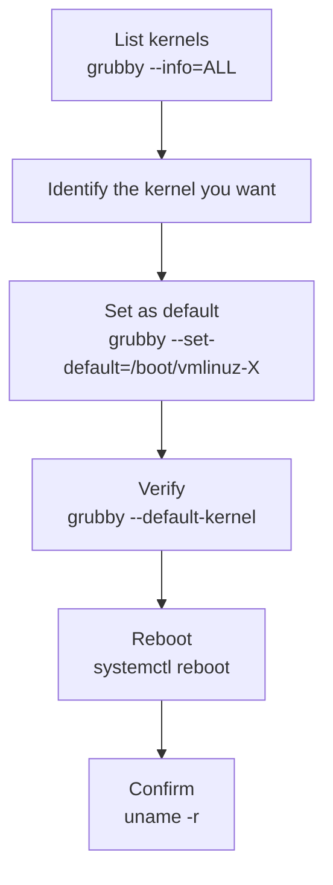

# How to Change the Default Boot Kernel on RHEL 9

Author: [nawazdhandala](https://www.github.com/nawazdhandala)

Tags: RHEL, Kernel, Boot, GRUB2, Linux

Description: Learn how to change the default boot kernel on RHEL 9 using grubby and GRUB2, including listing available kernels, setting the default, and handling rollback scenarios.

---

## Why Change the Default Kernel?

RHEL 9 installs new kernels alongside existing ones and automatically sets the newest kernel as the default. Most of the time this is what you want. But sometimes a kernel update introduces a regression, a driver issue, or an incompatibility with your hardware or application. In those cases, you need to switch back to a previous kernel and keep it as the default until the issue is resolved.

## Listing Installed Kernels

```bash
# List all installed kernel packages
rpm -qa kernel-core | sort

# List all kernels known to the boot loader
sudo grubby --info=ALL

# Show just the kernel paths and titles
sudo grubby --info=ALL | grep -E "^kernel|^title"

# See the current default
sudo grubby --default-kernel
sudo grubby --default-index
```

## Changing the Default with grubby

```bash
# Set a specific kernel as the default by path
sudo grubby --set-default=/boot/vmlinuz-5.14.0-362.el9.x86_64

# Set the default by index (0 is the first entry)
sudo grubby --set-default-index=1

# Verify the change
sudo grubby --default-kernel
```



## Setting a One-Time Boot Kernel

If you want to boot a different kernel once without changing the permanent default, use the GRUB2 environment.

```bash
# Set the next boot entry (one-time only)
sudo grub2-reboot 1

# Reboot to use it
sudo systemctl reboot
```

After the next boot, the system returns to the regular default. This is useful for testing a new kernel before committing to it.

## Using the GRUB Menu at Boot

You can also select a kernel manually during boot:

1. Reboot the system
2. When the GRUB menu appears (press `Esc` if it auto-boots too fast), select the kernel you want
3. Press Enter to boot

This is a one-time selection and does not change the default.

## Preventing a New Kernel from Becoming Default

If you want to keep a specific kernel as default even after installing updates, you can configure dnf to not change the default.

```bash
# Pin the current default kernel
# First note the current default
sudo grubby --default-kernel

# After a kernel update, reset the default if it changed
sudo grubby --set-default=/boot/vmlinuz-<your-preferred-version>
```

## Controlling How Many Kernels Are Kept

```bash
# Check the current installonly limit
grep installonly_limit /etc/dnf/dnf.conf

# Keep more kernels for extra rollback options (default is 3)
sudo sed -i 's/installonly_limit=.*/installonly_limit=5/' /etc/dnf/dnf.conf
```

## Removing an Unwanted Kernel

If a kernel is causing problems, you can remove it entirely.

```bash
# Remove a specific kernel (never remove the running kernel)
sudo dnf remove kernel-core-5.14.0-362.el9.x86_64

# Check which kernel is currently running before removing
uname -r

# Verify remaining kernels
rpm -qa kernel-core | sort
```

## Troubleshooting Default Kernel Issues

```bash
# If grubby shows the wrong default, check the GRUB environment
sudo grub2-editenv list

# Reset the saved entry
sudo grub2-editenv set saved_entry=0

# Check that the BLS entries are correct
ls -la /boot/loader/entries/

# Regenerate GRUB configuration if needed
# BIOS:
sudo grub2-mkconfig -o /boot/grub2/grub.cfg
# UEFI:
sudo grub2-mkconfig -o /boot/efi/EFI/redhat/grub.cfg
```

## Wrapping Up

Changing the default boot kernel on RHEL 9 is a single `grubby` command. The important thing is to know what kernels are available, verify the change before rebooting, and always keep at least one known-good kernel installed. Use `grub2-reboot` for one-time tests and `grubby --set-default` for permanent changes. It is a simple operation, but getting it wrong on a remote server with no console access can turn into a long day.
