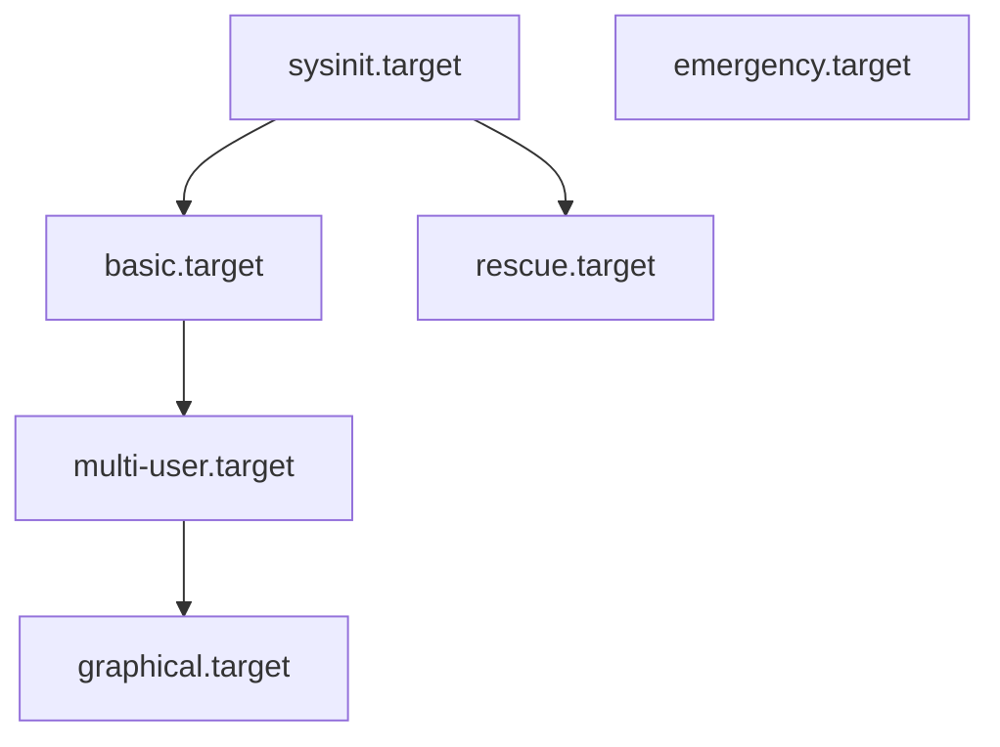

# How to Change the Default systemd Target (Runlevel) on RHEL

Author: [nawazdhandala](https://www.github.com/nawazdhandala)

Tags: RHEL, systemd, Targets, Runlevels, Linux

Description: Learn how to view and change the default systemd target on RHEL, including the relationship between classic runlevels and modern targets, and how to override at boot via GRUB.

---

## Runlevels Are Gone, Targets Are Here

If you grew up with SysVinit, you remember runlevels: 0 through 6, each with a specific meaning. RHEL uses systemd, and the equivalent concept is called a "target." Targets are more flexible than runlevels because they can depend on each other and you can create custom ones.

That said, the old runlevel numbers still work as aliases. RHEL ships compatibility symlinks so you can reference them if muscle memory takes over.

## Targets vs Runlevels: The Mapping

Here is how the classic runlevels map to systemd targets:

| Runlevel | systemd Target          | Description                        |
|----------|-------------------------|------------------------------------|
| 0        | poweroff.target         | Shut down the system               |
| 1        | rescue.target           | Single-user mode, root shell       |
| 2        | multi-user.target       | Multi-user, no GUI (RHEL default)  |
| 3        | multi-user.target       | Multi-user, no GUI                 |
| 4        | multi-user.target       | Unused/custom                      |
| 5        | graphical.target        | Multi-user with GUI                |
| 6        | reboot.target           | Reboot the system                  |

On RHEL servers, the two you will work with most are `multi-user.target` (headless server) and `graphical.target` (desktop/workstation).

## Checking the Current Default Target

Before changing anything, check what you have now.

```bash
# Show the current default boot target
systemctl get-default
```

On a fresh RHEL minimal install, this returns `multi-user.target`. On a workstation install, it returns `graphical.target`.

You can also check what target the system is currently running in:

```bash
# List all active targets
systemctl list-units --type=target --state=active
```

## Changing the Default Target

### Switch to Multi-User (No GUI)

If you are running a server and do not need a desktop environment:

```bash
# Set the default target to multi-user (no GUI)
sudo systemctl set-default multi-user.target
```

This creates a symlink at `/etc/systemd/system/default.target` pointing to the multi-user target. You can verify:

```bash
# Confirm the symlink was created
ls -l /etc/systemd/system/default.target
```

### Switch to Graphical (With GUI)

If you need the desktop environment on boot:

```bash
# Set the default target to graphical (with GUI)
sudo systemctl set-default graphical.target
```

Make sure you actually have a desktop environment installed first. If you do not, the system will boot but the graphical target will partially fail.

```bash
# Install a desktop environment if needed
sudo dnf groupinstall "Server with GUI"
```

### Switch Targets Without Rebooting

You do not need to reboot to change the current target. You can switch on the fly:

```bash
# Switch to multi-user target right now (stops the GUI)
sudo systemctl isolate multi-user.target
```

```bash
# Switch to graphical target right now (starts the GUI)
sudo systemctl isolate graphical.target
```

The `isolate` command starts the target unit and stops all units that are not dependencies of it. This is the equivalent of the old `init 3` or `init 5` commands.

## How Target Dependencies Work

Targets are not just labels. They pull in other units as dependencies. Here is a simplified view of how the major targets relate to each other:



`graphical.target` depends on `multi-user.target`, which depends on `basic.target`, which depends on `sysinit.target`. So when you boot into graphical mode, all the lower-level targets are activated first.

You can see the full dependency tree for any target:

```bash
# Show what a target pulls in
systemctl list-dependencies graphical.target
```

## Overriding the Target at Boot via GRUB

Sometimes you need to boot into a different target without permanently changing the default. Maybe the system will not boot into graphical mode and you need to drop to multi-user to fix it. You can do this from the GRUB menu.

### Temporary Override Steps

1. Reboot the system. When the GRUB menu appears, press `e` to edit the default entry.

2. Find the line starting with `linux`. It looks something like:

```
linux ($root)/vmlinuz-5.14.0-... root=/dev/mapper/rhel-root ro ...
```

3. Append the target you want to the end of that line:

```
# Boot into multi-user mode (no GUI)
systemd.unit=multi-user.target
```

Or for rescue mode:

```
# Boot into rescue (single-user) mode
systemd.unit=rescue.target
```

Or for emergency mode (minimal, no mounts):

```
# Boot into emergency mode
systemd.unit=emergency.target
```

4. Press `Ctrl+x` to boot with those parameters.

This is a one-time override. The next reboot uses the default target again.

### Making GRUB Changes Permanent

If you want to always pass a kernel parameter, edit the GRUB defaults:

```bash
# Edit GRUB configuration
sudo vi /etc/default/grub
```

Add the parameter to `GRUB_CMDLINE_LINUX`:

```
GRUB_CMDLINE_LINUX="crashkernel=1G-4G:192M,4G-64G:256M,64G-:512M resume=/dev/mapper/rhel-swap rd.lvm.lv=rhel/root rd.lvm.lv=rhel/swap systemd.unit=multi-user.target"
```

Then regenerate the GRUB config:

```bash
# Regenerate GRUB config on BIOS systems
sudo grub2-mkconfig -o /boot/grub2/grub.cfg

# On UEFI systems, the path is different
sudo grub2-mkconfig -o /boot/efi/EFI/redhat/grub.cfg
```

But honestly, using `systemctl set-default` is cleaner for permanent changes. The GRUB method is better for one-off situations or when systemd itself is misbehaving.

## Rescue vs Emergency Mode

These two deserve a quick explanation because people mix them up.

**Rescue mode** (`rescue.target`):
- Mounts all filesystems
- Starts minimal services
- Drops you to a root shell
- Good for fixing most configuration problems

**Emergency mode** (`emergency.target`):
- Mounts only the root filesystem as read-only
- Starts almost nothing
- Drops you to a root shell
- Good for fixing /etc/fstab problems or disk issues

To enter either from a running system:

```bash
# Enter rescue mode
sudo systemctl isolate rescue.target

# Enter emergency mode
sudo systemctl isolate emergency.target
```

## Creating a Custom Target

You can create your own targets if the built-in ones do not fit your needs. This is useful for maintenance windows or special operational modes.

```bash
# Create a custom target unit file
sudo vi /etc/systemd/system/maintenance.target
```

```ini
# Custom target for maintenance mode - starts networking but stops app services
[Unit]
Description=Maintenance Mode
Requires=basic.target
Conflicts=rescue.target
After=basic.target
AllowIsolate=yes
```

```bash
# Reload systemd to pick up the new target
sudo systemctl daemon-reload

# Switch to the custom target
sudo systemctl isolate maintenance.target
```

The `AllowIsolate=yes` line is required for any target you want to switch to with `isolate`.

## Quick Reference

```bash
# Check the current default
systemctl get-default

# Set default to text mode
sudo systemctl set-default multi-user.target

# Set default to GUI mode
sudo systemctl set-default graphical.target

# Switch targets on a running system
sudo systemctl isolate multi-user.target

# See target dependencies
systemctl list-dependencies graphical.target

# GRUB one-time override (append to linux line)
# systemd.unit=rescue.target
```

## Wrapping Up

Changing the default target is one of those things you do once per server and then forget about. But understanding how targets work, their dependencies, and how to override them at boot time is critical when something breaks. Rescue and emergency modes have saved me more times than I can count when a bad fstab entry or a broken GUI config left a box unbootable. Keep the GRUB override trick in your back pocket for those situations.
