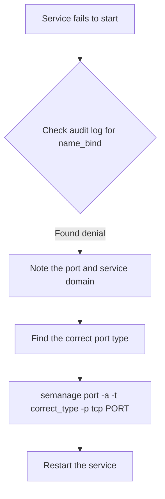

# How to Change SELinux Port Types for Non-Standard Service Ports on RHEL 9

Author: [nawazdhandala](https://www.github.com/nawazdhandala)

Tags: RHEL, SELinux, Port Types, Security, Linux

Description: Configure SELinux port labels on RHEL 9 to allow services to listen on non-standard ports without disabling SELinux enforcement.

---

## Why Port Types Matter

SELinux does not just control file access. It also controls which ports processes can bind to. Apache is allowed to listen on port 80 and 443 because those ports are labeled `http_port_t`. If you configure Apache to listen on port 8443, SELinux will block it because that port is not labeled for HTTP use. The same applies to SSH, databases, mail services, and everything else.

Instead of disabling SELinux when you move a service to a non-standard port, just label the port correctly.

## Viewing Current Port Labels

### List All Port Labels

```bash
# Show all SELinux port type assignments
sudo semanage port -l
```

### Search for Specific Types

```bash
# Find HTTP ports
sudo semanage port -l | grep http_port_t

# Find SSH ports
sudo semanage port -l | grep ssh_port_t

# Find database ports
sudo semanage port -l | grep -E "mysql|postgres|mongod"
```

Example output for HTTP:

```
http_port_t                    tcp      80, 81, 443, 488, 8008, 8009, 8443, 9000
```

## Adding a Port to an SELinux Type

### Syntax

```bash
sudo semanage port -a -t PORT_TYPE -p PROTOCOL PORT_NUMBER
```

### Examples

```bash
# Allow Apache to listen on port 8888
sudo semanage port -a -t http_port_t -p tcp 8888

# Allow SSH on port 2222
sudo semanage port -a -t ssh_port_t -p tcp 2222

# Allow Postfix SMTP on port 2525
sudo semanage port -a -t smtp_port_t -p tcp 2525

# Allow MariaDB on port 3307
sudo semanage port -a -t mysqld_port_t -p tcp 3307

# Allow PostgreSQL on port 5433
sudo semanage port -a -t postgresql_port_t -p tcp 5433
```

## Modifying an Existing Port Assignment

If a port is already assigned to a different type, you need to modify it:

```bash
# Port 8080 might already be assigned to http_cache_port_t
# Modify it to http_port_t instead
sudo semanage port -m -t http_port_t -p tcp 8080
```

If you try `-a` (add) on a port that already has a type, you get an error:

```
ValueError: Port tcp/8080 already defined
```

Use `-m` (modify) in that case.

## Deleting a Custom Port Assignment

```bash
# Remove a custom port assignment
sudo semanage port -d -t http_port_t -p tcp 8888
```

You can only delete custom (locally added) port assignments, not the default ones from the policy.

## Listing Custom Port Assignments

```bash
# Show only locally modified port assignments
sudo semanage port -l -C
```

This is useful for auditing what you have changed.

## Common Port Types

| Port Type | Service | Default Ports |
|---|---|---|
| http_port_t | Apache/Nginx | 80, 443, 8008, 8009, 8443 |
| ssh_port_t | SSH | 22 |
| smtp_port_t | Postfix SMTP | 25, 587 |
| pop_port_t | POP3 | 110, 995 |
| imap_port_t | IMAP | 143, 993 |
| mysqld_port_t | MySQL/MariaDB | 3306 |
| postgresql_port_t | PostgreSQL | 5432 |
| dns_port_t | BIND/DNS | 53 |
| squid_port_t | Squid | 3128 |
| mongod_port_t | MongoDB | 27017 |
| redis_port_t | Redis | 6379 |

## Practical Example: Moving SSH to Port 2222

```bash
# 1. Add the new port to SELinux
sudo semanage port -a -t ssh_port_t -p tcp 2222

# 2. Verify the port was added
sudo semanage port -l | grep ssh_port_t

# 3. Update the SSH configuration
sudo vi /etc/ssh/sshd_config
# Set: Port 2222

# 4. Update the firewall
sudo firewall-cmd --permanent --add-port=2222/tcp
sudo firewall-cmd --reload

# 5. Restart SSH
sudo systemctl restart sshd

# 6. Verify SSH is listening on the new port
sudo ss -tlnp | grep 2222
```

## Practical Example: Apache on Port 9090

```bash
# 1. Check if port 9090 is already assigned
sudo semanage port -l | grep 9090

# 2. Add port 9090 to http_port_t
sudo semanage port -a -t http_port_t -p tcp 9090

# 3. Configure Apache to listen on 9090
# In /etc/httpd/conf/httpd.conf: Listen 9090

# 4. Open the firewall port
sudo firewall-cmd --permanent --add-port=9090/tcp
sudo firewall-cmd --reload

# 5. Restart Apache
sudo systemctl restart httpd
```

## Troubleshooting Port Denials

When a service fails to start because of a port issue, the audit log shows the denial:

```bash
# Check for port-related denials
sudo ausearch -m avc -ts recent | grep name_bind
```

A typical port denial looks like:

```
type=AVC msg=audit(1234567890.123:456): avc:  denied  { name_bind } for  pid=1234 comm="httpd" src=9090 scontext=system_u:system_r:httpd_t:s0 tcontext=system_u:object_r:unreserved_port_t:s0 tclass=tcp_socket
```

This tells you:
- Process: httpd
- Port: 9090
- Current port type: unreserved_port_t
- Process domain: httpd_t

The fix is to add port 9090 to `http_port_t`.



## Finding the Right Port Type

If you are not sure which port type to use:

```bash
# Search for port types related to your service
sudo semanage port -l | grep -i "service_name"

# Or check what type the default port uses
sudo semanage port -l | grep "default_port_number"
```

## Using Port Ranges

You can assign a range of ports at once:

```bash
# Allow Apache to use ports 8000-8100
sudo semanage port -a -t http_port_t -p tcp 8000-8100
```

## Wrapping Up

When you run a service on a non-standard port, SELinux port labels are the first thing to check. The process is simple: find the right port type with `semanage port -l`, add your port with `semanage port -a`, and restart the service. It takes 30 seconds and keeps SELinux enforcing, which is always the right answer.
