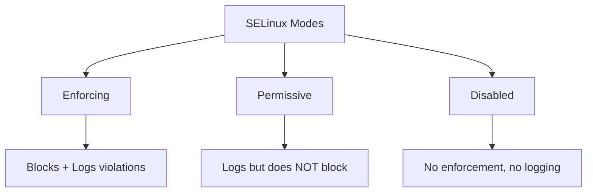

# How to Check and Change SELinux Modes (Enforcing, Permissive, Disabled) on RHEL

Author: [nawazdhandala](https://www.github.com/nawazdhandala)

Tags: RHEL, SELinux, Modes, Security, Linux

Description: Understand the three SELinux modes on RHEL and learn how to check, switch between, and permanently configure them.

---

## SELinux Modes Explained

SELinux operates in three modes, and understanding the difference is essential for every RHEL admin:

- **Enforcing** - SELinux actively enforces its security policy. Denied actions are blocked and logged. This is the default on RHEL and where you want to be in production.
- **Permissive** - SELinux logs policy violations but does not block them. Useful for troubleshooting and testing new policies.
- **Disabled** - SELinux is completely off. No policy enforcement, no logging. Strongly discouraged on RHEL.



## Checking the Current Mode

### Using getenforce

```bash
# Show the current SELinux mode in one word
getenforce
```

Output will be `Enforcing`, `Permissive`, or `Disabled`.

### Using sestatus

For more detailed information:

```bash
# Show full SELinux status
sestatus
```

Example output:

```
SELinux status:                 enabled
SELinuxfs mount:                /sys/fs/selinux
SELinux root directory:         /etc/selinux
Loaded policy name:             targeted
Current mode:                   enforcing
Mode from config file:          enforcing
Policy MLS status:              enabled
Policy deny_unknown status:     allowed
Memory protection checking:     actual (secure)
Max kernel policy version:      33
```

Key fields:
- **Current mode** - What SELinux is doing right now
- **Mode from config file** - What mode SELinux will use after reboot

## Switching Modes Temporarily

Temporary changes take effect immediately but do not survive a reboot.

### Switch to Permissive

```bash
# Switch to permissive mode (no reboot needed)
sudo setenforce 0
```

### Switch to Enforcing

```bash
# Switch to enforcing mode (no reboot needed)
sudo setenforce 1
```

Verify:

```bash
# Confirm the change
getenforce
```

You cannot switch to or from Disabled mode without a reboot. The `setenforce` command only toggles between Enforcing and Permissive.

## Changing the Mode Permanently

The permanent SELinux configuration is in `/etc/selinux/config`.

### View the Current Configuration

```bash
# Show the SELinux config file
cat /etc/selinux/config
```

### Set Enforcing Mode Permanently

```bash
# Edit the SELinux config
sudo vi /etc/selinux/config
```

Set:

```
SELINUX=enforcing
```

### Set Permissive Mode Permanently

```
SELINUX=permissive
```

### Disable SELinux (Not Recommended)

```
SELINUX=disabled
```

After changing the config file, reboot for the change to take effect:

```bash
sudo reboot
```

## Why You Should Not Disable SELinux

Disabling SELinux is tempting when you hit permission issues, but it removes a critical security layer. Here is what you lose:

- Process confinement (a compromised Apache cannot access SSH keys)
- Mandatory access control (even root processes are restricted)
- Protection against zero-day exploits that bypass traditional permissions

Instead of disabling SELinux, use Permissive mode temporarily to diagnose issues, then fix the policy and switch back to Enforcing.

## Switching from Disabled to Enforcing

If SELinux was previously disabled and you want to re-enable it, there is an extra step. The filesystem needs to be relabeled because files created while SELinux was off do not have security labels.

```bash
# 1. Set the config to permissive first (not enforcing)
sudo vi /etc/selinux/config
# Set: SELINUX=permissive

# 2. Create the relabel trigger file
sudo touch /.autorelabel

# 3. Reboot
sudo reboot
```

The system will relabel all files during boot (this can take a while on large filesystems). After relabeling completes:

```bash
# 4. Verify everything works in permissive mode
sudo ausearch -m avc -ts recent

# 5. If no critical denials, switch to enforcing
sudo vi /etc/selinux/config
# Set: SELINUX=enforcing
sudo reboot
```

## Kernel Boot Parameters

You can also control SELinux mode through kernel boot parameters in GRUB:

```bash
# View current kernel command line
cat /proc/cmdline
```

### Temporary Boot Override

At the GRUB menu, edit the kernel line and add:

```
enforcing=0     # Boot in permissive mode
enforcing=1     # Boot in enforcing mode
selinux=0       # Disable SELinux entirely
```

### Permanent GRUB Configuration

```bash
# Set permissive mode via GRUB
sudo grubby --update-kernel ALL --args enforcing=0

# Remove the override
sudo grubby --update-kernel ALL --remove-args enforcing
```

## Checking SELinux Mode in Scripts

```bash
#!/bin/bash
# Check SELinux mode in a script
MODE=$(getenforce)

case $MODE in
    Enforcing)
        echo "SELinux is enforcing - good"
        ;;
    Permissive)
        echo "WARNING: SELinux is in permissive mode"
        ;;
    Disabled)
        echo "CRITICAL: SELinux is disabled"
        ;;
esac
```

## Per-Domain Permissive Mode

Instead of setting the entire system to permissive, you can set a single SELinux domain to permissive. This is much safer:

```bash
# Set only httpd to permissive mode
sudo semanage permissive -a httpd_t

# List domains in permissive mode
sudo semanage permissive -l

# Remove the permissive exception
sudo semanage permissive -d httpd_t
```

This lets you troubleshoot a specific service without weakening SELinux for the entire system.

## Monitoring Mode Changes

SELinux mode changes are logged in the audit log:

```bash
# Check for mode change events
sudo ausearch -m MAC_STATUS -ts today
```

## Wrapping Up

Keep SELinux in Enforcing mode on production systems. Use Permissive mode temporarily for troubleshooting, and use per-domain permissive mode when only one service is causing issues. Never disable SELinux on a production RHEL system. The few minutes spent fixing an SELinux denial are worth far more than the security you lose by turning it off.
