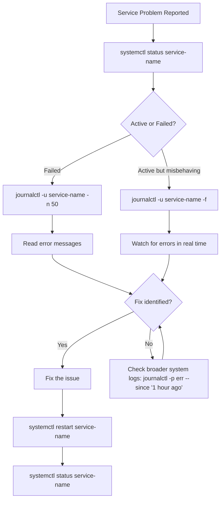

# How to Check the Status and Logs of a systemd Service on RHEL 9

Author: [nawazdhandala](https://www.github.com/nawazdhandala)

Tags: RHEL, systemd, Logs, journalctl, Linux, Troubleshooting

Description: Learn how to check service status and read logs using systemctl and journalctl on RHEL 9, including filtering, following live logs, and exporting output.

---

When something goes wrong with a service, the first two commands you reach for are `systemctl status` and `journalctl`. Together, they tell you whether a service is running, why it failed, and what it has been doing. Knowing how to use them efficiently is the difference between a five-minute fix and an hour of guessing.

This guide covers both tools in depth, from basic usage to the filtering and formatting options that make troubleshooting faster.

---

## Checking Service Status with systemctl

The most common command for a quick health check:

```bash
# Get the current status of httpd
sudo systemctl status httpd
```

The output packs a lot of information into a compact format:

```
httpd.service - The Apache HTTP Server
     Loaded: loaded (/usr/lib/systemd/system/httpd.service; enabled; preset: disabled)
     Active: active (running) since Tue 2026-03-04 10:15:30 UTC; 3h 22min ago
       Docs: man:httpd.service(8)
   Main PID: 1234 (httpd)
     Status: "Total requests: 1203; Idle/Busy workers 100/3"
      Tasks: 213 (limit: 23456)
     Memory: 52.1M
        CPU: 3.456s
     CGroup: /system.slice/httpd.service
             ├─1234 /usr/sbin/httpd -DFOREGROUND
             ├─1235 /usr/sbin/httpd -DFOREGROUND
             └─1236 /usr/sbin/httpd -DFOREGROUND

Mar 04 10:15:30 server01 systemd[1]: Starting The Apache HTTP Server...
Mar 04 10:15:30 server01 httpd[1234]: Server configured, listening on: port 443, port 80
Mar 04 10:15:30 server01 systemd[1]: Started The Apache HTTP Server.
```

Here is what each line tells you:

- **Loaded** - Where the unit file lives, whether it is enabled at boot, and the preset default
- **Active** - Current state and how long it has been running
- **Main PID** - The main process ID and its command name
- **Status** - Application-specific status (if the service reports it)
- **Tasks/Memory/CPU** - Resource usage at a glance
- **CGroup** - The control group tree showing all child processes
- **Log lines** - The most recent journal entries for this service

### Quick Status Checks

For scripting, you want single-word answers instead of the full status block:

```bash
# Returns "active" or "inactive"
systemctl is-active httpd

# Returns "enabled" or "disabled"
systemctl is-enabled httpd

# Returns "failed" if the service crashed, "active" otherwise
systemctl is-failed httpd
```

To check multiple services at once:

```bash
# Check several services in one command
systemctl is-active httpd mariadb php-fpm firewalld
```

Each service gets its own line in the output.

---

## Reading Logs with journalctl

The systemd journal captures everything a service writes to stdout, stderr, and syslog. `journalctl` is the tool to read it.

### Basic Service Log Viewing

```bash
# Show all logs for httpd
sudo journalctl -u httpd
```

This dumps the entire log history for that service, which can be overwhelming. You almost always want to add filters.

### Following Logs in Real Time

When troubleshooting an active issue, follow the logs as they come in:

```bash
# Follow httpd logs in real time (like tail -f)
sudo journalctl -u httpd -f
```

Press Ctrl+C to stop following.

### Showing Recent Logs

To see just the last N log entries:

```bash
# Show the last 50 log entries for httpd
sudo journalctl -u httpd -n 50
```

Or see logs since the last boot:

```bash
# Show httpd logs from the current boot only
sudo journalctl -u httpd -b
```

### Filtering by Time

Time-based filtering is incredibly useful during incident investigations:

```bash
# Show logs from the last hour
sudo journalctl -u httpd --since "1 hour ago"

# Show logs from a specific time window
sudo journalctl -u httpd --since "2026-03-04 14:00:00" --until "2026-03-04 15:00:00"

# Show logs since yesterday
sudo journalctl -u httpd --since yesterday
```

The time format is flexible. You can use `today`, `yesterday`, `-5min`, `-2h`, or full timestamps.

### Filtering by Priority

Journal entries have priority levels matching syslog. You can filter by severity:

```bash
# Show only error-level and above messages
sudo journalctl -u httpd -p err

# Show warnings and above
sudo journalctl -u httpd -p warning

# Show only critical and emergency messages
sudo journalctl -u httpd -p crit
```

The priority levels, from most to least severe:

| Priority | Level |
|----------|-------|
| 0 | emerg |
| 1 | alert |
| 2 | crit |
| 3 | err |
| 4 | warning |
| 5 | notice |
| 6 | info |
| 7 | debug |

---

## Output Formats

The default output is human-readable, but journalctl supports several formats:

```bash
# Short format (default) - one line per entry
sudo journalctl -u httpd -o short

# Include microsecond timestamps
sudo journalctl -u httpd -o short-precise

# JSON format - useful for piping to other tools
sudo journalctl -u httpd -o json

# Pretty-printed JSON
sudo journalctl -u httpd -o json-pretty

# Verbose format - shows all metadata fields
sudo journalctl -u httpd -o verbose

# Export format for machine processing
sudo journalctl -u httpd -o export
```

The JSON output is particularly useful when you need to feed logs into a monitoring system or log aggregator:

```bash
# Get the last 10 entries as JSON, one per line
sudo journalctl -u httpd -o json -n 10
```

---

## Combining Filters

You can combine all these filters to narrow down exactly what you need:

```bash
# Errors from httpd in the last 2 hours
sudo journalctl -u httpd -p err --since "2 hours ago"

# All logs from multiple services during a specific window
sudo journalctl -u httpd -u php-fpm --since "2026-03-04 14:00" --until "2026-03-04 14:30"
```

The `-u` flag can be specified multiple times to include logs from several services, which is helpful when debugging interactions between services.

---

## Checking for Failed Services

When you log into a server and want to quickly see if anything is broken:

```bash
# List all services that have failed
systemctl --failed
```

This shows a table of all failed units. For each failed service, dig into the logs:

```bash
# See why a specific service failed
sudo journalctl -u failed-service-name -n 30 --no-pager
```

The `--no-pager` flag prints directly to the terminal instead of opening a pager, which is useful when you want to copy-paste error messages.

---

## Practical Troubleshooting Workflow

Here is the workflow I follow every time a service is misbehaving:



Step by step:

```bash
# Step 1: Quick status check
sudo systemctl status httpd

# Step 2: If failed, check recent logs
sudo journalctl -u httpd -n 50 --no-pager

# Step 3: If still unclear, look at the full log around the failure time
sudo journalctl -u httpd --since "10 minutes ago" --no-pager

# Step 4: Check for related errors in other services
sudo journalctl -p err --since "10 minutes ago" --no-pager

# Step 5: After fixing, restart and verify
sudo systemctl restart httpd
sudo systemctl status httpd
```

---

## Journal Disk Usage

The journal can grow large over time. Check how much space it uses:

```bash
# Show journal disk usage
sudo journalctl --disk-usage
```

To clean up old entries:

```bash
# Keep only the last 7 days of logs
sudo journalctl --vacuum-time=7d

# Keep only 500M of journal data
sudo journalctl --vacuum-size=500M
```

You can also set permanent limits in `/etc/systemd/journald.conf`:

```ini
# /etc/systemd/journald.conf
[Journal]
SystemMaxUse=1G
MaxRetentionSec=30d
```

After editing, restart the journal service:

```bash
# Apply journal configuration changes
sudo systemctl restart systemd-journald
```

---

## Wrapping Up

Between `systemctl status` and `journalctl`, you have everything you need to diagnose service issues on RHEL 9. Build the habit of checking status first, then diving into logs with appropriate filters. The time-based and priority-based filters in journalctl are your best friends during incident response. Learn them well and you will resolve issues faster than anyone who is still grepping through flat log files.
