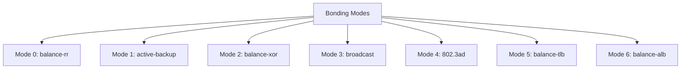

# How to Choose Between Network Bonding Modes on RHEL

Author: [nawazdhandala](https://www.github.com/nawazdhandala)

Tags: RHEL, Network Bonding, Bonding Modes, Linux

Description: A practical comparison of all Linux bonding modes available on RHEL, helping you pick the right one for your workload, switch setup, and redundancy requirements.

---

Picking the wrong bonding mode can mean you get no actual failover, or you wonder why your throughput did not increase at all. Each bonding mode has specific behaviors, requirements, and trade-offs. Here is a breakdown of all seven modes and when to use each one.

## Overview of Bonding Modes



## Mode 0: balance-rr (Round-Robin)

Packets are transmitted in sequential order across all slave interfaces. The first packet goes out eth0, the second out eth1, the third out eth0 again, and so on.

**Pros**: Provides both load balancing and fault tolerance. Easy to set up.

**Cons**: Can cause out-of-order packet delivery, which hurts TCP performance. Requires switch support (all ports in the same port-channel).

**Best for**: Environments where out-of-order packets are acceptable, or where you need raw throughput for large sequential transfers.

```bash
# Create a balance-rr bond
nmcli connection add type bond con-name bond0 ifname bond0 \
  bond.options "mode=balance-rr,miimon=100"
```

## Mode 1: active-backup

Only one slave is active at any time. The other slaves sit idle and take over if the active one fails. The bond uses a single MAC address on the active port, so there are no switch configuration requirements.

**Pros**: Works with any switch, no special configuration needed. Simple and reliable.

**Cons**: Only one interface carries traffic at a time, so you do not get increased bandwidth.

**Best for**: Most production servers where high availability is the primary goal and switch configuration is limited.

```bash
# Create an active-backup bond
nmcli connection add type bond con-name bond0 ifname bond0 \
  bond.options "mode=active-backup,miimon=100"
```

## Mode 2: balance-xor

Transmits based on a hash of the source and destination MAC addresses (by default). The same source-destination pair always uses the same slave, giving you predictable traffic patterns.

**Pros**: Provides load balancing and fault tolerance. Predictable slave selection.

**Cons**: Requires switch support (port-channel). May not distribute traffic evenly if you have few peers.

**Best for**: Environments with many different peers where you want deterministic path selection.

```bash
# Create a balance-xor bond with layer3+4 hashing
nmcli connection add type bond con-name bond0 ifname bond0 \
  bond.options "mode=balance-xor,miimon=100,xmit_hash_policy=layer3+4"
```

## Mode 3: broadcast

Every packet is transmitted on all slave interfaces. This is a niche mode.

**Pros**: Maximum fault tolerance since every packet goes everywhere.

**Cons**: No load balancing. Doubles (or more) network traffic. Requires switch support.

**Best for**: Highly specialized scenarios where you absolutely cannot lose a packet, like certain financial or cluster heartbeat networks. Rarely used in practice.

```bash
# Create a broadcast bond
nmcli connection add type bond con-name bond0 ifname bond0 \
  bond.options "mode=broadcast,miimon=100"
```

## Mode 4: 802.3ad (LACP)

Uses the IEEE 802.3ad Link Aggregation Control Protocol. Both the server and switch negotiate a link aggregation group dynamically. This is the standard way to do bonding when your switch supports LACP.

**Pros**: Industry standard. Provides both load balancing and fault tolerance. Switch and server agree on the bond configuration.

**Cons**: Requires switch support for LACP. More complex to set up on the switch side.

**Best for**: Data center environments where you control the switch and want the best combination of throughput and redundancy.

```bash
# Create an 802.3ad bond with fast LACP rate
nmcli connection add type bond con-name bond0 ifname bond0 \
  bond.options "mode=802.3ad,miimon=100,lacp_rate=fast,xmit_hash_policy=layer3+4"
```

## Mode 5: balance-tlb (Adaptive Transmit Load Balancing)

Outgoing traffic is distributed based on each slave's current load. Incoming traffic goes to the current slave. If the receiving slave fails, another slave takes over the failed slave's MAC address.

**Pros**: Does not require any switch support. Provides outgoing load balancing.

**Cons**: Incoming traffic is not balanced. Requires the NIC driver to support `ethtool` for retrieving speed info.

**Best for**: Servers with heavy outbound traffic where switch configuration is not possible.

```bash
# Create a balance-tlb bond
nmcli connection add type bond con-name bond0 ifname bond0 \
  bond.options "mode=balance-tlb,miimon=100"
```

## Mode 6: balance-alb (Adaptive Load Balancing)

Like balance-tlb but also balances incoming traffic by manipulating ARP replies. The bond intercepts ARP replies and rewrites them so that different peers send traffic to different slaves.

**Pros**: Balances both incoming and outgoing traffic. No switch support needed.

**Cons**: Only works with IPv4 (the ARP trick does not apply to IPv6). Can sometimes confuse network monitoring tools because of MAC address changes.

**Best for**: Servers that need bidirectional load balancing without switch configuration. IPv4-only environments.

```bash
# Create a balance-alb bond
nmcli connection add type bond con-name bond0 ifname bond0 \
  bond.options "mode=balance-alb,miimon=100"
```

## Decision Matrix

| Criteria | Recommended Mode |
|---|---|
| No switch configuration available | active-backup, balance-tlb, or balance-alb |
| Need LACP with switch | 802.3ad |
| Pure redundancy, no load balancing needed | active-backup |
| Load balancing with switch support | 802.3ad or balance-xor |
| Load balancing without switch support | balance-alb |
| Heavy outbound traffic only | balance-tlb |

## Hash Policy Options

For modes that support load balancing (balance-xor and 802.3ad), the `xmit_hash_policy` controls how traffic is distributed:

- **layer2** (default): Hash on source/destination MAC. Good if all traffic goes to one gateway.
- **layer2+3**: Hash on MAC and IP. Better distribution when traffic goes through a router.
- **layer3+4**: Hash on IP and port. Best distribution for most workloads.

```bash
# Set hash policy on an existing bond
nmcli connection modify bond0 bond.options "mode=802.3ad,miimon=100,xmit_hash_policy=layer3+4"
```

## Summary

For most people, the answer is simple: use **active-backup** if you just need failover without touching the switch, or use **802.3ad** if your switch supports LACP and you want both redundancy and throughput. The other modes have their place, but those two cover 90% of real-world setups. Whatever you pick, always test failover before going live.
