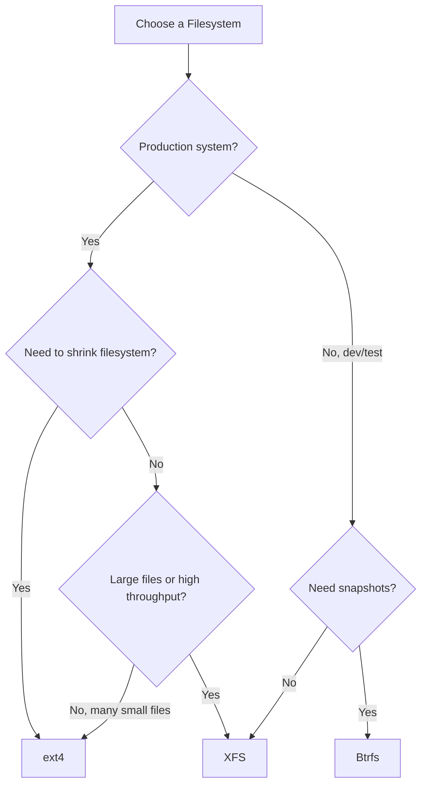

# How to Choose Between XFS, ext4, and Btrfs on RHEL

Author: [nawazdhandala](https://www.github.com/nawazdhandala)

Tags: RHEL, XFS, Ext4, Btrfs, Comparison, Linux

Description: A practical comparison of XFS, ext4, and Btrfs on RHEL to help you pick the right filesystem for your workload.

---

RHEL gives you three filesystem options: XFS (the default), ext4 (the veteran), and Btrfs (available as a technology preview). Each has strengths and tradeoffs. After years of running all three in production, here is my take on when to use each one.

## Quick Comparison

| Feature | XFS | ext4 | Btrfs |
|---------|-----|------|-------|
| RHEL default | Yes | No | No |
| Max filesystem size | 1 EB | 1 EB | 16 EB |
| Max file size | 8 EB | 16 TB | 16 EB |
| Online grow | Yes | Yes | Yes |
| Online shrink | No | No | Yes |
| Snapshots | No (use LVM) | No (use LVM) | Built-in |
| Checksums | Metadata only | No | Data + Metadata |
| RHEL support status | Full | Full | Technology Preview |
| Defragmentation | xfs_fsr | e4defrag | btrfs defrag |

## XFS - The Default Choice

XFS is the default filesystem on RHEL for good reasons. It handles large files and high-throughput workloads extremely well.

### When to Use XFS

- Large filesystems (multi-terabyte)
- High-throughput sequential I/O (video, backups, large datasets)
- Systems with many concurrent I/O operations
- When you want the best-tested and best-supported option on RHEL

### XFS Strengths

```bash
# Create an XFS filesystem
mkfs.xfs /dev/vg_data/lv_data

# Grow XFS online (no unmount needed)
xfs_growfs /data
```

- Excellent parallel I/O performance (allocation groups work independently)
- Delayed allocation reduces fragmentation
- Online defragmentation with `xfs_fsr`
- Built-in quota support that is fast and efficient
- Handles large files and large filesystems gracefully

### XFS Limitations

- Cannot be shrunk (ever, not even offline)
- Slightly higher CPU overhead for metadata operations compared to ext4
- Less mature tooling for data recovery compared to ext4

## ext4 - The Reliable Veteran

ext4 has been the default Linux filesystem for over a decade across many distributions. It is battle-tested and well-understood.

### When to Use ext4

- Small to medium filesystems (under 16 TB)
- Workloads with many small files (mail servers, news servers)
- When you need the ability to shrink the filesystem
- Environments migrated from RHEL 7/8 where ext4 was already in use
- When recovery tools matter (ext4 recovery is very mature)

### ext4 Strengths

```bash
# Create an ext4 filesystem
mkfs.ext4 /dev/vg_data/lv_data

# Grow ext4 online
resize2fs /dev/vg_data/lv_data

# Shrink ext4 offline (requires unmount)
umount /data
e2fsck -f /dev/vg_data/lv_data
resize2fs /dev/vg_data/lv_data 50G
```

- Can be shrunk (unlike XFS)
- Lower memory usage for metadata operations
- Mature recovery tools (`e2fsck`, `debugfs`, `testdisk`)
- Faster metadata operations for small file workloads
- Very predictable performance characteristics

### ext4 Limitations

- No data checksums (silent corruption can go undetected)
- Maximum file size of 16 TB
- No built-in snapshots
- Fragmentation can be an issue with certain workloads

## Btrfs - The Feature-Rich Newcomer

Btrfs brings modern features like built-in snapshots, checksums, and compression. On RHEL, it is available as a technology preview, meaning Red Hat does not provide full production support.

### When to Consider Btrfs

- Development and testing environments
- Systems where snapshots without LVM are valuable
- Workloads that benefit from transparent compression
- When data integrity (checksums) is critical and you accept the technology preview status

### Btrfs Strengths

```bash
# Create a Btrfs filesystem
mkfs.btrfs /dev/vg_data/lv_data

# Create a snapshot
btrfs subvolume snapshot /data /data/.snapshots/snap1

# Enable transparent compression
mount -o compress=zstd /dev/vg_data/lv_data /data
```

- Built-in snapshots (no LVM needed)
- Data and metadata checksums detect corruption
- Transparent compression (zstd, lzo, zlib)
- Online shrink and grow
- Send/receive for incremental backups

### Btrfs Limitations on RHEL

- Technology preview, not fully supported
- RAID 5/6 support is still considered unstable
- Performance can be unpredictable under heavy random write loads
- More complex to manage and troubleshoot
- Quota groups (qgroups) can cause performance issues

## Decision Framework



## Performance Comparison

Based on typical benchmarks on RHEL:

### Sequential Read/Write (Large Files)

XFS leads for large sequential operations because its allocation group architecture allows parallel I/O:

```bash
# Quick sequential write test with dd
dd if=/dev/zero of=/data/testfile bs=1M count=1024 oflag=direct
```

### Random I/O (Small Files)

ext4 often edges out XFS for random I/O with small files due to lower metadata overhead.

### Metadata Operations (File Creation/Deletion)

ext4 is faster for creating and deleting many small files. XFS has improved significantly but still lags for very metadata-heavy workloads.

## Migration Considerations

### Moving from ext4 to XFS

There is no in-place conversion. You need to:
1. Back up data
2. Reformat as XFS
3. Restore data

### Moving from XFS to ext4

Same process - backup, reformat, restore. There is no conversion tool.

## My Recommendations

For most RHEL deployments, stick with **XFS**. It is the default, best tested, and handles the widest range of workloads well.

Use **ext4** when you have a specific reason: you need filesystem shrink capability, you have a workload with millions of tiny files, or you are running older software that was tested against ext4.

Use **Btrfs** only in non-production environments or when you have a specific need for its features and accept that Red Hat's support is limited.

## Summary

XFS is the right choice for most RHEL systems - it is the default, well-supported, and performs great for general and large-file workloads. ext4 is better for small-file workloads and when you need shrink capability. Btrfs brings powerful features like snapshots and checksums but is only a technology preview on RHEL. Pick based on your workload, not hype.
