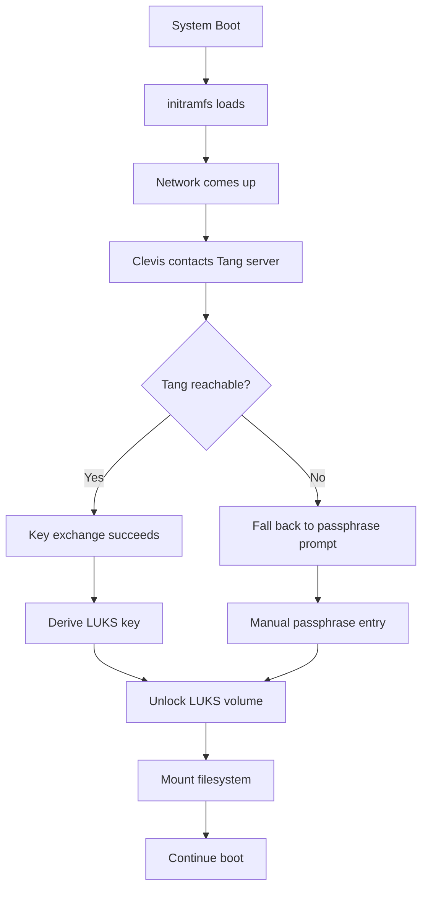

# How to Configure Clevis to Automatically Unlock LUKS Volumes on RHEL

Author: [nawazdhandala](https://www.github.com/nawazdhandala)

Tags: RHEL, Clevis, LUKS, NBDE, Linux

Description: Configure Clevis on RHEL client systems to automatically unlock LUKS-encrypted volumes by binding them to a Tang server for seamless network-bound disk encryption.

---

Once you have a Tang server running, the next step is configuring Clevis on your RHEL systems so their LUKS volumes unlock automatically during boot. No more typing passphrases, no more out-of-band console access for reboots. As long as the server can reach the Tang server, the disks unlock on their own.

## Installing Clevis

Install the Clevis packages on the client system:

```bash
# Install Clevis with Tang and LUKS support
sudo dnf install clevis clevis-luks clevis-dracut -y
```

The packages provide:
- `clevis` - the base framework
- `clevis-luks` - LUKS integration for binding encrypted volumes
- `clevis-dracut` - early boot support so volumes unlock before the root filesystem is needed

## Identifying Your LUKS Volume

First, find the LUKS encrypted device you want to bind:

```bash
# List block devices and find LUKS volumes
lsblk -f

# Check LUKS status of a specific device
sudo cryptsetup luksDump /dev/sda3
```

Note the device path (like `/dev/sda3`) and which LUKS key slots are in use. Clevis will add a new key slot.

## Binding a LUKS Volume to Tang

Bind the LUKS volume to your Tang server using `clevis luks bind`:

```bash
# Bind the LUKS volume to the Tang server
# You will be prompted for the existing LUKS passphrase
sudo clevis luks bind -d /dev/sda3 tang '{"url":"http://tang.example.com"}'
```

Clevis will:
1. Fetch the Tang server's advertisement
2. Show you the key thumbprint for verification
3. Ask for your existing LUKS passphrase
4. Add a new key to an available LUKS key slot

Verify the thumbprint matches your Tang server. You can check the Tang server's thumbprint with:

```bash
# On the Tang server, get the signing key thumbprint
sudo tang-show-keys
```

## Verifying the Binding

Check that the binding was created:

```bash
# List Clevis bindings on the LUKS device
sudo clevis luks list -d /dev/sda3
```

You should see output showing the Tang binding with the URL and thumbprint.

Also verify the LUKS key slots:

```bash
# Check LUKS key slot usage
sudo cryptsetup luksDump /dev/sda3 | grep "Key Slot"
```

You will see your original passphrase in one slot and the Clevis-managed key in another.

## Enabling Early Boot Unlock

For the root volume or any volume needed at boot, regenerate the initramfs to include Clevis:

```bash
# Rebuild the initramfs with Clevis support
sudo dracut -fv
```

This adds the Clevis and networking components to the initramfs so the Tang key exchange can happen before the root filesystem is mounted.

## Configuring Network in Early Boot

Clevis needs network access during early boot. Configure dracut to bring up networking:

```bash
# Add network support to dracut
sudo tee /etc/dracut.conf.d/clevis.conf << 'EOF'
# Enable network for Clevis Tang during early boot
kernel_cmdline="rd.neednet=1"
EOF

# Rebuild initramfs
sudo dracut -fv
```

If your server uses DHCP, this should work automatically. For static IP configurations, add the network parameters:

```bash
# For static IP, add to kernel command line in GRUB
sudo grubby --update-kernel=ALL --args="rd.neednet=1 ip=10.0.1.50::10.0.1.1:255.255.255.0:server01:ens192:none"
```

## Testing the Binding

Test that Clevis can unlock the volume without the passphrase:

```bash
# Test the Clevis binding (this does not actually unlock, just verifies)
sudo clevis luks unlock -d /dev/sda3
```

For a full test, reboot the system and verify it comes up without prompting for a passphrase:

```bash
# Reboot to test automatic unlock
sudo reboot
```

## Binding Workflow



## Binding Non-Root Volumes

For data volumes that are not needed at boot, you can use systemd integration instead of dracut:

```bash
# Install the systemd Clevis integration
sudo dnf install clevis-systemd -y

# Enable the Clevis unlock service
sudo systemctl enable clevis-luks-askpass.path
```

Bind the volume the same way:

```bash
# Bind a data volume
sudo clevis luks bind -d /dev/sdb1 tang '{"url":"http://tang.example.com"}'
```

## Removing a Clevis Binding

If you need to remove the Clevis binding:

```bash
# List bindings to find the slot number
sudo clevis luks list -d /dev/sda3

# Remove the binding from the specific slot
sudo clevis luks unbind -d /dev/sda3 -s 1
```

Replace `1` with the actual slot number shown by `clevis luks list`.

## Keeping Your Passphrase

Always keep a working passphrase on the LUKS volume as a fallback. If the Tang server is unreachable, you will need it. Test that your passphrase still works after binding:

```bash
# Verify the passphrase slot still works
sudo cryptsetup luksOpen --test-passphrase /dev/sda3
```

Store the fallback passphrase securely, for example in a sealed envelope in a safe or in an approved secrets manager.

## Troubleshooting

If automatic unlock fails after reboot:

```bash
# Check if Clevis tried to contact Tang during boot
sudo journalctl -b | grep clevis

# Check network availability during early boot
sudo journalctl -b | grep -i "network\|dhcp\|ip "

# Verify Tang is reachable
curl -sf http://tang.example.com/adv

# Check the binding is intact
sudo clevis luks list -d /dev/sda3
```

Common issues include network not being available during early boot, firewall rules blocking access to Tang, and DNS resolution failures (use IP addresses instead of hostnames in the Tang URL if DNS is unreliable during boot).
