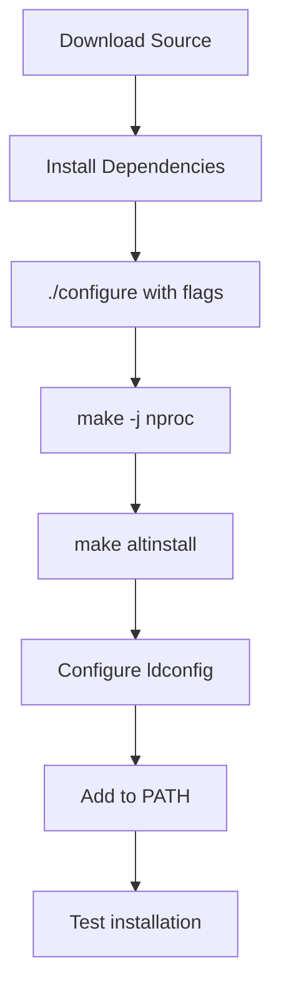

# How to Compile Python 3.12 from Source on RHEL

Author: [nawazdhandala](https://www.github.com/nawazdhandala)

Tags: RHEL, Python, Compilation, Source Build, Linux, Development

Description: Step-by-step instructions for compiling and installing Python 3.12 from source on RHEL, with optimizations enabled and without affecting the system Python.

---

Sometimes you need a Python version or build configuration that is not available in the RHEL repositories. Compiling from source gives you full control over the build, including optimizations like PGO (Profile-Guided Optimization) and LTO (Link-Time Optimization).

## Installing Build Dependencies

Before compiling Python, you need development tools and libraries that Python depends on.

```bash
# Install the base development tools
sudo dnf groupinstall -y "Development Tools"

# Install libraries that Python modules need
sudo dnf install -y \
    openssl-devel \
    bzip2-devel \
    libffi-devel \
    zlib-devel \
    readline-devel \
    sqlite-devel \
    xz-devel \
    tk-devel \
    gdbm-devel \
    libuuid-devel \
    ncurses-devel \
    expat-devel \
    wget
```

## Downloading the Python Source Code

```bash
# Set the version you want to build
PYTHON_VERSION=3.12.4

# Download the source tarball
cd /tmp
wget "https://www.python.org/ftp/python/${PYTHON_VERSION}/Python-${PYTHON_VERSION}.tgz"

# Verify the download (optional but recommended)
wget "https://www.python.org/ftp/python/${PYTHON_VERSION}/Python-${PYTHON_VERSION}.tgz.asc"

# Extract the source
tar xzf "Python-${PYTHON_VERSION}.tgz"
cd "Python-${PYTHON_VERSION}"
```

## Configuring the Build

```bash
# Configure with optimizations and a custom install prefix
# --prefix keeps this separate from the system Python
# --enable-optimizations enables PGO for better runtime performance
# --with-lto enables Link-Time Optimization
# --enable-shared builds a shared library (needed by some tools)

./configure \
    --prefix=/usr/local/python3.12 \
    --enable-optimizations \
    --with-lto \
    --enable-shared \
    --with-system-ffi \
    --with-ensurepip=upgrade
```

## Building and Installing

```bash
# Build using all available CPU cores
# 'make -j' uses all cores, or specify a number like -j4
make -j "$(nproc)"

# Install without overwriting the system Python
# 'altinstall' installs as python3.12 instead of python3
sudo make altinstall
```

The `altinstall` target is important. Using `install` instead of `altinstall` would overwrite the system `python3` symlink and could break system tools.

## Configuring the Shared Library

Since we built with `--enable-shared`, we need to make the shared library findable.

```bash
# Add the library path to the system configuration
echo '/usr/local/python3.12/lib' | sudo tee /etc/ld.so.conf.d/python3.12.conf

# Reload the library cache
sudo ldconfig

# Verify the shared library is found
ldd /usr/local/python3.12/bin/python3.12
```

## Adding to PATH

```bash
# Add the custom Python to your PATH
echo 'export PATH="/usr/local/python3.12/bin:$PATH"' >> ~/.bashrc
source ~/.bashrc

# Verify the installation
python3.12 --version
# Output: Python 3.12.4

# Verify pip is available
pip3.12 --version
```

## Testing the Build

```bash
# Run the Python test suite (this takes a while)
python3.12 -m test

# Quick smoke test - check that key modules work
python3.12 -c "
import ssl; print('ssl:', ssl.OPENSSL_VERSION)
import sqlite3; print('sqlite3: OK')
import ctypes; print('ctypes: OK')
import readline; print('readline: OK')
import zlib; print('zlib: OK')
import bz2; print('bz2: OK')
import lzma; print('lzma: OK')
import _decimal; print('decimal (C): OK')
print('All key modules working.')
"
```

## Creating a Virtual Environment with the Custom Build

```bash
# Create a venv using your custom Python
/usr/local/python3.12/bin/python3.12 -m venv ~/projects/myapp/venv

# Activate and verify
source ~/projects/myapp/venv/bin/activate
python --version  # Python 3.12.4
pip --version
```

## Build Configuration Reference



## Cleaning Up

```bash
# Remove the build directory
cd /
rm -rf /tmp/Python-${PYTHON_VERSION}
rm -f /tmp/Python-${PYTHON_VERSION}.tgz
```

## Uninstalling a Source-Built Python

Since we installed to a dedicated prefix, removal is straightforward.

```bash
# Remove the installation directory
sudo rm -rf /usr/local/python3.12

# Remove the library config
sudo rm -f /etc/ld.so.conf.d/python3.12.conf
sudo ldconfig

# Remove the PATH entry from ~/.bashrc
```

## Summary

Compiling Python from source on RHEL gives you access to any version with customized build options. Always use `altinstall` to avoid overwriting the system Python, install to a dedicated prefix, and configure the shared library path. The result is a fully functional Python installation that coexists peacefully with the system version.
