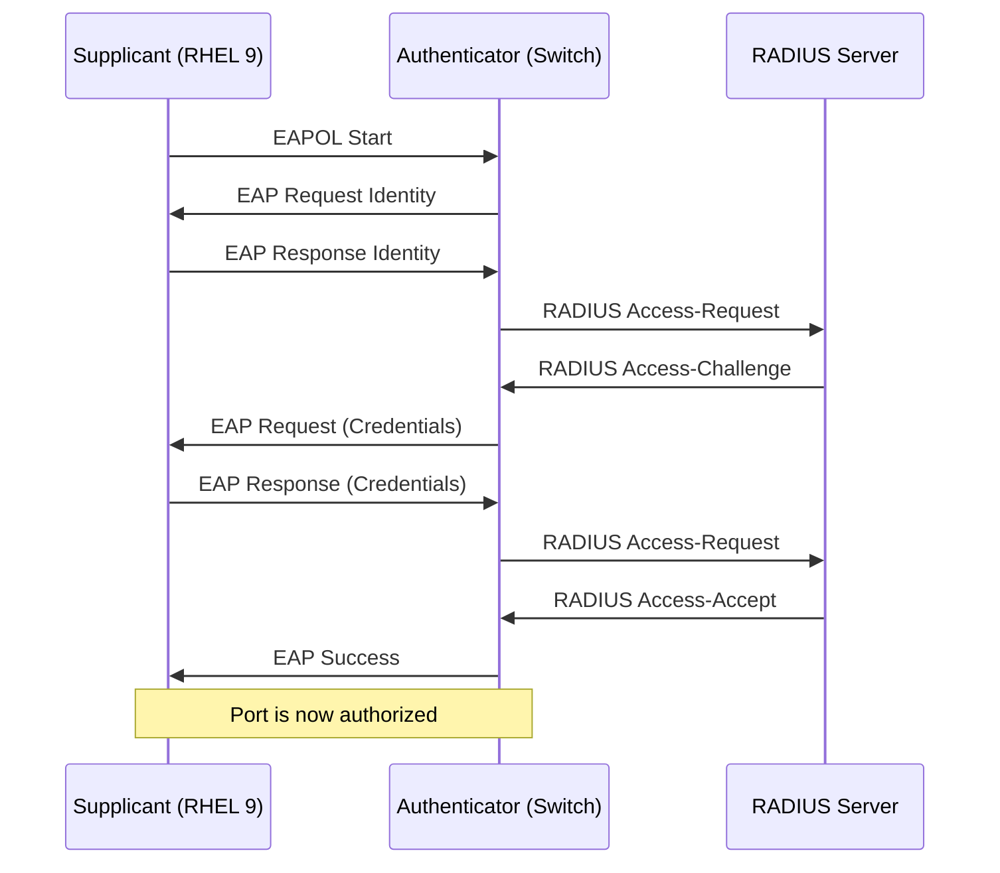

# How to Configure 802.1X Network Authentication on RHEL 9

Author: [nawazdhandala](https://www.github.com/nawazdhandala)

Tags: RHEL, 802.1X, Network Authentication, Security, Linux

Description: A step-by-step guide to configuring 802.1X wired network authentication on RHEL 9 using NetworkManager, with examples for PEAP, EAP-TLS, and EAP-TTLS.

---

In high-security environments, plugging a cable into a switch port does not automatically grant network access. 802.1X port-based authentication requires each device to prove its identity before the switch allows traffic through. Hospitals, financial institutions, government networks, and any organization that takes network access control seriously uses 802.1X. Setting it up on RHEL 9 involves configuring NetworkManager with the right EAP credentials and certificates.

## How 802.1X Works

802.1X is a standard for port-based network access control. It involves three parties:

1. **Supplicant** - The client device (your RHEL 9 server)
2. **Authenticator** - The network switch
3. **Authentication server** - Typically a RADIUS server (like FreeRADIUS or Microsoft NPS)



Until authentication succeeds, the switch only allows 802.1X (EAPOL) frames through. All other traffic is blocked.

## Prerequisites

Before configuring 802.1X on RHEL 9, you need:

- A switch port configured for 802.1X authentication
- A RADIUS server with your authentication method configured
- Credentials (username/password for PEAP/TTLS, or certificates for EAP-TLS)
- The CA certificate that signed the RADIUS server's certificate

Install the required wpa_supplicant package (usually already installed):

```bash
# Install wpa_supplicant if not present
dnf install wpa_supplicant -y

# Verify it is installed
rpm -q wpa_supplicant
```

## Method 1: PEAP with MSCHAPv2

PEAP (Protected EAP) with MSCHAPv2 is the most common 802.1X method in corporate environments. It uses a username and password for authentication.

### Using nmcli

```bash
# Configure 802.1X with PEAP/MSCHAPv2
nmcli connection add \
  con-name "corporate-802.1x" \
  ifname ens192 \
  type ethernet \
  802-1x.eap peap \
  802-1x.phase2-auth mschapv2 \
  802-1x.identity "server01" \
  802-1x.password "YourSecurePassword" \
  802-1x.ca-cert /etc/pki/tls/certs/corporate-ca.pem \
  ipv4.method auto

# Activate the connection
nmcli connection up corporate-802.1x
```

### Storing Passwords Securely

Putting passwords directly in the command or keyfile is not ideal. You can configure NetworkManager to prompt for the password or use a secrets agent:

```bash
# Set the password flag to require agent-provided secrets
nmcli connection modify corporate-802.1x 802-1x.password-flags 1

# Or store the password in the keyfile but restrict file permissions
# (passwords in keyfiles are encrypted at rest on RHEL 9)
nmcli connection modify corporate-802.1x 802-1x.password "YourSecurePassword"
```

## Method 2: EAP-TLS (Certificate-Based)

EAP-TLS uses client certificates instead of passwords. This is the most secure option because there are no passwords to steal or guess.

### Preparing Certificates

You need three files:
- **CA certificate** - The CA that signed the RADIUS server's certificate
- **Client certificate** - Your server's identity certificate
- **Client private key** - The private key for the client certificate

```bash
# Verify your certificates
openssl x509 -in /etc/pki/tls/certs/corporate-ca.pem -noout -subject -dates
openssl x509 -in /etc/pki/tls/certs/server01.pem -noout -subject -dates
openssl rsa -in /etc/pki/tls/private/server01.key -check -noout
```

### Configuring EAP-TLS

```bash
# Configure 802.1X with EAP-TLS
nmcli connection add \
  con-name "cert-802.1x" \
  ifname ens192 \
  type ethernet \
  802-1x.eap tls \
  802-1x.identity "server01.example.com" \
  802-1x.ca-cert /etc/pki/tls/certs/corporate-ca.pem \
  802-1x.client-cert /etc/pki/tls/certs/server01.pem \
  802-1x.private-key /etc/pki/tls/private/server01.key \
  802-1x.private-key-password "KeyFilePassword" \
  ipv4.method auto

# Activate the connection
nmcli connection up cert-802.1x
```

### Using PKCS#12 Bundles

If your certificates are in PKCS#12 format (a single .p12 or .pfx file):

```bash
# Configure with a PKCS#12 bundle
nmcli connection add \
  con-name "cert-802.1x" \
  ifname ens192 \
  type ethernet \
  802-1x.eap tls \
  802-1x.identity "server01.example.com" \
  802-1x.ca-cert /etc/pki/tls/certs/corporate-ca.pem \
  802-1x.private-key /etc/pki/tls/private/server01.p12 \
  802-1x.private-key-password "BundlePassword" \
  ipv4.method auto
```

## Method 3: EAP-TTLS

EAP-TTLS creates a TLS tunnel and then runs a simpler authentication method inside it:

```bash
# Configure 802.1X with EAP-TTLS/PAP
nmcli connection add \
  con-name "ttls-802.1x" \
  ifname ens192 \
  type ethernet \
  802-1x.eap ttls \
  802-1x.phase2-auth pap \
  802-1x.identity "server01" \
  802-1x.password "YourSecurePassword" \
  802-1x.ca-cert /etc/pki/tls/certs/corporate-ca.pem \
  ipv4.method auto
```

## Editing the Keyfile Directly

For 802.1X, the keyfile includes a `[802-1x]` section:

```ini
[connection]
id=corporate-802.1x
type=ethernet
interface-name=ens192
autoconnect=true

[ethernet]

[802-1x]
eap=peap;
identity=server01
password=YourSecurePassword
ca-cert=/etc/pki/tls/certs/corporate-ca.pem
phase2-auth=mschapv2

[ipv4]
method=auto

[ipv6]
method=auto
```

Remember that the keyfile must have 600 permissions since it may contain passwords:

```bash
chmod 600 /etc/NetworkManager/system-connections/corporate-802.1x.nmconnection
```

## Verifying 802.1X Authentication

After activating the connection, check the authentication status:

```bash
# Check the connection status
nmcli connection show corporate-802.1x | grep 802-1x

# Check the device for authentication state
nmcli device show ens192

# Look at the wpa_supplicant logs for detailed auth info
journalctl -u wpa_supplicant --since "5 minutes ago" --no-pager

# Check NetworkManager logs for 802.1X events
journalctl -u NetworkManager --since "5 minutes ago" | grep -i "802.1x\|eap\|supplicant"
```

## Troubleshooting 802.1X

### Authentication Fails Immediately

```bash
# Enable debug logging
nmcli general logging level DEBUG domains ALL

# Try to connect
nmcli connection up corporate-802.1x

# Check the detailed logs
journalctl -u NetworkManager --since "2 minutes ago" --no-pager | grep -i eap
journalctl -u wpa_supplicant --since "2 minutes ago" --no-pager
```

Common causes:
- Wrong CA certificate (the RADIUS server cert is not signed by the CA you specified)
- Wrong identity format (some RADIUS servers expect just a username, others expect user@domain)
- Certificate expired

### Certificate Validation Fails

```bash
# Check the CA certificate
openssl x509 -in /etc/pki/tls/certs/corporate-ca.pem -noout -subject -dates

# Check if the RADIUS server's cert chains to your CA
# (You need to capture the server cert during auth - check wpa_supplicant logs)

# Temporarily disable server cert validation for testing (NOT for production)
nmcli connection modify corporate-802.1x 802-1x.phase1-auth-flags 0x00000001
```

### Switch Port Not Authenticating

If the switch is not even sending EAP requests:

```bash
# Check if EAPOL frames are being received
tcpdump -i ens192 -n ether proto 0x888e

# Verify the switch port is configured for 802.1X
# (This requires switch access - check with your network team)
```

## Security Best Practices

**Always validate the server certificate.** The `802-1x.ca-cert` parameter ensures your server only authenticates to legitimate RADIUS servers. Skipping this opens you up to rogue authentication server attacks.

**Use EAP-TLS when possible.** Certificate-based authentication eliminates password-related vulnerabilities entirely.

**Rotate credentials regularly.** If using password-based methods, implement a credential rotation process. For certificate-based methods, set up certificate renewal before expiration.

**Restrict certificate file permissions.** Private keys and PKCS#12 bundles should be readable only by root:

```bash
# Secure certificate files
chmod 600 /etc/pki/tls/private/server01.key
chmod 644 /etc/pki/tls/certs/server01.pem
chmod 644 /etc/pki/tls/certs/corporate-ca.pem
```

## Wrapping Up

802.1X on RHEL 9 is handled cleanly through NetworkManager and wpa_supplicant. The most common deployment uses PEAP/MSCHAPv2 with username and password, but for servers in production environments, EAP-TLS with client certificates is the better choice. The setup requires coordination with your network team (switch configuration) and your security team (RADIUS server and certificates), but once everything is in place, it provides a strong layer of network access control that ensures only authorized devices can communicate on your network.
