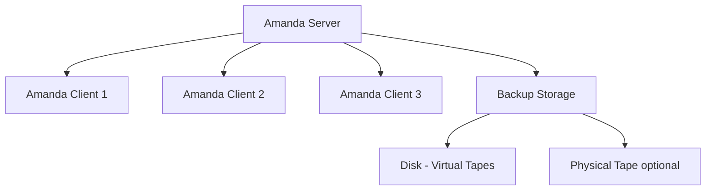

# How to Configure Amanda Backup Server on RHEL

Author: [nawazdhandala](https://www.github.com/nawazdhandala)

Tags: RHEL, Amanda, Backup, Network, Linux

Description: Set up Amanda (Advanced Maryland Automatic Network Disk Archiver) as a centralized backup server on RHEL for automated network backups.

---

Amanda (Advanced Maryland Automatic Network Disk Archiver) is an open-source backup solution that lets you set up a single backup server to back up multiple network clients. It manages scheduling, tape/disk rotation, and supports both full and incremental backups.

## Amanda Architecture



## Installing Amanda Server

```bash
# Install Amanda server package
sudo dnf install amanda-server amanda-client

# The amanda user is created automatically
id amandabackup
```

## Configuring the Server

```bash
# Create a configuration for your backup set
sudo mkdir -p /etc/amanda/daily
sudo chown amandabackup:disk /etc/amanda/daily
```

Create the main configuration file:

```bash
# /etc/amanda/daily/amanda.conf
sudo -u amandabackup tee /etc/amanda/daily/amanda.conf << 'CONF'
# Amanda configuration for daily backups
org "MyOrg-Daily"
mailto "admin@example.com"
dumpcycle 7         # Full backup cycle in days
runspercycle 7      # Runs per dump cycle
tapecycle 14        # Number of virtual tapes to keep

# Use disk-based virtual tapes
tpchanger "chg-disk:/backup/amanda/vtapes/daily"
tapetype DISK

# Holding disk for staging
holdingdisk hd1 {
    directory "/backup/amanda/holding"
    use 10 Gb
}

# Define the tape type for disk backups
define tapetype DISK {
    length 50 Gb
}

# Compression and encryption
compress client fast

# Logging
logdir "/var/log/amanda/daily"

# Info and index directories
infofile "/etc/amanda/daily/curinfo"
indexdir "/etc/amanda/daily/index"
CONF
```

## Setting Up Virtual Tapes

```bash
# Create virtual tape directories
sudo mkdir -p /backup/amanda/vtapes/daily
sudo mkdir -p /backup/amanda/holding
sudo mkdir -p /var/log/amanda/daily
sudo chown -R amandabackup:disk /backup/amanda /var/log/amanda

# Create virtual tape slots (14 tapes for a 2-week cycle)
for i in $(seq 1 14); do
    sudo -u amandabackup mkdir -p /backup/amanda/vtapes/daily/slot${i}
done
```

## Defining What to Back Up

Create the disk list:

```bash
# /etc/amanda/daily/disklist
sudo -u amandabackup tee /etc/amanda/daily/disklist << 'DISKLIST'
# hostname  disk/directory  dumptype
# Back up the local server
localhost /etc      comp-user-tar
localhost /home     comp-user-tar
localhost /var/www  comp-user-tar

# Back up remote clients
client1.example.com /etc      comp-user-tar
client1.example.com /home     comp-user-tar
client2.example.com /etc      comp-user-tar
client2.example.com /var/www  comp-user-tar
DISKLIST
```

## Installing Amanda Client

On each client machine:

```bash
# Install the Amanda client
sudo dnf install amanda-client

# Allow the Amanda server to connect
echo "amanda.example.com amandabackup amdump" | sudo tee /var/lib/amanda/.amandahosts
sudo chown amandabackup:disk /var/lib/amanda/.amandahosts
sudo chmod 600 /var/lib/amanda/.amandahosts
```

## Configuring Firewall

On the server:

```bash
# Open Amanda ports
sudo firewall-cmd --permanent --add-port=10080/tcp
sudo firewall-cmd --permanent --add-port=10080/udp
sudo firewall-cmd --reload
```

On the clients:

```bash
sudo firewall-cmd --permanent --add-port=10080/tcp
sudo firewall-cmd --permanent --add-port=10080/udp
sudo firewall-cmd --reload
```

## Testing the Configuration

```bash
# Check the configuration
sudo -u amandabackup amcheck daily

# Run a test backup
sudo -u amandabackup amdump daily

# Check the backup report
sudo -u amandabackup amstatus daily
```

## Running Backups

```bash
# Manual backup run
sudo -u amandabackup amdump daily

# Schedule with cron (run at 1 AM daily)
# Edit amandabackup's crontab
sudo -u amandabackup crontab -e
```

Add:

```bash
# Run Amanda daily backup at 1 AM
0 1 * * * /usr/sbin/amdump daily
```

## Restoring Files

```bash
# List available backups for a host
sudo -u amandabackup amadmin daily find client1.example.com /etc

# Restore files interactively
sudo -u amandabackup amrecover daily
# Then use commands like:
#   sethost client1.example.com
#   setdisk /etc
#   setdate 2026-03-01
#   ls
#   add ssh/sshd_config
#   extract

# Restore directly
sudo -u amandabackup amrestore /backup/amanda/vtapes/daily/slot1 client1.example.com /etc
```

## Monitoring Backups

```bash
# View the last backup report
sudo -u amandabackup amreport daily

# Check tape usage
sudo -u amandabackup amadmin daily info

# View backup history
sudo -u amandabackup amadmin daily find --sort hostname
```

## Wrapping Up

Amanda is overkill for backing up a single server, but it shines when you need to manage backups across a network of machines. It handles scheduling, rotation, and reporting. The virtual tape (vtape) feature means you do not need physical tape drives. The main learning curve is the configuration file syntax, but once set up, Amanda runs reliably with minimal attention. For simpler needs, rsync or rdiff-backup might be more appropriate.
