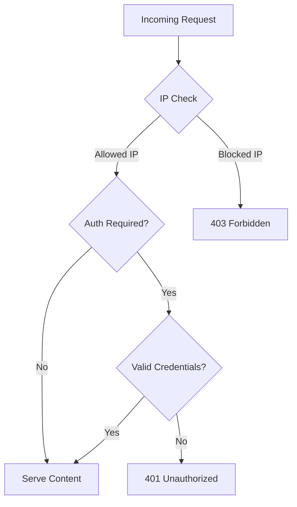

# How to Configure Apache Access Control and Authentication on RHEL 9

Author: [nawazdhandala](https://www.github.com/nawazdhandala)

Tags: RHEL, Apache, Access Control, Authentication, Linux

Description: Learn how to restrict access to directories and set up password-based authentication in Apache httpd on RHEL 9.

---

## When You Need Access Control

Not every page on your server should be public. Admin panels, staging sites, internal documentation, and API endpoints often need restricted access. Apache gives you two main tools for this: IP-based access control and password authentication.

## Prerequisites

- RHEL 9 with Apache httpd installed
- Root or sudo access

## IP-Based Access Control

### Restrict to a Specific Network

Use the `Require` directive to limit access by IP address:

```apache
# Only allow access from the 10.0.0.0/24 subnet
<Directory /var/www/html/internal>
    Require ip 10.0.0.0/24
</Directory>
```

### Allow Multiple Networks

```apache
# Allow access from two subnets and localhost
<Directory /var/www/html/admin>
    Require ip 10.0.0.0/24
    Require ip 192.168.1.0/24
    Require ip 127.0.0.1
</Directory>
```

### Deny Specific IPs

```apache
# Allow everyone except a specific IP
<Directory /var/www/html>
    <RequireAll>
        Require all granted
        Require not ip 203.0.113.50
    </RequireAll>
</Directory>
```

## Password-Based Authentication

### Step 1 - Create a Password File

Use `htpasswd` to create a password file. It ships with the `httpd-tools` package:

```bash
# Create a new password file with the first user
sudo htpasswd -c /etc/httpd/.htpasswd admin
```

The `-c` flag creates the file. To add more users later, drop the `-c`:

```bash
# Add another user to the existing file
sudo htpasswd /etc/httpd/.htpasswd developer
```

Set proper permissions on the file:

```bash
# Restrict the password file so only root and Apache can read it
sudo chown root:apache /etc/httpd/.htpasswd
sudo chmod 640 /etc/httpd/.htpasswd
```

### Step 2 - Configure Basic Authentication

Add an authentication block to your virtual host or a `.conf` file:

```apache
# Protect the /admin directory with basic authentication
<Directory /var/www/html/admin>
    AuthType Basic
    AuthName "Admin Area"
    AuthUserFile /etc/httpd/.htpasswd
    Require valid-user
</Directory>
```

When someone visits `/admin`, the browser will pop up a login prompt.

### Step 3 - Restrict to Specific Users

Instead of allowing any user in the password file, you can name specific users:

```apache
# Only allow the admin user to access this directory
<Directory /var/www/html/admin>
    AuthType Basic
    AuthName "Admin Area"
    AuthUserFile /etc/httpd/.htpasswd
    Require user admin
</Directory>
```

## Combining IP and Password Authentication

### Require Both (AND Logic)

```apache
# Must be on the right network AND provide valid credentials
<Directory /var/www/html/secure>
    <RequireAll>
        Require ip 10.0.0.0/24
        AuthType Basic
        AuthName "Secure Zone"
        AuthUserFile /etc/httpd/.htpasswd
        Require valid-user
    </RequireAll>
</Directory>
```

### Require Either (OR Logic)

```apache
# Allow if on the right network OR if credentials are provided
<Directory /var/www/html/internal>
    <RequireAny>
        Require ip 10.0.0.0/24
        <RequireAll>
            AuthType Basic
            AuthName "Internal Access"
            AuthUserFile /etc/httpd/.htpasswd
            Require valid-user
        </RequireAll>
    </RequireAny>
</Directory>
```

## Access Control Flow



## Digest Authentication

Basic authentication sends credentials in base64, which is not encrypted. Digest authentication hashes the credentials. However, the real solution is to use Basic auth over HTTPS:

```apache
# Digest authentication setup
<Directory /var/www/html/protected>
    AuthType Digest
    AuthName "private"
    AuthDigestProvider file
    AuthUserFile /etc/httpd/.htdigest
    Require valid-user
</Directory>
```

Create the digest password file:

```bash
# Create a digest auth password file
sudo htdigest -c /etc/httpd/.htdigest private admin
```

In practice, just use Basic auth with HTTPS. It is simpler and just as secure.

## Protecting a Location Instead of a Directory

Use `<Location>` when you want to match URL paths regardless of filesystem layout:

```apache
# Protect a URL path
<Location /api/admin>
    AuthType Basic
    AuthName "API Admin"
    AuthUserFile /etc/httpd/.htpasswd
    Require valid-user
</Location>
```

## Apply and Test

```bash
# Validate configuration
sudo apachectl configtest

# Reload Apache
sudo systemctl reload httpd
```

Test the authentication:

```bash
# Test without credentials (should return 401)
curl -I http://your-server/admin/

# Test with credentials
curl -u admin:yourpassword http://your-server/admin/
```

## Wrap-Up

Apache's access control is flexible enough to handle most scenarios. For public-facing sites, always combine password authentication with HTTPS so credentials are encrypted in transit. IP restrictions work well for internal tools where you control the network. The `RequireAll` and `RequireAny` containers let you build complex access policies without too much pain.
