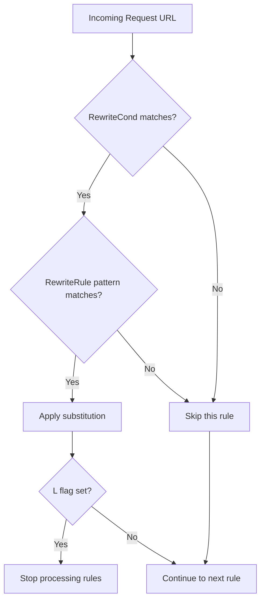

# How to Configure Apache mod_rewrite Rules on RHEL

Author: [nawazdhandala](https://www.github.com/nawazdhandala)

Tags: RHEL, Apache, Mod_rewrite, URL Rewriting, Linux

Description: A hands-on guide to writing mod_rewrite rules for URL rewriting, redirects, and clean URLs on Apache httpd in RHEL.

---

## What mod_rewrite Does

mod_rewrite is Apache's Swiss army knife for URL manipulation. It lets you redirect URLs, rewrite them internally, enforce HTTPS, add or strip trailing slashes, and route clean URLs to backend scripts. It is powerful but can be confusing if you do not understand the evaluation order.

## Prerequisites

- RHEL with Apache httpd installed
- Root or sudo access
- Basic familiarity with regular expressions

## Step 1 - Verify mod_rewrite Is Loaded

On RHEL, mod_rewrite is included with httpd and loaded by default:

```bash
# Check if mod_rewrite is loaded
httpd -M | grep rewrite
```

You should see `rewrite_module (shared)` in the output. If not, check `/etc/httpd/conf.modules.d/00-base.conf` for the LoadModule line.

## Step 2 - Enable AllowOverride for .htaccess

If you want to put rewrite rules in `.htaccess` files (common for CMS deployments), you need `AllowOverride` set:

```apache
# In your virtual host or directory block
<Directory /var/www/html>
    AllowOverride All
    Require all granted
</Directory>
```

For better performance, put rules directly in the virtual host config and leave `AllowOverride None`. Apache has to check for `.htaccess` files on every request when `AllowOverride` is enabled.

## Step 3 - Basic Redirect Rules

Redirect a single URL to a new location:

```apache
# Permanent redirect (301) from old path to new path
RewriteEngine On
RewriteRule ^/old-page$ /new-page [R=301,L]
```

Redirect an entire directory:

```apache
# Redirect everything under /blog/ to /articles/
RewriteEngine On
RewriteRule ^/blog/(.*)$ /articles/$1 [R=301,L]
```

## Step 4 - Force HTTPS with mod_rewrite

```apache
# Redirect all HTTP traffic to HTTPS
RewriteEngine On
RewriteCond %{HTTPS} off
RewriteRule ^(.*)$ https://%{HTTP_HOST}$1 [R=301,L]
```

The `RewriteCond` line ensures the rule only fires when the connection is not already encrypted.

## Step 5 - Force www or Remove www

Force the www prefix:

```apache
# Add www prefix if missing
RewriteEngine On
RewriteCond %{HTTP_HOST} !^www\. [NC]
RewriteRule ^(.*)$ https://www.%{HTTP_HOST}$1 [R=301,L]
```

Remove the www prefix:

```apache
# Strip www prefix
RewriteEngine On
RewriteCond %{HTTP_HOST} ^www\.(.+)$ [NC]
RewriteRule ^(.*)$ https://%1$1 [R=301,L]
```

## Step 6 - Clean URLs for Applications

Many web applications need clean URLs. This is the classic pattern that routes everything through a front controller:

```apache
# Route all non-file, non-directory requests to index.php
RewriteEngine On
RewriteCond %{REQUEST_FILENAME} !-f
RewriteCond %{REQUEST_FILENAME} !-d
RewriteRule ^(.*)$ /index.php?q=$1 [QSA,L]
```

The `QSA` flag appends any existing query string. The `L` flag stops processing further rules.

## Step 7 - Block Specific User Agents

```apache
# Block a known bad bot
RewriteEngine On
RewriteCond %{HTTP_USER_AGENT} "BadBot" [NC]
RewriteRule .* - [F]
```

The `[F]` flag returns a 403 Forbidden response.

## Understanding Rule Evaluation



## Common Flags Reference

| Flag | Meaning |
|------|---------|
| `[R=301]` | External redirect with 301 status |
| `[R=302]` | Temporary redirect (default if just `[R]`) |
| `[L]` | Last rule, stop processing |
| `[F]` | Forbidden, return 403 |
| `[QSA]` | Append query string |
| `[NC]` | Case-insensitive match |
| `[P]` | Proxy the request (needs mod_proxy) |
| `[PT]` | Pass through to next handler |

## Step 8 - Debugging Rewrite Rules

Enable the rewrite log to trace what is happening:

```apache
# Add to your virtual host for debugging
LogLevel alert rewrite:trace3
```

Then watch the error log:

```bash
# Follow the error log to see rewrite debug output
sudo tail -f /var/log/httpd/error_log
```

Set the trace level between 1 (minimal) and 8 (maximum). Use level 3 for most debugging. Turn it off in production because it generates a lot of output.

## Step 9 - Test and Reload

```bash
# Validate configuration
sudo apachectl configtest

# Reload to apply changes
sudo systemctl reload httpd
```

Test your rules with curl:

```bash
# Follow redirects and show headers
curl -ILs http://example.com/old-page
```

## Wrap-Up

mod_rewrite is one of those tools that looks intimidating at first but becomes second nature once you understand the condition-then-rule pattern. Start simple, test each rule individually, and use the rewrite trace log when things do not behave as expected. For production, always put rules in the virtual host config rather than .htaccess files for better performance.
