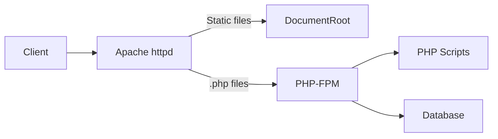

# How to Configure Apache with PHP-FPM on RHEL

Author: [nawazdhandala](https://www.github.com/nawazdhandala)

Tags: RHEL, Apache, PHP-FPM, Linux

Description: How to set up Apache httpd with PHP-FPM on RHEL for better PHP performance compared to mod_php.

---

## Why PHP-FPM Instead of mod_php?

mod_php embeds the PHP interpreter into every Apache process, which means every process uses PHP memory even when serving static files. PHP-FPM (FastCGI Process Manager) runs PHP as a separate service. Apache handles HTTP, PHP-FPM handles PHP scripts, and they communicate over a socket or TCP port. This lets you use the event MPM (instead of prefork) and scale each piece independently.

## Prerequisites

- RHEL with Apache httpd installed
- Root or sudo access

## Step 1 - Install PHP and PHP-FPM

Install PHP and the FPM package from the AppStream repository:

```bash
# Install PHP, PHP-FPM, and common extensions
sudo dnf install -y php php-fpm php-mysqlnd php-json php-mbstring php-xml php-zip
```

Check the installed PHP version:

```bash
# Verify PHP version
php -v
```

## Step 2 - Configure PHP-FPM

The main PHP-FPM config is at `/etc/php-fpm.d/www.conf`. Review the key settings:

```bash
# Open the PHP-FPM pool configuration
sudo vi /etc/php-fpm.d/www.conf
```

Important settings to check:

```ini
; Run as apache user to match Apache
user = apache
group = apache

; Use a Unix socket for better performance
listen = /run/php-fpm/www.sock
listen.owner = apache
listen.group = apache
listen.mode = 0660

; Process manager settings
pm = dynamic
pm.max_children = 50
pm.start_servers = 5
pm.min_spare_servers = 5
pm.max_spare_servers = 35
```

The `pm = dynamic` setting creates processes on demand. For high-traffic sites, consider `pm = static` with a fixed number of children.

## Step 3 - Configure Apache to Use PHP-FPM

RHEL usually creates `/etc/httpd/conf.d/php.conf` automatically. If it does not exist or needs adjustment:

```bash
# Create or update the PHP-FPM configuration for Apache
sudo tee /etc/httpd/conf.d/php.conf > /dev/null <<'EOF'
# Route PHP requests to PHP-FPM via the Unix socket
<FilesMatch \.php$>
    SetHandler "proxy:unix:/run/php-fpm/www.sock|fcgi://localhost"
</FilesMatch>

# Set the default directory index to include index.php
DirectoryIndex index.php index.html
EOF
```

## Step 4 - Switch to the Event MPM

Since we are not using mod_php, we can switch from prefork to the faster event MPM:

```bash
# Edit the MPM configuration
sudo vi /etc/httpd/conf.modules.d/00-mpm.conf
```

Make sure the event module is uncommented and prefork is commented out:

```apache
# Use the event MPM for better performance with PHP-FPM
LoadModule mpm_event_module modules/mod_mpm_event.so
#LoadModule mpm_prefork_module modules/mod_mpm_prefork.so
#LoadModule mpm_worker_module modules/mod_mpm_worker.so
```

## Step 5 - Start PHP-FPM and Restart Apache

```bash
# Enable and start PHP-FPM
sudo systemctl enable --now php-fpm

# Restart Apache (not just reload, because we changed the MPM)
sudo systemctl restart httpd
```

## Step 6 - Test the Setup

Create a PHP info page:

```bash
# Create a test PHP file
sudo tee /var/www/html/info.php > /dev/null <<'EOF'
<?php phpinfo(); ?>
EOF
```

Open `http://your-server-ip/info.php` in a browser. You should see the PHP info page. Look for the `Server API` line, which should say `FPM/FastCGI`.

Remove the test file when done:

```bash
# Remove the info page (it exposes sensitive information)
sudo rm /var/www/html/info.php
```

## Step 7 - Using TCP Instead of Unix Socket

If PHP-FPM runs on a different server, use TCP:

In `/etc/php-fpm.d/www.conf`:

```ini
; Use TCP instead of Unix socket
listen = 127.0.0.1:9000
```

In the Apache config:

```apache
# Route PHP to a TCP-based PHP-FPM instance
<FilesMatch \.php$>
    SetHandler "proxy:fcgi://127.0.0.1:9000"
</FilesMatch>
```

## Architecture Overview



## Step 8 - Tune PHP-FPM Pool Settings

Calculate `pm.max_children` based on available memory:

```bash
# Check average PHP-FPM process memory usage
ps --no-headers -o rss -C php-fpm | awk '{sum += $1; count++} END {print "Avg:", sum/count/1024, "MB"}'
```

If each process uses 50 MB and you have 2 GB for PHP-FPM, set `pm.max_children = 40`.

For production with steady traffic:

```ini
; Static pool for predictable performance
pm = static
pm.max_children = 40
pm.max_requests = 500
```

`pm.max_requests` recycles workers after handling that many requests, preventing memory leaks.

## Step 9 - PHP-FPM Status Page

Enable the status page for monitoring:

In `/etc/php-fpm.d/www.conf`:

```ini
; Enable the status page
pm.status_path = /fpm-status
```

In Apache:

```apache
# Expose PHP-FPM status to localhost
<Location /fpm-status>
    SetHandler "proxy:unix:/run/php-fpm/www.sock|fcgi://localhost/fpm-status"
    Require ip 127.0.0.1
</Location>
```

Restart both services and check:

```bash
# View FPM status
curl http://localhost/fpm-status
```

## Wrap-Up

PHP-FPM with Apache on RHEL is the recommended setup for PHP applications. It is faster and more memory-efficient than mod_php, and it lets you use the event MPM. Size the pool based on your memory and traffic, use Unix sockets when PHP-FPM and Apache are on the same box, and always remove the phpinfo test page after verifying the setup.
