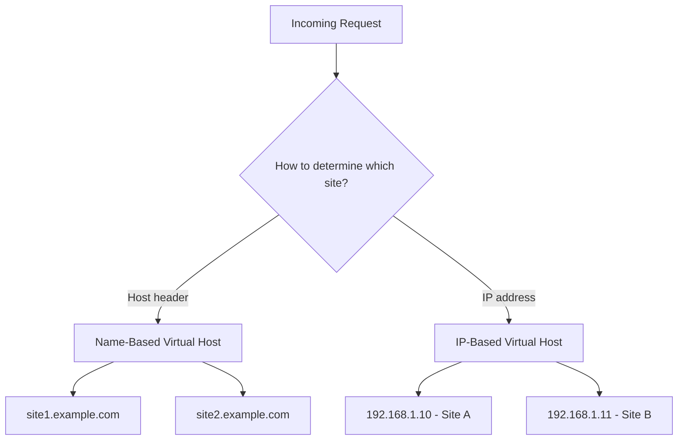

# How to Configure Apache Virtual Hosts on RHEL

Author: [nawazdhandala](https://www.github.com/nawazdhandala)

Tags: RHEL, Apache, Virtual Hosts, Web Server, Linux

Description: Step-by-step instructions for configuring name-based and IP-based Apache virtual hosts on RHEL to host multiple websites on a single server.

---

Virtual hosts let you run multiple websites on a single Apache server. Each site gets its own configuration, document root, and log files. RHEL makes this straightforward with Apache's drop-in configuration directory. This guide covers both name-based virtual hosts (most common) and IP-based virtual hosts.

## Prerequisites

- A RHEL system with Apache installed and running
- DNS records pointing your domains to the server (or local /etc/hosts entries for testing)
- Root or sudo access

## Understanding Virtual Host Types



Name-based virtual hosts are far more common since they allow multiple sites on a single IP address.

## Step 1: Create Directory Structure

```bash
# Create document roots for two websites
sudo mkdir -p /var/www/site1.example.com/public_html
sudo mkdir -p /var/www/site2.example.com/public_html

# Create log directories
sudo mkdir -p /var/www/site1.example.com/logs
sudo mkdir -p /var/www/site2.example.com/logs

# Set ownership to the apache user
sudo chown -R apache:apache /var/www/site1.example.com
sudo chown -R apache:apache /var/www/site2.example.com

# Set correct permissions
sudo chmod -R 755 /var/www/site1.example.com
sudo chmod -R 755 /var/www/site2.example.com
```

## Step 2: Create Test Pages

```bash
# Create an index page for site1
cat <<'EOF' | sudo tee /var/www/site1.example.com/public_html/index.html
<!DOCTYPE html>
<html>
<head><title>Site 1</title></head>
<body><h1>Welcome to Site 1</h1></body>
</html>
EOF

# Create an index page for site2
cat <<'EOF' | sudo tee /var/www/site2.example.com/public_html/index.html
<!DOCTYPE html>
<html>
<head><title>Site 2</title></head>
<body><h1>Welcome to Site 2</h1></body>
</html>
EOF
```

## Step 3: Create Virtual Host Configuration Files

Create a separate config file for each virtual host in the drop-in directory.

```bash
# Virtual host configuration for site1
cat <<'EOF' | sudo tee /etc/httpd/conf.d/site1.example.com.conf
# Virtual host for site1.example.com
<VirtualHost *:80>
    # The domain name this virtual host responds to
    ServerName site1.example.com

    # Additional domain aliases
    ServerAlias www.site1.example.com

    # Administrator email for this site
    ServerAdmin admin@site1.example.com

    # Where the website files are stored
    DocumentRoot /var/www/site1.example.com/public_html

    # Directory permissions
    <Directory /var/www/site1.example.com/public_html>
        Options -Indexes +FollowSymLinks
        AllowOverride All
        Require all granted
    </Directory>

    # Separate log files for this site
    ErrorLog /var/www/site1.example.com/logs/error.log
    CustomLog /var/www/site1.example.com/logs/access.log combined
</VirtualHost>
EOF
```

```bash
# Virtual host configuration for site2
cat <<'EOF' | sudo tee /etc/httpd/conf.d/site2.example.com.conf
# Virtual host for site2.example.com
<VirtualHost *:80>
    ServerName site2.example.com
    ServerAlias www.site2.example.com
    ServerAdmin admin@site2.example.com
    DocumentRoot /var/www/site2.example.com/public_html

    <Directory /var/www/site2.example.com/public_html>
        Options -Indexes +FollowSymLinks
        AllowOverride All
        Require all granted
    </Directory>

    ErrorLog /var/www/site2.example.com/logs/error.log
    CustomLog /var/www/site2.example.com/logs/access.log combined
</VirtualHost>
EOF
```

## Step 4: Set SELinux Contexts

```bash
# Set the correct SELinux context for the website directories
sudo semanage fcontext -a -t httpd_sys_content_t "/var/www/site1.example.com(/.*)?"
sudo semanage fcontext -a -t httpd_sys_content_t "/var/www/site2.example.com(/.*)?"

# Set the log directory context
sudo semanage fcontext -a -t httpd_log_t "/var/www/site1.example.com/logs(/.*)?"
sudo semanage fcontext -a -t httpd_log_t "/var/www/site2.example.com/logs(/.*)?"

# Apply the contexts
sudo restorecon -Rv /var/www/site1.example.com
sudo restorecon -Rv /var/www/site2.example.com
```

## Step 5: Test and Apply Configuration

```bash
# Check configuration syntax
sudo apachectl configtest

# If syntax is OK, reload Apache
sudo systemctl reload httpd

# Verify which virtual hosts are configured
sudo httpd -S
```

## Step 6: Test the Virtual Hosts

If you do not have DNS set up, add entries to your local hosts file:

```bash
# On your local machine (not the server), add to /etc/hosts
# Replace 192.168.1.100 with your server IP
192.168.1.100  site1.example.com www.site1.example.com
192.168.1.100  site2.example.com www.site2.example.com
```

Test with curl:

```bash
# Test site1
curl -H "Host: site1.example.com" http://192.168.1.100

# Test site2
curl -H "Host: site2.example.com" http://192.168.1.100
```

## Setting Up a Default Virtual Host

Requests that do not match any virtual host go to the first virtual host defined. Create an explicit default:

```bash
cat <<'EOF' | sudo tee /etc/httpd/conf.d/000-default.conf
# Default virtual host for unmatched requests
<VirtualHost *:80>
    ServerName default
    DocumentRoot /var/www/html

    <Directory /var/www/html>
        Require all granted
    </Directory>

    ErrorLog logs/default-error.log
    CustomLog logs/default-access.log combined
</VirtualHost>
EOF
```

## IP-Based Virtual Hosts

If your server has multiple IP addresses, you can bind each site to a specific IP:

```bash
# IP-based virtual host on 192.168.1.10
<VirtualHost 192.168.1.10:80>
    ServerName siteA.example.com
    DocumentRoot /var/www/siteA/public_html
</VirtualHost>

# IP-based virtual host on 192.168.1.11
<VirtualHost 192.168.1.11:80>
    ServerName siteB.example.com
    DocumentRoot /var/www/siteB/public_html
</VirtualHost>
```

## Troubleshooting

```bash
# List all configured virtual hosts and their settings
sudo httpd -S

# Check for configuration errors
sudo apachectl configtest

# Look at site-specific error logs
sudo tail -f /var/www/site1.example.com/logs/error.log

# Check SELinux denials
sudo ausearch -m avc -ts recent | grep httpd

# Verify files have the correct SELinux context
ls -lZ /var/www/site1.example.com/public_html/
```

## Summary

You now have multiple websites running on a single Apache server on RHEL. Each virtual host has its own document root, log files, and configuration. Name-based virtual hosts are the preferred approach since they allow hosting many sites on one IP address. Remember to set proper SELinux contexts for any content outside the default document root.
