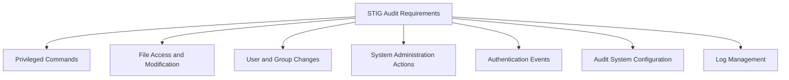

# How to Configure auditd for STIG Compliance on RHEL

Author: [nawazdhandala](https://www.github.com/nawazdhandala)

Tags: RHEL, Auditd, STIG, Compliance, Security, DISA, Linux

Description: Configure the Linux audit system on RHEL to meet DISA STIG requirements with the correct audit rules, daemon settings, and log management.

---

The Defense Information Systems Agency (DISA) Security Technical Implementation Guide (STIG) defines strict auditing requirements for systems processing government data. On RHEL, meeting these requirements means configuring auditd with specific rules, settings, and behaviors. This guide walks through the STIG-required audit configuration step by step.

## STIG Audit Requirements Overview

The RHEL STIG requires auditing in several categories:



## Step 1: Configure auditd.conf

The STIG requires specific daemon settings:

```bash
sudo tee /etc/audit/auditd.conf << 'EOF'
# STIG-compliant auditd configuration
local_events = yes
write_logs = yes
log_file = /var/log/audit/audit.log
log_group = root
log_format = ENRICHED
flush = INCREMENTAL_ASYNC
freq = 50
max_log_file = 25
num_logs = 5
priority_boost = 4
name_format = hostname
max_log_file_action = ROTATE
space_left = 25%
space_left_action = email
action_mail_acct = root
verify_email = yes
admin_space_left = 50
admin_space_left_action = single
disk_full_action = HALT
disk_error_action = HALT
use_libwrap = yes
tcp_listen_queue = 5
tcp_max_per_addr = 1
tcp_client_max_idle = 0
distribute_network = no
EOF
```

Key STIG requirements:
- `disk_full_action = HALT` - The system must halt when the audit log disk is full
- `disk_error_action = HALT` - The system must halt on disk errors
- `space_left_action = email` - Alert administrators when space is low
- `max_log_file_action = ROTATE` - Rotate logs to preserve audit data

## Step 2: Base Audit Rules

```bash
sudo tee /etc/audit/rules.d/10-base.rules << 'EOF'
## STIG Base Rules
## Remove any existing rules
-D

## Set buffer size (STIG requires adequate buffer)
-b 8192

## Set failure mode to panic (STIG requirement)
## 2 = kernel panic on audit failure
-f 2

## Set backlog wait time
--backlog_wait_time 60000
EOF
```

## Step 3: Identity and Authentication Rules

```bash
sudo tee /etc/audit/rules.d/20-identity.rules << 'EOF'
## STIG: Monitor identity files

# Monitor user/group identity files
-w /etc/passwd -p wa -k identity
-w /etc/shadow -p wa -k identity
-w /etc/group -p wa -k identity
-w /etc/gshadow -p wa -k identity
-w /etc/security/opasswd -p wa -k identity

# Monitor sudoers
-w /etc/sudoers -p wa -k actions
-w /etc/sudoers.d/ -p wa -k actions

# Monitor PAM configuration
-w /etc/pam.d/ -p wa -k pam

# Monitor authentication configuration
-w /etc/nsswitch.conf -p wa -k auth_config
-w /etc/login.defs -p wa -k login_config
-w /etc/securetty -p wa -k securetty
-w /etc/security/limits.conf -p wa -k limits
-w /etc/security/limits.d/ -p wa -k limits
EOF
```

## Step 4: Privileged Command Auditing

The STIG requires auditing all setuid and setgid programs:

```bash
# Generate rules for all privileged commands
sudo tee /usr/local/bin/gen-privileged-rules.sh << 'SCRIPT'
#!/bin/bash
# Generate STIG audit rules for privileged commands

RULES_FILE="/etc/audit/rules.d/30-privileged.rules"

echo "## STIG: Audit privileged command execution" > "$RULES_FILE"
echo "## Auto-generated - do not edit manually" >> "$RULES_FILE"

# Find all setuid and setgid executables
find / -xdev \( -perm -4000 -o -perm -2000 \) -type f 2>/dev/null | \
while read -r prog; do
    echo "-a always,exit -F path=${prog} -F perm=x -F auid>=1000 -F auid!=4294967295 -k privileged" >> "$RULES_FILE"
done

echo "Privileged command rules written to $RULES_FILE"
SCRIPT

sudo chmod +x /usr/local/bin/gen-privileged-rules.sh
sudo /usr/local/bin/gen-privileged-rules.sh
```

## Step 5: System Call Audit Rules

```bash
sudo tee /etc/audit/rules.d/40-syscalls.rules << 'EOF'
## STIG: System call audit rules

# File deletion events
-a always,exit -F arch=b64 -S unlink -S unlinkat -S rename -S renameat -F auid>=1000 -F auid!=4294967295 -k delete
-a always,exit -F arch=b32 -S unlink -S unlinkat -S rename -S renameat -F auid>=1000 -F auid!=4294967295 -k delete

# File permission changes
-a always,exit -F arch=b64 -S chmod -S fchmod -S fchmodat -F auid>=1000 -F auid!=4294967295 -k perm_mod
-a always,exit -F arch=b32 -S chmod -S fchmod -S fchmodat -F auid>=1000 -F auid!=4294967295 -k perm_mod

# File ownership changes
-a always,exit -F arch=b64 -S chown -S fchown -S lchown -S fchownat -F auid>=1000 -F auid!=4294967295 -k perm_mod
-a always,exit -F arch=b32 -S chown -S fchown -S lchown -S fchownat -F auid>=1000 -F auid!=4294967295 -k perm_mod

# Extended attribute changes
-a always,exit -F arch=b64 -S setxattr -S lsetxattr -S fsetxattr -S removexattr -S lremovexattr -S fremovexattr -F auid>=1000 -F auid!=4294967295 -k perm_mod
-a always,exit -F arch=b32 -S setxattr -S lsetxattr -S fsetxattr -S removexattr -S lremovexattr -S fremovexattr -F auid>=1000 -F auid!=4294967295 -k perm_mod

# Unauthorized access attempts (failed file opens)
-a always,exit -F arch=b64 -S open -S openat -S truncate -S ftruncate -F exit=-EACCES -F auid>=1000 -F auid!=4294967295 -k access
-a always,exit -F arch=b64 -S open -S openat -S truncate -S ftruncate -F exit=-EPERM -F auid>=1000 -F auid!=4294967295 -k access
-a always,exit -F arch=b32 -S open -S openat -S truncate -S ftruncate -F exit=-EACCES -F auid>=1000 -F auid!=4294967295 -k access
-a always,exit -F arch=b32 -S open -S openat -S truncate -S ftruncate -F exit=-EPERM -F auid>=1000 -F auid!=4294967295 -k access

# Kernel module operations
-a always,exit -F arch=b64 -S init_module -S finit_module -S delete_module -k modules
-w /usr/bin/kmod -p x -k modules

# Mount operations
-a always,exit -F arch=b64 -S mount -F auid>=1000 -F auid!=4294967295 -k mounts
-a always,exit -F arch=b32 -S mount -F auid>=1000 -F auid!=4294967295 -k mounts

# Time changes
-a always,exit -F arch=b64 -S adjtimex -S settimeofday -k time-change
-a always,exit -F arch=b64 -S clock_settime -F a0=0x0 -k time-change
-w /etc/localtime -p wa -k time-change

# Network configuration changes
-a always,exit -F arch=b64 -S sethostname -S setdomainname -k system-locale
-w /etc/hostname -p wa -k system-locale
-w /etc/hosts -p wa -k system-locale
-w /etc/sysconfig/network -p wa -k system-locale

# Session initiation
-w /var/run/utmp -p wa -k session
-w /var/log/wtmp -p wa -k session
-w /var/log/btmp -p wa -k session

# Login and logout
-w /var/log/lastlog -p wa -k logins
-w /var/log/faillock/ -p wa -k logins
EOF
```

## Step 6: Audit Configuration Self-Protection

```bash
sudo tee /etc/audit/rules.d/50-audit-self.rules << 'EOF'
## STIG: Protect the audit configuration itself

# Monitor changes to audit configuration
-w /etc/audit/ -p wa -k audit-config
-w /etc/audit/auditd.conf -p wa -k audit-config
-w /etc/audit/rules.d/ -p wa -k audit-config

# Monitor the audit tools
-w /usr/sbin/auditctl -p x -k audit-tools
-w /usr/sbin/auditd -p x -k audit-tools
-w /usr/sbin/augenrules -p x -k audit-tools
EOF
```

## Step 7: Make Rules Immutable

```bash
sudo tee /etc/audit/rules.d/99-finalize.rules << 'EOF'
## STIG: Make rules immutable (required)
-e 2
EOF
```

## Step 8: Load and Verify

```bash
# Load all rules
sudo augenrules --load

# Verify rules are loaded
sudo auditctl -l | wc -l

# Verify immutable mode
sudo auditctl -s | grep enabled
# Should show: enabled 2

# Reload the daemon to pick up auditd.conf changes
sudo service auditd reload
```

## Step 9: Verify STIG Compliance

Check specific STIG requirements:

```bash
# Verify audit is running
sudo systemctl is-active auditd

# Verify audit is enabled at boot
sudo systemctl is-enabled auditd

# Verify grub does not disable audit
grep -i "audit" /etc/default/grub
# Should contain audit=1 or not have audit=0

# Verify disk_full_action
grep disk_full_action /etc/audit/auditd.conf
# Should be HALT

# Verify space_left_action
grep space_left_action /etc/audit/auditd.conf
# Should be email
```

## Using SCAP for Automated Compliance Checking

You can use OpenSCAP to automatically verify STIG compliance:

```bash
# Install OpenSCAP
sudo dnf install openscap-scanner scap-security-guide

# Run a STIG compliance scan
sudo oscap xccdf eval \
    --profile xccdf_org.ssgproject.content_profile_stig \
    --results /tmp/stig-results.xml \
    --report /tmp/stig-report.html \
    /usr/share/xml/scap/ssg/content/ssg-rhel9-ds.xml
```

## Summary

Configuring auditd for STIG compliance on RHEL requires attention to many details: the daemon configuration must halt on disk errors, audit rules must cover privileged commands, file modifications, authentication events, and system call monitoring, and the rules must be locked with the immutable flag. Use the provided rule files as a starting point and validate compliance with OpenSCAP scans.
