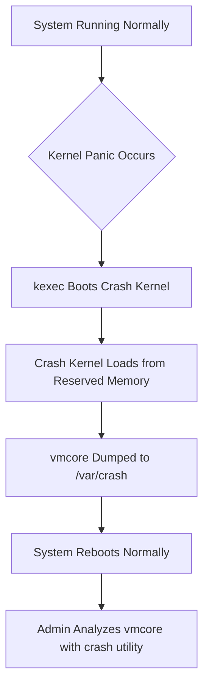

# How to Configure Automatic Crash Dumps with kdump on RHEL

Author: [nawazdhandala](https://www.github.com/nawazdhandala)

Tags: RHEL, Kdump, Crash Dumps, Debugging, Linux, System Administration

Description: Set up kdump on RHEL to automatically capture crash dumps when your system panics. This guide covers installation, configuration, testing, and analyzing vmcore files.

---

A kernel panic on a production server is bad enough. A kernel panic with no crash dump to investigate is worse. kdump is the standard tool on RHEL for capturing the state of memory when the kernel crashes, giving you a vmcore file you can analyze after the fact to figure out what went wrong.

I have been running kdump on every RHEL server I manage for years. It has saved me more than once when tracking down a buggy kernel module or a hardware issue that only showed up under load. Here is how to set it up properly on RHEL.

---

## How kdump Works

The basic idea is straightforward. RHEL reserves a chunk of memory at boot time for a secondary "crash kernel." When the primary kernel panics, it boots into this crash kernel, which then dumps the contents of memory to disk. Because the crash kernel is loaded into reserved memory, it is not affected by whatever corruption caused the panic.



---

## Installing and Enabling kdump

On a minimal RHEL install, kdump might not be installed. Let's fix that:

```bash
# Install the kdump tools and crash analysis utility
sudo dnf install kexec-tools crash kernel-debuginfo -y
```

The `kexec-tools` package provides kdump itself. The `crash` utility is what you use to analyze the dump files later. The `kernel-debuginfo` package provides the symbols needed for meaningful analysis.

Enable the kdump service so it starts on every boot:

```bash
# Enable kdump to start at boot and start it now
sudo systemctl enable --now kdump
```

Check that it is running:

```bash
# Verify kdump is active
sudo systemctl status kdump
```

You should see "active (exited)" in the output. kdump loads the crash kernel into memory and then exits, so that status is normal.

---

## Configuring the crashkernel Boot Parameter

RHEL usually sets the `crashkernel` parameter automatically during installation. You can verify it is present in your boot configuration:

```bash
# Check the current crashkernel setting
cat /proc/cmdline | tr ' ' '\n' | grep crashkernel
```

On RHEL with the default configuration, you should see something like `crashkernel=1G-4G:192M,4G-64G:256M,64G-:512M`. This is the auto-scaling syntax that reserves different amounts of memory based on total system RAM.

If the parameter is missing or you need to change it, use `grubby`:

```bash
# Set crashkernel to reserve 256M for systems with enough RAM
sudo grubby --update-kernel=ALL --args="crashkernel=256M"
```

After changing the boot parameter, you need to reboot for it to take effect:

```bash
# Reboot to apply the new crashkernel setting
sudo reboot
```

After reboot, verify the memory was reserved:

```bash
# Confirm crash kernel memory is reserved
dmesg | grep -i "crash kernel"
```

You should see a message like "Reserving 256MB of memory at [address] for crashkernel."

---

## Understanding /etc/kdump.conf

The main configuration file controls where and how crash dumps are saved. Let's look at the key settings:

```bash
# View the active (non-commented) settings
grep -v "^#" /etc/kdump.conf | grep -v "^$"
```

Here are the most important options you will want to set:

```bash
# /etc/kdump.conf - Key settings explained

# Where to save the dump (path relative to the filesystem root)
path /var/crash

# What to capture. This controls how much data goes into the dump.
# Level 31 skips zero pages, cache, user data - good balance of size vs info
core_collector makedumpfile -l --message-level 7 -d 31

# What to do after the dump is saved
default reboot
```

The `core_collector` line is the most important tuning knob. The `-d` flag sets the dump level, which controls what pages are excluded:

| Level | What Gets Excluded |
|-------|-------------------|
| 0 | Nothing excluded (full dump) |
| 1 | Zero-filled pages |
| 17 | Zero pages + free pages |
| 31 | Zero + cache + free + user pages |

Level 31 is usually the right choice. It gives you kernel memory, which is what you need for debugging panics, while keeping the dump file manageable in size.

### Saving Dumps to a Remote Server

If your local disk might be part of the problem (say, a storage driver panic), you can send dumps over the network:

```bash
# Save dumps to a remote server via SSH
ssh user@crashserver.example.com
path /var/crash/remote-dumps
```

Or via NFS:

```bash
# Save dumps to an NFS share
nfs crashserver.example.com:/var/crash/nfs-dumps
```

After making any changes to `/etc/kdump.conf`, restart the service:

```bash
# Restart kdump to pick up config changes
sudo systemctl restart kdump
```

---

## Testing kdump

You absolutely must test kdump before you need it. There is nothing worse than finding out your crash dump setup is broken during an actual incident.

First, make sure kdump is loaded and ready:

```bash
# Verify the crash kernel is loaded
sudo kdumpctl status
```

You should see "kdump: Kdump is operational." If not, check the journal for errors:

```bash
# Check kdump logs for issues
sudo journalctl -u kdump --no-pager -n 20
```

When you are ready to test, trigger a manual panic. This will crash the system, so do this on a test machine or during a maintenance window:

```bash
# Trigger a kernel panic to test kdump (THIS WILL CRASH THE SYSTEM)
echo 1 | sudo tee /proc/sys/kernel/sysrq
echo c | sudo tee /proc/sysrq-trigger
```

The system will panic, the crash kernel will boot, the dump will be saved, and the system will reboot. After it comes back up, check for the dump:

```bash
# List crash dump files
ls -la /var/crash/
```

You should see a timestamped directory containing a `vmcore` file and a `vmcore-dmesg.txt` file.

---

## Analyzing a vmcore File

The `vmcore-dmesg.txt` file is the quick win. It contains the kernel log buffer at the time of the crash, which often tells you exactly what happened:

```bash
# Check the kernel log from the crash
cat /var/crash/127.0.0.1-2026-03-04-15\:30\:00/vmcore-dmesg.txt | tail -50
```

For deeper analysis, use the `crash` utility:

```bash
# Open the crash dump for analysis
sudo crash /usr/lib/debug/lib/modules/$(uname -r)/vmlinux /var/crash/127.0.0.1-2026-03-04-15\:30\:00/vmcore
```

Once inside the crash shell, here are the commands you will use most:

```bash
# Show the panic message and call trace
crash> bt

# Display system information
crash> sys

# Show all processes at the time of the crash
crash> ps

# Show kernel log buffer
crash> log

# Display memory usage statistics
crash> kmem -i

# Show loaded kernel modules
crash> mod

# Exit the crash utility
crash> quit
```

The `bt` (backtrace) command is usually the first thing you run. It shows you the call stack that led to the panic, which points you toward the responsible code or module.

---

## Managing Disk Space

Crash dumps can be large, especially on systems with lots of RAM. Set up automatic cleanup to avoid filling your disk:

```bash
# Check how much space crash dumps are using
du -sh /var/crash/*
```

You can add a cron job or systemd timer to clean up old dumps:

```bash
# Remove crash dumps older than 30 days
find /var/crash -type d -mtime +30 -exec rm -rf {} + 2>/dev/null
```

---

## Troubleshooting Common Issues

**kdump fails to start:** Usually a memory reservation problem. Check that `crashkernel` is set in your boot parameters and that you have enough RAM. On systems with less than 2GB, you might need to reduce the reservation.

**Dump file is incomplete:** Increase the `crashkernel` memory reservation. The crash kernel needs enough memory to run and write the dump.

**Cannot load kernel debuginfo:** Make sure the `kernel-debuginfo` package version matches your running kernel exactly:

```bash
# Check running kernel version
uname -r

# Install matching debuginfo
sudo dnf install kernel-debuginfo-$(uname -r)
```

---

## Wrapping Up

kdump is one of those services that sits quietly in the background until you desperately need it. Setting it up takes ten minutes. Not having it when a production kernel panics costs you hours of guesswork. Configure it, test it, and check on it after kernel updates. Future you will be grateful.
