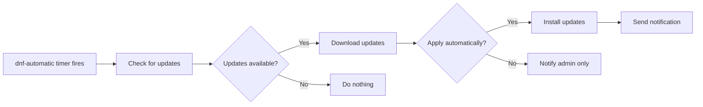

# How to Configure Automatic Security Updates on RHEL

Author: [nawazdhandala](https://www.github.com/nawazdhandala)

Tags: RHEL, Security Updates, Automation, Linux

Description: Set up automatic security updates on RHEL using dnf-automatic so critical patches are applied promptly without manual intervention.

---

Unpatched vulnerabilities are one of the most common ways systems get compromised. The problem is not that administrators do not know they should patch - it is that patching gets deprioritized when things are busy. Automatic security updates solve this by applying critical fixes without waiting for someone to run dnf update manually.

On RHEL, the tool for this is dnf-automatic. It integrates with systemd timers and gives you fine-grained control over what gets updated and when.

## Install dnf-automatic

```bash
# Install the dnf-automatic package
dnf install -y dnf-automatic

# Verify the installation
rpm -qi dnf-automatic
```

## Understanding the Configuration

The main configuration file is `/etc/dnf/automatic.conf`. It controls what gets downloaded, what gets applied, and how you get notified.



## Configure for Security-Only Updates

The safest approach is to automatically apply only security updates, not feature updates or bugfixes:

```bash
# Back up the original configuration
cp /etc/dnf/automatic.conf /etc/dnf/automatic.conf.bak

# Edit the configuration
cat > /etc/dnf/automatic.conf << 'EOF'
[commands]
# Only apply security updates automatically
upgrade_type = security

# Actually apply the updates (not just download)
apply_updates = yes

# How to handle package manager confirmations
download_updates = yes

# Random sleep before running (0 to 3600 seconds)
# Prevents all servers from hitting the repo at the same time
random_sleep = 3600

[emitters]
# How to send notifications
emit_via = stdio

[email]
# Email notification settings (if using email)
email_from = root@localhost
email_to = root
email_host = localhost

[command]
# Command to run for notifications (if using command emitter)

[base]
# Exclude specific packages from automatic updates if needed
# excludepkgs =
debuglevel = 1
EOF
```

## Enable the Systemd Timer

dnf-automatic uses a systemd timer, not cron. There are actually several timer options:

```bash
# Available timers:
# dnf-automatic.timer           - download and apply (runs at 6am)
# dnf-automatic-download.timer  - download only
# dnf-automatic-install.timer   - download and install
# dnf-automatic-notifyonly.timer - check and notify only

# Enable the main timer for automatic security updates
systemctl enable --now dnf-automatic.timer

# Verify the timer is active
systemctl status dnf-automatic.timer

# Check when it will next run
systemctl list-timers dnf-automatic.timer
```

## Customize the Timer Schedule

By default, dnf-automatic runs daily at 6:00 AM with a random delay. You can customize this:

```bash
# Create an override for the timer
mkdir -p /etc/systemd/system/dnf-automatic.timer.d/

cat > /etc/systemd/system/dnf-automatic.timer.d/override.conf << 'EOF'
[Timer]
# Clear the default schedule
OnCalendar=
# Run at 2:00 AM every day
OnCalendar=*-*-* 02:00:00
# Random delay up to 1 hour to stagger across fleet
RandomizedDelaySec=3600
EOF

# Reload systemd to pick up the change
systemctl daemon-reload

# Verify the new schedule
systemctl list-timers dnf-automatic.timer
```

## Set Up Email Notifications

To receive email notifications about applied updates:

```bash
# Edit /etc/dnf/automatic.conf and set:
# emit_via = email
# email_from = rhel-updates@yourdomain.com
# email_to = sysadmin@yourdomain.com
# email_host = smtp.yourdomain.com

# Make sure postfix or another MTA is installed and running
dnf install -y postfix
systemctl enable --now postfix
```

## Exclude Specific Packages

Some packages should not be updated automatically because they need testing first, like the kernel or database packages:

```bash
# Add exclusions to /etc/dnf/automatic.conf under [base]
# excludepkgs = kernel* postgresql* mysql*

# Or set them in the main dnf config
echo "exclude=kernel* postgresql*" >> /etc/dnf/dnf.conf
```

## Monitor Update Activity

Check what dnf-automatic has done:

```bash
# View the dnf-automatic service logs
journalctl -u dnf-automatic.service --since "1 week ago"

# Check dnf history for recent transactions
dnf history list --reverse | tail -20

# Get details about a specific transaction
dnf history info last
```

## Test the Configuration

Before trusting automatic updates in production, test manually:

```bash
# Do a dry run to see what would be updated
dnf updateinfo list security

# Run dnf-automatic manually to test the full workflow
/usr/bin/dnf-automatic /etc/dnf/automatic.conf

# Check the output in the journal
journalctl -u dnf-automatic.service -n 50
```

## Handle Reboots After Kernel Updates

Security updates sometimes include kernel patches that require a reboot. You can handle this automatically or manually:

```bash
# Check if a reboot is needed
needs-restarting -r
echo $?
# Exit code 0 = no reboot needed
# Exit code 1 = reboot needed

# Automate reboot checks with a cron job
cat > /etc/cron.daily/check-reboot << 'SCRIPT'
#!/bin/bash
if ! needs-restarting -r > /dev/null 2>&1; then
    echo "Reboot required on $(hostname)" | mail -s "Reboot needed" root
fi
SCRIPT
chmod +x /etc/cron.daily/check-reboot
```

For environments where unplanned reboots are acceptable, you can add an automatic reboot:

```bash
# Add this to the reboot check script (use with caution)
# if ! needs-restarting -r > /dev/null 2>&1; then
#     /usr/sbin/shutdown -r +5 "Automatic reboot for kernel security update"
# fi
```

## Considerations for Production Environments

Automatic security updates work well for most servers, but consider these factors:

- **Staging first**: Test updates on non-production systems before enabling auto-updates in production.
- **Maintenance windows**: Schedule the timer to run during your maintenance window.
- **Rollback plan**: Know how to roll back an update if something breaks using `dnf history undo`.
- **Monitoring**: Set up monitoring to detect if a service stops working after an update.

```bash
# Roll back the last transaction if something breaks
dnf history undo last -y
```

Automatic security updates are one of those things where the risk of not patching is almost always greater than the risk of a broken update. Get dnf-automatic configured, set up notifications so you know what is happening, and sleep a little better knowing critical vulnerabilities are getting patched promptly.
