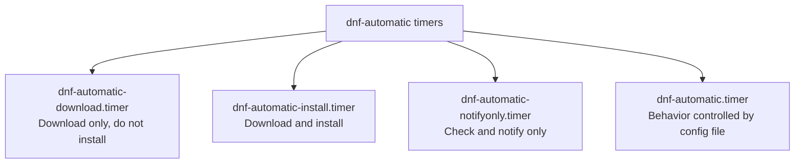

# How to Configure Automatic System Updates with dnf-automatic on RHEL

Author: [nawazdhandala](https://www.github.com/nawazdhandala)

Tags: RHEL, dnf-automatic, Automatic Updates, Security, Linux, Package Management

Description: A complete guide to setting up automatic system updates on RHEL using dnf-automatic, covering configuration options, security-only updates, email notifications, and timer scheduling.

---

## Why Automatic Updates?

Keeping a RHEL system patched is one of the most fundamental security practices, but it is also one of the easiest to fall behind on. Manual updates require someone to remember, log in, run the commands, and verify the results. On a handful of servers that is manageable. On dozens or hundreds, it becomes a full-time job.

dnf-automatic solves this by handling updates automatically. You configure it once, and it takes care of downloading and optionally applying updates on a schedule. It is especially valuable for security patches, where the window between vulnerability disclosure and exploitation keeps getting shorter.

## Installing dnf-automatic

On RHEL, dnf-automatic is provided by the `dnf-automatic` package.

```bash
# Install dnf-automatic
sudo dnf install dnf-automatic -y

# Verify the installation
rpm -q dnf-automatic
```

The package installs:
- The configuration file at `/etc/dnf/automatic.conf`
- Several systemd timer units for different update behaviors
- The `dnf-automatic` service that performs the actual work

## Understanding the Timer Options

dnf-automatic comes with multiple systemd timers, each providing a different level of automation.



| Timer | What it does |
|-------|-------------|
| dnf-automatic-notifyonly.timer | Checks for updates and sends notification |
| dnf-automatic-download.timer | Downloads updates but does not install |
| dnf-automatic-install.timer | Downloads and installs updates automatically |
| dnf-automatic.timer | Behavior depends on automatic.conf settings |

Choose the one that matches your comfort level. Most production environments start with download-only or notify-only and move to auto-install after gaining confidence.

## Configuring /etc/dnf/automatic.conf

This is the main configuration file. Let us go through each section.

```bash
# Open the configuration file
sudo vi /etc/dnf/automatic.conf
```

### The [commands] Section

This section controls what dnf-automatic actually does.

```ini
[commands]
# What kind of updates to apply
# Options: default, security
# "default" applies all updates
# "security" applies only security-related updates
upgrade_type = default

# How far to go with the update process
# Options: 0 = just check, 1 = download, 2 = download and apply
# When using specific timers like dnf-automatic-install.timer,
# this setting is overridden by the timer
download_updates = yes
apply_updates = no

# Automatically reboot if needed after updates (be careful with this)
random_sleep = 0
```

For a security-focused configuration:

```ini
[commands]
upgrade_type = security
download_updates = yes
apply_updates = yes
random_sleep = 300
```

### The [emitters] Section

This controls how you get notified about updates.

```ini
[emitters]
# How to send notifications
# Options: stdio, email, motd, command_email
# stdio sends to stdout (useful with systemd journal)
# email uses the built-in email emitter
# motd updates /etc/motd with available updates
# command_email uses a command to send email
emit_via = email
```

You can combine multiple emitters:

```ini
[emitters]
emit_via = email, motd
```

### The [email] Section

Configure email notifications here.

```ini
[email]
# Email sender address
email_from = dnf-automatic@myserver.example.com

# Recipient addresses (comma separated)
email_to = sysadmin@example.com

# SMTP server to use
email_host = smtp.example.com
```

For systems that use local mail delivery:

```ini
[email]
email_from = root@localhost
email_to = root
email_host = localhost
```

### The [command_email] Section

If you need more control over how email is sent, use the command_email emitter.

```ini
[command_email]
# Command to use for sending email
command_email = /usr/bin/mail
email_from = dnf-automatic@myserver.example.com
email_to = sysadmin@example.com
```

### The [base] Section

This section mirrors standard dnf configuration options.

```ini
[base]
# Exclude specific packages from automatic updates
# Useful for packages that need manual testing before update
excludepkgs = kernel*, mysql-server

# Debug level (0-10)
debuglevel = 1
```

## Complete Production Configuration Example

Here is a configuration I use on production servers that installs security updates only and sends email notifications.

```ini
[commands]
# Only apply security updates automatically
upgrade_type = security

# Download and apply updates
download_updates = yes
apply_updates = yes

# Add up to 5 minutes of random delay to prevent all servers updating at once
random_sleep = 300

[emitters]
# Send email and update MOTD
emit_via = email, motd

[email]
email_from = dnf-auto@prod-server.example.com
email_to = ops-team@example.com
email_host = smtp.internal.example.com

[base]
# Do not auto-update the kernel or database packages
excludepkgs = kernel*, postgresql*
debuglevel = 1
```

## Enabling the Timer

After configuring `automatic.conf`, enable the appropriate timer.

```bash
# For automatic security updates (download and install)
sudo systemctl enable --now dnf-automatic-install.timer

# For download-only (manual install later)
sudo systemctl enable --now dnf-automatic-download.timer

# For notification only
sudo systemctl enable --now dnf-automatic-notifyonly.timer

# Verify the timer is active
sudo systemctl status dnf-automatic-install.timer
```

Check when the timer will next fire:

```bash
# List all dnf-automatic timers and their schedules
sudo systemctl list-timers 'dnf-automatic*'
```

## Customizing the Timer Schedule

By default, dnf-automatic runs once a day, sometime within an hour of 6 AM. You can customize this.

```bash
# Create a timer override
sudo systemctl edit dnf-automatic-install.timer
```

Add your custom schedule:

```ini
[Timer]
# Clear the default schedule
OnCalendar=
# Run at 3 AM every day
OnCalendar=*-*-* 03:00:00
# Add some randomization so not all servers update at the exact same time
RandomizedDelaySec=30m
```

```bash
# Reload systemd to pick up the change
sudo systemctl daemon-reload

# Verify the new schedule
sudo systemctl list-timers dnf-automatic-install.timer
```

### Schedule for Different Environments

```bash
# Development servers - update aggressively, daily at 2 AM
OnCalendar=*-*-* 02:00:00

# Staging servers - update weekly on Wednesday at 3 AM
OnCalendar=Wed *-*-* 03:00:00

# Production servers - update weekly on Sunday during maintenance window
OnCalendar=Sun *-*-* 04:00:00
```

## Security-Only Updates

For production servers, applying all updates automatically can be risky. Limiting to security updates is a good middle ground.

```ini
[commands]
upgrade_type = security
```

You can verify what security updates are available before enabling automatic updates:

```bash
# List available security updates
sudo dnf updateinfo list security

# Show details about security advisories
sudo dnf updateinfo info security

# Manually apply security updates to test
sudo dnf update --security
```

## Testing the Configuration

Before relying on automatic updates, test the setup.

```bash
# Do a dry run to see what would happen
sudo dnf-automatic --timer

# Or run it manually to verify the full workflow
sudo systemctl start dnf-automatic-install.service

# Check the journal for output
sudo journalctl -u dnf-automatic-install.service --since "10 minutes ago"
```

## Monitoring Automatic Updates

After enabling dnf-automatic, you should verify it is actually working.

```bash
# Check the timer status and last run time
sudo systemctl status dnf-automatic-install.timer

# Check the service logs for the last run
sudo journalctl -u dnf-automatic-install.service -n 50

# Check dnf history for automatic update transactions
sudo dnf history list --reverse | tail -20

# See details of a specific transaction
sudo dnf history info last
```

### Monitoring Script

```bash
#!/bin/bash
# /usr/local/bin/check-auto-updates.sh
# Quick status check for dnf-automatic

echo "=== dnf-automatic Status ==="
echo ""

echo "Timer status:"
systemctl is-active dnf-automatic-install.timer
echo ""

echo "Last run:"
systemctl show dnf-automatic-install.service -p ExecMainStartTimestamp
echo ""

echo "Next scheduled run:"
systemctl list-timers dnf-automatic-install.timer --no-pager
echo ""

echo "Recent update activity:"
dnf history list | head -10
echo ""

echo "Available updates:"
dnf check-update --quiet | wc -l
echo "packages available for update"
```

## Handling Reboots After Kernel Updates

dnf-automatic does not reboot the system after installing updates. If a kernel update is applied, the new kernel will not be active until the next reboot.

```bash
# Check if a reboot is needed
sudo needs-restarting -r
echo $?
# Exit code 0 = no reboot needed, 1 = reboot needed

# List services that need restarting after updates
sudo needs-restarting -s
```

You can automate reboots with a separate cron job or script, but be careful with this on production systems.

```bash
# A cautious automatic reboot script (use with care)
#!/bin/bash
# Only reboot during maintenance window if needed
# Run this via cron at your preferred reboot time

if needs-restarting -r > /dev/null 2>&1; then
    echo "No reboot needed"
else
    logger "dnf-automatic: Reboot required, initiating reboot"
    /usr/sbin/shutdown -r +5 "System reboot for kernel update in 5 minutes"
fi
```

## Rollback if Something Goes Wrong

If an automatic update causes issues, dnf's history feature lets you roll back.

```bash
# List recent transactions
sudo dnf history list

# See what a specific transaction did
sudo dnf history info 42

# Undo a specific transaction
sudo dnf history undo 42
```

## Best Practices

1. **Start with notify-only.** Run the notification timer for a week to see what updates are available before enabling automatic installation.

2. **Use security-only on production.** Feature updates can introduce behavioral changes. Security updates are safer for automatic application.

3. **Exclude sensitive packages.** Kernel, database, and major application packages should be updated manually after testing.

4. **Stagger updates across environments.** Update dev first, then staging, then production. Use different timer schedules for each.

5. **Monitor the results.** Check logs regularly and set up alerts for failed updates.

6. **Have a rollback plan.** Know how to use `dnf history undo` before you need it.

## Summary

dnf-automatic on RHEL takes the manual effort out of keeping your system patched. Start conservatively with notifications or download-only mode, limit to security updates on production systems, exclude packages that need careful handling, and always monitor the results. Combined with a good rollback strategy, automatic updates significantly reduce your exposure to known vulnerabilities without introducing unacceptable risk.
