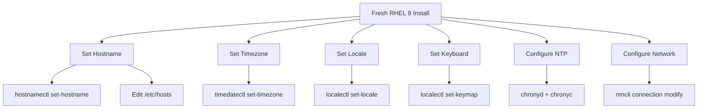

# How to Configure Basic System Settings on RHEL 9

Author: [nawazdhandala](https://www.github.com/nawazdhandala)

Tags: RHEL, System Settings, Linux, System Administration

Description: A practical walkthrough of the essential system settings you should configure on every fresh RHEL 9 installation, from hostname and timezone to locale and network basics.

---

Every time I spin up a fresh RHEL 9 box, the first thing I do is run through a quick checklist of basic system settings. Getting these right from the start saves headaches down the road, especially when you're managing dozens of servers and need consistent configurations across the fleet. This guide covers the settings I touch on every single deployment.

## Setting the Hostname

The hostname is one of those things that seems trivial until you're staring at 40 terminal tabs and can't tell which server you're on.

RHEL 9 uses `hostnamectl` to manage the hostname. There are three types: static (stored on disk), transient (assigned by the kernel at boot), and pretty (a free-form description for humans).

Set a static hostname that persists across reboots:

```bash
# Set the static hostname
sudo hostnamectl set-hostname webserver01.example.com

# Verify it took effect
hostnamectl
```

You should also update `/etc/hosts` so the hostname resolves locally:

```bash
# Add your hostname to /etc/hosts for local resolution
echo "127.0.1.1   webserver01.example.com webserver01" | sudo tee -a /etc/hosts
```

## Configuring the Timezone

Mismatched timezones across your infrastructure will make log correlation a nightmare. Pick one timezone (I usually go with UTC for servers) and stick with it.

List available timezones and set yours:

```bash
# List all available timezones
timedatectl list-timezones

# Filter for a specific region
timedatectl list-timezones | grep America

# Set the timezone to UTC
sudo timedatectl set-timezone UTC

# Or set it to a specific city
sudo timedatectl set-timezone America/New_York

# Confirm the change
timedatectl
```

The output of `timedatectl` will show you the local time, UTC time, timezone, and whether NTP sync is active.

## Setting the System Locale

The locale controls how the system handles language, character encoding, date formats, and number formatting. For most server environments, `en_US.UTF-8` is a solid default.

```bash
# Check current locale settings
localectl status

# List available locales
localectl list-locales

# Set the system locale
sudo localectl set-locale LANG=en_US.UTF-8

# Verify the change
localectl status
```

If you need a locale that isn't installed, you can generate it:

```bash
# Install the langpacks for your desired locale
sudo dnf install glibc-langpack-en -y
```

## Keyboard Layout

On servers you mostly access via SSH, the keyboard layout won't matter much. But if you're working with physical machines or VMs with console access, setting the right layout avoids frustration.

```bash
# Check the current keyboard layout
localectl status

# List available keyboard layouts
localectl list-keymaps

# Set the keyboard layout to US
sudo localectl set-keymap us

# For X11 sessions, you can also set:
sudo localectl set-x11-keymap us
```

## Configuring NTP Time Synchronization

Accurate time is critical. Kerberos authentication, TLS certificates, log timestamps, distributed databases - they all depend on clocks being in sync. RHEL 9 uses Chrony as its default NTP client.

```bash
# Make sure chrony is installed and running
sudo dnf install chrony -y
sudo systemctl enable --now chronyd

# Check if NTP synchronization is active
timedatectl show | grep NTP

# Verify chrony is talking to NTP servers
chronyc sources -v

# Check the current time offset
chronyc tracking
```

The default Chrony configuration in `/etc/chrony.conf` points to Red Hat's NTP pool, which works fine for most setups. If you need to use internal NTP servers, edit that file and replace the pool lines with your server addresses.

## Basic Network Settings

RHEL 9 uses NetworkManager for all network configuration. The `nmcli` command is your primary tool for managing connections from the terminal.

Check the current network status:

```bash
# Show all network connections
nmcli connection show

# Show device status
nmcli device status

# Show detailed info for a specific connection
nmcli connection show "Wired connection 1"
```

Configure a static IP address:

```bash
# Set a static IPv4 address on an existing connection
sudo nmcli connection modify "Wired connection 1" \
  ipv4.addresses 192.168.1.100/24 \
  ipv4.gateway 192.168.1.1 \
  ipv4.dns "8.8.8.8 8.8.4.4" \
  ipv4.method manual

# Bring the connection down and back up to apply changes
sudo nmcli connection down "Wired connection 1"
sudo nmcli connection up "Wired connection 1"
```

Configure DNS settings:

```bash
# Add DNS servers to a connection
sudo nmcli connection modify "Wired connection 1" \
  ipv4.dns "8.8.8.8 1.1.1.1"

# Add a DNS search domain
sudo nmcli connection modify "Wired connection 1" \
  ipv4.dns-search "example.com"

# Apply the changes
sudo nmcli connection up "Wired connection 1"

# Verify DNS resolution works
dig example.com
```

## The Configuration Flow

Here's a visual overview of the settings and the tools used to configure each one:



## Verifying Everything at Once

After making all your changes, run a quick verification pass:

```bash
# One-liner to check all basic settings
echo "=== Hostname ===" && hostnamectl | head -3 && \
echo "=== Timezone ===" && timedatectl | grep "Time zone" && \
echo "=== Locale ===" && localectl | head -2 && \
echo "=== NTP ===" && timedatectl | grep "NTP" && \
echo "=== Network ===" && nmcli device status
```

## Tips from the Field

**Use Ansible for consistency.** If you're managing more than a handful of servers, automate this with Ansible. All of these settings have corresponding Ansible modules (`hostname`, `timezone`, `locale_gen`, etc.) that make it easy to enforce a baseline across your fleet.

**Document your baseline.** Keep a record of what your standard settings should be. When something drifts, you'll want a reference to compare against.

**Don't skip NTP.** I've seen production outages caused by clock drift breaking certificate validation. Even if your servers seem fine, always verify NTP is active and syncing.

**Test DNS after network changes.** A misconfigured DNS can make a server feel "broken" even though the network is technically up. Always run a quick `dig` or `nslookup` after changing network settings.

## Wrapping Up

These basic settings form the foundation of a well-configured RHEL 9 system. None of them are complicated on their own, but skipping any of them on a fresh install will come back to bite you eventually. Build a checklist, automate what you can, and always verify your changes took effect before moving on to more complex configuration tasks.
