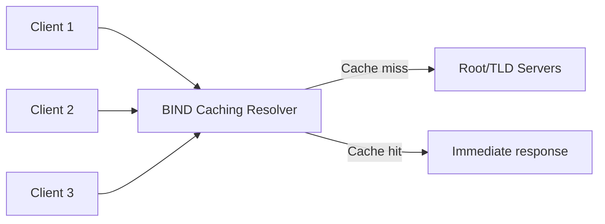

# How to Configure BIND as a Caching DNS Resolver on RHEL

Author: [nawazdhandala](https://www.github.com/nawazdhandala)

Tags: RHEL, BIND, DNS, Caching, Linux

Description: Set up BIND as a caching-only DNS resolver on RHEL to speed up DNS lookups across your local network.

---

A caching DNS resolver sits on your network and handles DNS queries for your clients. The first time someone looks up a domain, the resolver fetches the answer from the internet and caches it. Subsequent queries for the same domain get answered instantly from cache. This reduces latency, saves bandwidth, and gives you control over DNS for your entire network.

## Why Run a Local Caching Resolver?

There are several practical reasons:
- Faster DNS resolution for repeated queries
- Reduced external DNS traffic
- Control over which upstream servers you use
- Ability to add local overrides
- Better privacy (your ISP doesn't see every DNS query)



## Installation

Install BIND:

```bash
dnf install bind bind-utils -y
```

## Configuration

The key difference between a caching resolver and an authoritative server is that the resolver has recursion enabled and doesn't serve its own zones.

Create the configuration:

```bash
cp /etc/named.conf /etc/named.conf.bak

cat > /etc/named.conf << 'EOF'
// BIND caching DNS resolver configuration

acl "trusted_clients" {
    localhost;
    10.0.0.0/8;
    192.168.0.0/16;
    172.16.0.0/12;
};

options {
    listen-on port 53 { any; };
    listen-on-v6 port 53 { any; };
    directory "/var/named";

    // Allow queries only from trusted networks
    allow-query { trusted_clients; };

    // Enable recursion - this is what makes it a resolver
    recursion yes;
    allow-recursion { trusted_clients; };

    // Forward to upstream DNS servers
    // Remove or comment out if you want full recursion from root
    forwarders {
        8.8.8.8;
        8.8.4.4;
    };
    forward only;

    // DNSSEC validation
    dnssec-validation auto;

    // Cache size limit (in bytes, default is unlimited)
    max-cache-size 256m;

    // Cache TTL limits
    max-cache-ttl 86400;      // Maximum 1 day
    max-ncache-ttl 3600;      // Maximum 1 hour for negative cache

    managed-keys-directory "/var/named/dynamic";
    pid-file "/run/named/named.pid";
    session-keyfile "/run/named/session.key";
};

// Logging
logging {
    channel resolver_log {
        file "/var/log/named/resolver.log" versions 5 size 10m;
        severity info;
        print-time yes;
        print-severity yes;
        print-category yes;
    };

    channel query_log {
        file "/var/log/named/queries.log" versions 3 size 20m;
        severity info;
        print-time yes;
    };

    category default { resolver_log; };
    category queries { query_log; };
};

// Root hints for iterative resolution
zone "." IN {
    type hint;
    file "named.ca";
};

// Localhost zones
zone "localhost" IN {
    type primary;
    file "named.localhost";
    allow-update { none; };
};

zone "0.0.127.in-addr.arpa" IN {
    type primary;
    file "named.loopback";
    allow-update { none; };
};
EOF
```

## Forwarding Modes

There are two forwarding modes to choose from:

**forward only** - BIND only asks the configured forwarders. If they don't respond, the query fails:

```
forwarders { 8.8.8.8; 8.8.4.4; };
forward only;
```

**forward first** - BIND asks the forwarders first, but if they don't respond, it falls back to doing full recursive resolution from the root servers:

```
forwarders { 8.8.8.8; 8.8.4.4; };
forward first;
```

For a pure caching resolver, `forward only` with reliable upstream servers is usually the safest choice. If you want full independence, remove the forwarders entirely and let BIND resolve from root servers.

## Prepare the Environment

Create the log directory:

```bash
mkdir -p /var/log/named
chown named:named /var/log/named
```

Verify the configuration:

```bash
named-checkconf /etc/named.conf
```

## Start the Service

Enable and start BIND:

```bash
systemctl enable --now named
```

Check that it's listening:

```bash
ss -tulnp | grep :53
```

## Firewall

Allow DNS traffic:

```bash
firewall-cmd --permanent --add-service=dns
firewall-cmd --reload
```

## Testing

Test from the server itself:

```bash
dig @localhost google.com
```

Test a second time to see the cache in action (look at the query time):

```bash
dig @localhost google.com
```

The first query might take 30-100ms. The cached response should be under 1ms.

Test from a client machine:

```bash
dig @192.168.1.10 google.com
```

## Configuring Clients

Point your clients to use this resolver. On RHEL/CentOS clients using NetworkManager:

```bash
nmcli connection modify "System eth0" ipv4.dns "192.168.1.10"
nmcli connection up "System eth0"
```

Or if you're running DHCP, configure it to hand out your resolver's IP as the DNS server.

## Cache Management

View cache statistics:

```bash
rndc status
```

Dump the cache to a file for inspection:

```bash
rndc dumpdb -cache
cat /var/named/data/cache_dump.db | head -50
```

Flush the entire cache:

```bash
rndc flush
```

Flush a specific domain from cache:

```bash
rndc flushname example.com
```

## Adding Local Overrides

You can add response policy zones (RPZ) or local zone entries to override DNS for specific domains. This is useful for internal services or ad blocking.

Add a local zone for internal names by appending to named.conf:

```
zone "internal.corp" IN {
    type primary;
    file "internal.corp.zone";
    allow-update { none; };
};
```

Create the zone file:

```bash
cat > /var/named/internal.corp.zone << 'EOF'
$TTL 86400
@   IN  SOA ns1.internal.corp. admin.internal.corp. (
            2026030401 3600 1800 604800 86400 )
@       IN  NS  ns1.internal.corp.
ns1     IN  A   192.168.1.10
gitlab  IN  A   192.168.1.50
jenkins IN  A   192.168.1.51
wiki    IN  A   192.168.1.52
EOF

chown named:named /var/named/internal.corp.zone
rndc reload
```

## Performance Tuning

For busy networks, increase the number of worker threads and cache size:

```
options {
    // ... existing options ...
    max-cache-size 512m;
};
```

Monitor the query rate:

```bash
rndc stats
cat /var/named/data/named_stats.txt | grep -A 10 "Resolver Statistics"
```

A well-configured caching resolver can handle thousands of queries per second and dramatically improve the DNS experience for everyone on your network.
