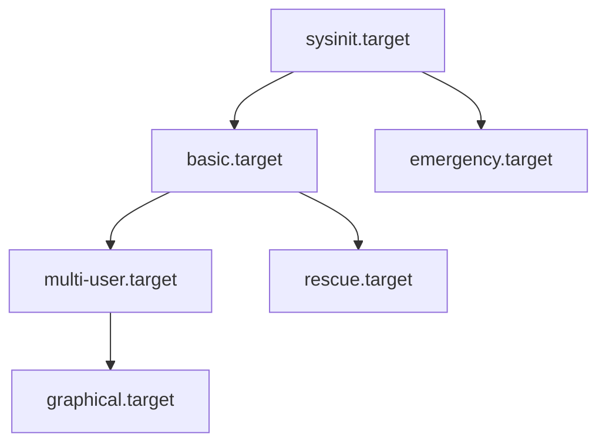
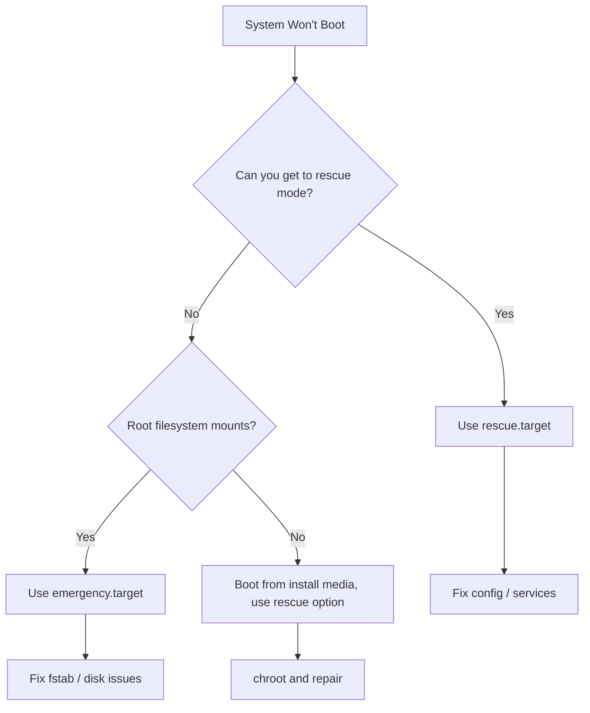

# How to Configure Boot Targets and Default Runlevels in RHEL 9 with systemd

Author: [nawazdhandala](https://www.github.com/nawazdhandala)

Tags: RHEL, systemd, Boot Targets, Runlevels, Linux

Description: Learn how systemd targets replace traditional runlevels in RHEL 9, and how to switch between multi-user, graphical, rescue, and emergency modes for day-to-day server administration.

---

If you grew up on SysVinit, you think in runlevels. Runlevel 3 for multi-user text mode, runlevel 5 for graphical, and so on. RHEL 9 uses systemd, which replaces runlevels with "targets." The concept is similar, but targets are more flexible. This guide covers everything you need to know about managing boot targets in RHEL 9.

## Targets vs Runlevels

Systemd targets are essentially named groups of units (services, sockets, mounts, etc.) that define a system state. The traditional runlevels map to specific targets:

| Runlevel | systemd Target | Purpose |
|----------|---------------|---------|
| 0 | poweroff.target | Halt the system |
| 1 | rescue.target | Single-user / rescue mode |
| 2 | multi-user.target | Multi-user (no network in SysV, same as 3 in systemd) |
| 3 | multi-user.target | Multi-user with networking, no GUI |
| 4 | multi-user.target | Custom (unused traditionally) |
| 5 | graphical.target | Multi-user with GUI |
| 6 | reboot.target | Reboot |

The big difference is that targets can depend on other targets, creating a dependency chain. For example, `graphical.target` depends on `multi-user.target`, which depends on `basic.target`, and so on.



## Checking the Current and Default Target

```bash
# See what target the system is currently running
systemctl get-default

# Check the active target
systemctl list-units --type=target --state=active
```

On a minimal server install, the default is usually `multi-user.target`. On a workstation install, it is `graphical.target`.

## Setting the Default Boot Target

If you want your server to boot into a specific target every time, use `set-default`.

### Set Multi-User (Text Mode) as Default

This is the standard for servers. No GUI, just a text console.

```bash
# Set the default target to multi-user (equivalent to runlevel 3)
sudo systemctl set-default multi-user.target
```

This creates a symlink at `/etc/systemd/system/default.target` pointing to the chosen target.

```bash
# Verify the symlink
ls -la /etc/systemd/system/default.target
```

### Set Graphical Mode as Default

If you have a desktop environment installed and want to boot into it:

```bash
# Set the default target to graphical (equivalent to runlevel 5)
sudo systemctl set-default graphical.target
```

## Switching Targets at Runtime

You do not need to reboot to switch targets. You can do it live.

### Switch from Graphical to Multi-User

This will stop the display manager and all graphical session services:

```bash
# Switch to multi-user mode (drops the GUI)
sudo systemctl isolate multi-user.target
```

### Switch from Multi-User to Graphical

This will start the display manager and bring up the login screen:

```bash
# Switch to graphical mode
sudo systemctl isolate graphical.target
```

The `isolate` command starts the specified target and stops all units that are not dependencies of that target. Think of it as "switch to this mode exclusively."

Not all targets can be isolated. A target must have `AllowIsolate=yes` in its unit file.

```bash
# Check if a target supports isolation
systemctl cat multi-user.target | grep AllowIsolate
```

## Rescue Mode

Rescue mode is the systemd equivalent of single-user mode (runlevel 1). It starts a minimal system with the root filesystem mounted and a root shell. Networking is not started, and most services are stopped.

### Entering Rescue Mode from a Running System

```bash
# Switch to rescue mode
sudo systemctl isolate rescue.target
```

You will be prompted for the root password.

### Entering Rescue Mode at Boot

If the system will not boot normally, you can select rescue mode from the GRUB menu:

1. Reboot the system
2. When the GRUB menu appears, press `e` to edit the default boot entry
3. Find the line starting with `linux` (the kernel line)
4. Append `systemd.unit=rescue.target` to the end of that line
5. Press `Ctrl+X` to boot with the modified entry

```
linux ($root)/vmlinuz-5.14.0-... root=/dev/mapper/rhel-root ... systemd.unit=rescue.target
```

### What Rescue Mode Gives You

- Root filesystem mounted read-write
- No networking
- No multi-user services
- Root shell after password authentication
- Basic system services only

This is useful when you need to fix configuration issues, reset passwords, or repair a broken package.

## Emergency Mode

Emergency mode is even more stripped down than rescue mode. It mounts the root filesystem as read-only and starts almost nothing.

### Entering Emergency Mode at Boot

Same process as rescue mode, but use `emergency.target`:

1. Edit the GRUB boot entry
2. Append `systemd.unit=emergency.target` to the kernel line
3. Boot with `Ctrl+X`

```bash
# Once in emergency mode, you'll likely need to remount root as read-write
mount -o remount,rw /
```

### When to Use Emergency vs Rescue



Use **rescue mode** when:
- A service is misconfigured and prevents normal boot
- You need to reset a password
- You need networking disabled for troubleshooting

Use **emergency mode** when:
- `/etc/fstab` has errors preventing filesystems from mounting
- A disk or LVM issue is blocking the boot process
- Rescue mode itself fails to start

## Creating Custom Targets

You can create your own targets if the built-in ones do not fit your needs. This is useful for defining specific system states for different workloads.

```bash
# Create a custom target file
sudo tee /etc/systemd/system/maintenance.target << 'EOF'
[Unit]
Description=Maintenance Mode
Requires=basic.target
Conflicts=rescue.target
After=basic.target
AllowIsolate=yes
EOF

# Reload systemd to pick up the new target
sudo systemctl daemon-reload

# Switch to the custom target
sudo systemctl isolate maintenance.target
```

You can then configure specific services to be wanted by your custom target:

```bash
# Make a service start in maintenance mode
sudo systemctl add-wants maintenance.target sshd.service
```

## Listing All Available Targets

```bash
# List all loaded targets
systemctl list-units --type=target

# List all installed targets (including inactive ones)
systemctl list-unit-files --type=target
```

## Troubleshooting Boot Target Issues

### System Boots to Wrong Target

Check the default target symlink:

```bash
# See where default.target points
ls -la /etc/systemd/system/default.target

# If it is wrong, reset it
sudo systemctl set-default multi-user.target
```

### System Hangs During Boot

If the system hangs while trying to reach a target, you can see which units are blocking progress:

```bash
# List jobs that systemd is waiting on
systemctl list-jobs
```

This shows units that are still starting or are stuck. You can then investigate or kill the problematic unit.

### Checking the Boot Process

```bash
# See the full boot log
journalctl -b

# See how long each service took to start
systemd-analyze blame

# See the critical chain (what blocked the boot)
systemd-analyze critical-chain
```

The `critical-chain` output is especially useful for identifying which services are slowing down boot time.

```bash
# Generate an SVG chart of the boot process
systemd-analyze plot > boot-chart.svg
```

## Practical Tips

- On production servers, always set `multi-user.target` as the default. There is no reason to waste resources on a display manager.
- If you are troubleshooting a remote server and cannot get SSH access, ask your hosting provider or use an out-of-band console to boot into rescue mode.
- The `systemctl isolate` command will terminate running sessions when switching away from graphical mode. Save your work first.
- If you break something in `/etc/fstab` and the system will not boot, emergency mode with the kernel parameter is your best friend. Fix the fstab entry and reboot.

Boot targets in RHEL 9 are straightforward once you get past the runlevel-to-target mental shift. The key commands are `get-default`, `set-default`, and `isolate`, and for emergencies, appending `systemd.unit=` to the kernel command line at GRUB.
