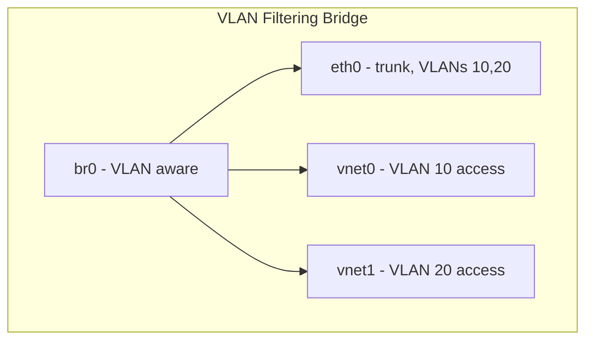

# How to Configure a Bridge with VLAN Filtering on RHEL 9

Author: [nawazdhandala](https://www.github.com/nawazdhandala)

Tags: RHEL, Bridge, VLAN Filtering, Networking, Linux

Description: How to enable and configure VLAN filtering on a Linux bridge in RHEL 9, allowing you to control which VLANs pass through each bridge port.

---

Linux bridges can do more than simple Layer 2 forwarding. With VLAN filtering enabled, a bridge acts like a VLAN-aware switch, controlling which VLAN traffic is allowed on each port. This is particularly useful for KVM virtualization where you want different VMs on different VLANs through a single bridge.

## VLAN Filtering vs VLAN Interfaces

There are two approaches to VLANs on bridges:

1. **VLAN interfaces on top of the bridge** - Create separate VLAN sub-interfaces (br0.10, br0.20). Simple but does not let you control per-port VLAN membership.

2. **Bridge VLAN filtering** - The bridge itself manages VLAN tagging and filtering per port. More flexible, like a real managed switch.



## Step 1: Create a VLAN-Aware Bridge

```bash
# Create the bridge
nmcli connection add type bridge con-name br0 ifname br0

# Enable VLAN filtering on the bridge
nmcli connection modify br0 bridge.vlan-filtering yes

# Disable STP for simplicity (enable if you have redundant paths)
nmcli connection modify br0 bridge.stp no

# Set IP if the host needs one (optional)
nmcli connection modify br0 ipv4.method disabled
nmcli connection modify br0 ipv6.method disabled
```

## Step 2: Add Physical Port as a Trunk

```bash
# Add the physical interface as a bridge port
nmcli connection add type ethernet con-name br0-trunk ifname eth0 master br0

# Activate the bridge
nmcli connection up br0
```

## Step 3: Configure VLAN Memberships

Once the bridge is up, use the `bridge` command to manage VLAN filtering:

```bash
# Add VLAN 10 to the trunk port (tagged)
bridge vlan add vid 10 dev eth0

# Add VLAN 20 to the trunk port (tagged)
bridge vlan add vid 20 dev eth0

# Add VLAN 10 to a VM port as untagged (access port)
bridge vlan add vid 10 dev vnet0 pvid untagged

# Add VLAN 20 to another VM port as untagged (access port)
bridge vlan add vid 20 dev vnet1 pvid untagged
```

Key parameters:
- **vid**: VLAN ID
- **pvid**: Port VLAN ID, the default VLAN for untagged incoming traffic
- **untagged**: Strip VLAN tags on egress (like a switch access port)

## Step 4: Verify VLAN Configuration

```bash
# Show VLAN configuration on all bridge ports
bridge vlan show

# Example output:
# port     vlan-id
# eth0     10
#          20
# vnet0    10 PVID Egress Untagged
# vnet1    20 PVID Egress Untagged
```

## Removing Default VLAN 1

By default, all bridge ports are members of VLAN 1. If you want strict VLAN isolation, remove it:

```bash
# Remove default VLAN 1 from the physical port
bridge vlan del vid 1 dev eth0

# Remove default VLAN 1 from VM ports
bridge vlan del vid 1 dev vnet0
bridge vlan del vid 1 dev vnet1

# Remove default VLAN 1 from the bridge itself
bridge vlan del vid 1 dev br0 self
```

## Giving the Host an IP on a Specific VLAN

If the host needs an IP on one of the VLANs:

```bash
# Add the VLAN to the bridge itself (not a port)
bridge vlan add vid 10 dev br0 self

# Create a VLAN interface on the bridge for the host
nmcli connection add type vlan con-name br0-vlan10 ifname br0.10 vlan.parent br0 vlan.id 10
nmcli connection modify br0-vlan10 ipv4.addresses 10.10.10.50/24
nmcli connection modify br0-vlan10 ipv4.method manual
nmcli connection up br0-vlan10
```

## Making VLAN Filtering Persistent

The `bridge vlan` commands are not persistent by default. To make them survive reboots, you have a few options:

### Option A: Use a NetworkManager Dispatcher Script

```bash
# Create a dispatcher script
cat > /etc/NetworkManager/dispatcher.d/99-bridge-vlans << 'SCRIPT'
#!/bin/bash
if [ "$1" = "br0" ] && [ "$2" = "up" ]; then
    bridge vlan add vid 10 dev eth0
    bridge vlan add vid 20 dev eth0
    bridge vlan del vid 1 dev eth0
fi
SCRIPT

chmod +x /etc/NetworkManager/dispatcher.d/99-bridge-vlans
```

### Option B: Use nmcli VLAN Options (RHEL 9.2+)

On newer RHEL 9 versions, nmcli supports bridge port VLAN configuration directly:

```bash
# Set VLANs on a bridge port via nmcli
nmcli connection modify br0-trunk bridge-port.vlans "10, 20"
nmcli connection up br0-trunk
```

## Example: Multi-VLAN KVM Setup

Here is a complete example for a KVM host with VMs on different VLANs:

```bash
# Create the VLAN-aware bridge
nmcli connection add type bridge con-name br0 ifname br0
nmcli connection modify br0 bridge.vlan-filtering yes
nmcli connection modify br0 bridge.stp no
nmcli connection modify br0 ipv4.method disabled

# Add physical trunk port
nmcli connection add type ethernet con-name br0-trunk ifname eth0 master br0

# Activate
nmcli connection up br0

# Configure VLANs on the trunk
bridge vlan add vid 10 dev eth0
bridge vlan add vid 20 dev eth0
bridge vlan add vid 30 dev eth0
bridge vlan del vid 1 dev eth0
```

When creating VMs, use libvirt to assign them to the bridge. Then configure VLAN membership on their tap interfaces:

```bash
# After VM starts and vnet0 appears
bridge vlan add vid 10 dev vnet0 pvid untagged
bridge vlan del vid 1 dev vnet0
```

## Troubleshooting

**VMs cannot communicate across VLANs**: This is expected behavior. VLANs isolate traffic. If you need inter-VLAN routing, set up a router or use the host as a router.

**VLAN filtering not working**: Verify it is enabled:

```bash
# Check if VLAN filtering is on
cat /sys/class/net/br0/bridge/vlan_filtering
# Should output: 1
```

**Traffic not flowing after enabling VLAN filtering**: When you enable VLAN filtering, the bridge stops forwarding all traffic by default. You must explicitly add VLAN memberships to each port.

```bash
# Verify VLAN membership
bridge vlan show

# If a port has no VLANs assigned, no traffic will flow through it
```

## Summary

Bridge VLAN filtering turns a Linux bridge into a VLAN-aware virtual switch. Enable it with `bridge.vlan-filtering yes`, add VLAN memberships to each port with `bridge vlan add`, and use `pvid untagged` for access ports. This approach is cleaner than creating multiple bridges or stacking VLAN interfaces, especially for KVM hosts with many VMs across different network segments. Just remember to persist your VLAN configurations since the `bridge vlan` commands are not persistent by default.
