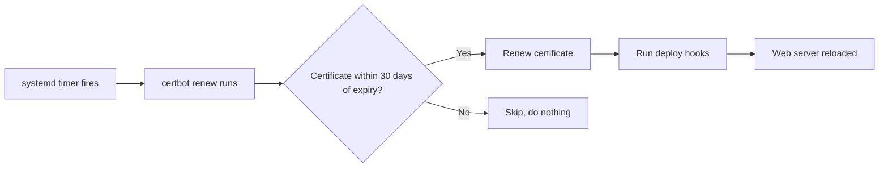

# How to Configure Certbot Auto-Renewal for TLS Certificates on RHEL 9

Author: [nawazdhandala](https://www.github.com/nawazdhandala)

Tags: RHEL, Certbot, Auto-Renewal, TLS, Linux

Description: Learn how to set up and verify automatic TLS certificate renewal with Certbot on RHEL 9, including hooks for reloading web servers.

---

Getting a Let's Encrypt certificate is the easy part. Keeping it valid is where most people slip up. Let's Encrypt certificates expire every 90 days, and if your renewal process breaks silently, you wake up to a site serving expired certificates and angry users.

This guide covers everything about Certbot auto-renewal on RHEL 9, from the default systemd timer to custom hooks and monitoring.

## How Certbot Renewal Works

When you install Certbot on RHEL 9, it registers a systemd timer that fires twice daily. Each time it runs, Certbot checks all managed certificates and renews any that are within 30 days of expiry. Since certificates last 90 days, that gives you a 30-day window where renewal attempts happen automatically.



## Checking the Default Timer

After installing Certbot from EPEL, check if the timer is already active:

```bash
# Check the status of the Certbot renewal timer
sudo systemctl status certbot-renew.timer
```

If it is not enabled:

```bash
# Enable and start the Certbot renewal timer
sudo systemctl enable --now certbot-renew.timer
```

You can see when it will next fire:

```bash
# List all timers and find the Certbot one
sudo systemctl list-timers | grep certbot
```

## Understanding the Timer and Service Unit

The timer unit is usually at `/etc/systemd/system/certbot-renew.timer` or in the package-provided path. Check its contents:

```bash
# View the timer configuration
sudo systemctl cat certbot-renew.timer
```

The corresponding service unit runs the actual renewal:

```bash
# View the service that the timer triggers
sudo systemctl cat certbot-renew.service
```

Typically the service runs something like `certbot renew --no-random-sleep-on-renew` or just `certbot renew`.

## Testing Renewal with a Dry Run

Before trusting the automation, always do a dry run:

```bash
# Simulate the renewal process without making changes
sudo certbot renew --dry-run
```

This contacts the Let's Encrypt staging servers and walks through the entire process without writing new certificates. If this passes, your actual renewal will work.

Common dry-run failures include:

- Port 80 blocked by firewall
- Web server not running (for webroot or plugin-based renewals)
- DNS records changed since original issuance
- File permission changes on the webroot directory

## Configuring Renewal Hooks

The real power of Certbot renewal is in hooks. You almost certainly need to reload your web server after a certificate is renewed, otherwise it keeps serving the old one from memory.

### Deploy Hook (Recommended)

Deploy hooks run only when a certificate is actually renewed, not on every Certbot invocation:

```bash
# Create a deploy hook directory for your domain
sudo mkdir -p /etc/letsencrypt/renewal-hooks/deploy
```

Create a hook script to reload Apache:

```bash
# Write a deploy hook that reloads Apache after renewal
sudo tee /etc/letsencrypt/renewal-hooks/deploy/reload-apache.sh << 'SCRIPT'
#!/bin/bash
systemctl reload httpd
SCRIPT

sudo chmod 755 /etc/letsencrypt/renewal-hooks/deploy/reload-apache.sh
```

For Nginx:

```bash
# Write a deploy hook that reloads Nginx after renewal
sudo tee /etc/letsencrypt/renewal-hooks/deploy/reload-nginx.sh << 'SCRIPT'
#!/bin/bash
systemctl reload nginx
SCRIPT

sudo chmod 755 /etc/letsencrypt/renewal-hooks/deploy/reload-nginx.sh
```

### Pre and Post Hooks

Pre hooks run before any renewal attempt, and post hooks run after, regardless of whether renewal happened. These are useful for standalone mode where you need to stop and start a service:

```bash
# Write pre and post hooks for standalone mode
sudo tee /etc/letsencrypt/renewal-hooks/pre/stop-httpd.sh << 'SCRIPT'
#!/bin/bash
systemctl stop httpd
SCRIPT

sudo tee /etc/letsencrypt/renewal-hooks/post/start-httpd.sh << 'SCRIPT'
#!/bin/bash
systemctl start httpd
SCRIPT

sudo chmod 755 /etc/letsencrypt/renewal-hooks/pre/stop-httpd.sh
sudo chmod 755 /etc/letsencrypt/renewal-hooks/post/start-httpd.sh
```

### Per-Domain Hook Configuration

You can also set hooks in the renewal configuration file for each domain:

```bash
# Edit the renewal config for your domain
sudo vi /etc/letsencrypt/renewal/example.com.conf
```

Add or modify these lines under `[renewalparams]`:

```ini
[renewalparams]
# Hook to reload web server after successful renewal
post_hook = systemctl reload httpd
```

## Creating a Custom Systemd Timer

If you want more control over when renewal happens, you can create your own timer:

```bash
# Create a custom renewal service
sudo tee /etc/systemd/system/certbot-custom-renew.service << 'UNIT'
[Unit]
Description=Certbot Certificate Renewal
After=network-online.target

[Service]
Type=oneshot
ExecStart=/usr/bin/certbot renew --quiet
UNIT
```

```bash
# Create a custom timer that runs at 3 AM daily
sudo tee /etc/systemd/system/certbot-custom-renew.timer << 'UNIT'
[Unit]
Description=Run Certbot renewal daily at 3 AM

[Timer]
OnCalendar=*-*-* 03:00:00
RandomizedDelaySec=3600
Persistent=true

[Install]
WantedBy=timers.target
UNIT
```

Enable it:

```bash
# Enable and start the custom timer
sudo systemctl daemon-reload
sudo systemctl enable --now certbot-custom-renew.timer
```

The `RandomizedDelaySec` spreads load across the Let's Encrypt infrastructure, which is courteous and recommended.

## Monitoring Renewal

Automated renewal is great until it silently fails. Here are practical ways to know if something goes wrong.

### Check the Systemd Journal

```bash
# View recent Certbot renewal logs
sudo journalctl -u certbot-renew.service --since "7 days ago"
```

### Check Certificate Expiry Dates

```bash
# List all managed certificates with their expiry dates
sudo certbot certificates
```

### Script-Based Monitoring

Here is a simple script you can run from cron or your monitoring system:

```bash
# Check if any certificates expire within 14 days
#!/bin/bash
THRESHOLD=14

for cert_dir in /etc/letsencrypt/live/*/; do
    domain=$(basename "$cert_dir")
    expiry_date=$(openssl x509 -enddate -noout -in "${cert_dir}fullchain.pem" 2>/dev/null | cut -d= -f2)

    if [ -z "$expiry_date" ]; then
        continue
    fi

    expiry_epoch=$(date -d "$expiry_date" +%s)
    now_epoch=$(date +%s)
    days_left=$(( (expiry_epoch - now_epoch) / 86400 ))

    if [ "$days_left" -lt "$THRESHOLD" ]; then
        echo "WARNING: ${domain} expires in ${days_left} days"
    fi
done
```

### Using Systemd to Alert on Failure

You can configure systemd to notify you when the renewal service fails:

```bash
# Create an on-failure notification service
sudo tee /etc/systemd/system/certbot-failure-notify@.service << 'UNIT'
[Unit]
Description=Send notification on %i failure

[Service]
Type=oneshot
ExecStart=/usr/bin/logger -p crit "Certbot renewal failed for %i"
UNIT
```

Then add `OnFailure=certbot-failure-notify@certbot-renew.service` to your Certbot service unit.

## Renewal Configuration Files

Every certificate Certbot manages has a renewal configuration file:

```bash
# List renewal configurations
ls /etc/letsencrypt/renewal/
```

Each `.conf` file stores the parameters used during the original issuance, including the authenticator plugin, server, and account details. Certbot uses these during renewal so it knows exactly how to renew each certificate.

```bash
# View a renewal config
sudo cat /etc/letsencrypt/renewal/example.com.conf
```

## Handling Renewal Failures

If renewal fails, check these in order:

1. **Firewall:** Is port 80 still open? `sudo firewall-cmd --list-services`
2. **DNS:** Does the domain still resolve to this server? `dig +short example.com`
3. **Web server:** Is it running? `sudo systemctl status httpd`
4. **Rate limits:** Check the Certbot log at `/var/log/letsencrypt/letsencrypt.log`
5. **Permissions:** Can Certbot write to `/etc/letsencrypt/`?

After fixing the issue, run `sudo certbot renew` manually to catch up.

## Wrapping Up

Auto-renewal is not optional with Let's Encrypt, it is the entire point of the 90-day certificate lifetime. Set up the timer, add your hooks, test with a dry run, and put monitoring in place. Once this pipeline is solid, TLS certificate management becomes something you genuinely never think about.
