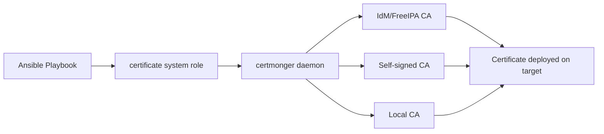

# How to Configure Certificate Management with RHEL System Roles

Author: [nawazdhandala](https://www.github.com/nawazdhandala)

Tags: RHEL, System Roles, Certificates, TLS, Ansible, Linux

Description: Learn how to automate TLS/SSL certificate management across RHEL systems using the certificate RHEL System Role with Ansible.

---

Managing certificates across a fleet of RHEL servers by hand is tedious and error-prone. Certificates expire, get misconfigured, or use weak algorithms. The RHEL certificate system role lets you declare what certificates you want, where you want them, and the role handles the rest through Ansible.

## What the Certificate System Role Does

The `rhel-system-roles.certificate` role manages certificates through the certmonger service. It can request certificates from IdM/FreeIPA, self-signed CAs, or local CAs, and it handles renewals automatically.



## Prerequisites

Install the RHEL system roles package on your control node:

```bash
# Install RHEL system roles
sudo dnf install rhel-system-roles
```

Verify the certificate role is available:

```bash
# Check that the certificate role exists
ls /usr/share/ansible/roles/rhel-system-roles.certificate/
```

## Basic Playbook: Self-Signed Certificate

Here is a simple playbook that creates a self-signed certificate for a web server:

```yaml
# playbook-cert-selfsigned.yml
# Creates a self-signed TLS certificate for Apache/Nginx
---
- name: Configure self-signed certificates
  hosts: webservers
  become: true
  vars:
    certificate_requests:
      # Define a certificate for the web server
      - name: mycert
        dns: "{{ ansible_fqdn }}"
        ca: self-sign
        # Where to store the certificate and key
        certificate_file: /etc/pki/tls/certs/webapp.crt
        key_file: /etc/pki/tls/private/webapp.key
        # Set file ownership
        owner: root
        group: root

  roles:
    - rhel-system-roles.certificate
```

Run it:

```bash
# Apply the certificate playbook to your webservers group
ansible-playbook -i inventory playbook-cert-selfsigned.yml
```

## Requesting a Certificate from IdM/FreeIPA

If your environment uses Red Hat Identity Management, you can request certificates from the IPA CA:

```yaml
# playbook-cert-ipa.yml
# Request a certificate from the IdM/FreeIPA CA
---
- name: Request IPA-signed certificates
  hosts: webservers
  become: true
  vars:
    certificate_requests:
      - name: webapp-ipa
        dns:
          - "{{ ansible_fqdn }}"
          - "www.{{ ansible_domain }}"
        # Use the IPA CA
        ca: ipa
        # Principal for the certificate
        principal: "HTTP/{{ ansible_fqdn }}@{{ ansible_domain | upper }}"
        # File locations
        certificate_file: /etc/pki/tls/certs/webapp.crt
        key_file: /etc/pki/tls/private/webapp.key
        owner: root
        group: root

  roles:
    - rhel-system-roles.certificate
```

## Multiple Certificates in One Playbook

You can define several certificates at once:

```yaml
# playbook-cert-multiple.yml
# Deploy multiple certificates to a single host
---
- name: Configure multiple certificates
  hosts: appservers
  become: true
  vars:
    certificate_requests:
      # Certificate for the main web application
      - name: webapp
        dns: "{{ ansible_fqdn }}"
        ca: self-sign
        certificate_file: /etc/pki/tls/certs/webapp.crt
        key_file: /etc/pki/tls/private/webapp.key

      # Certificate for the internal API
      - name: api
        dns: "api.{{ ansible_domain }}"
        ca: self-sign
        certificate_file: /etc/pki/tls/certs/api.crt
        key_file: /etc/pki/tls/private/api.key

      # Certificate for database connections
      - name: dbclient
        dns: "{{ ansible_fqdn }}"
        ca: self-sign
        certificate_file: /etc/pki/tls/certs/dbclient.crt
        key_file: /etc/pki/tls/private/dbclient.key

  roles:
    - rhel-system-roles.certificate
```

## Configuring Certificate Options

The role supports several useful options:

```yaml
# playbook-cert-options.yml
# Certificate with custom options
---
- name: Configure certificate with custom settings
  hosts: servers
  become: true
  vars:
    certificate_requests:
      - name: custom-cert
        dns:
          - "{{ ansible_fqdn }}"
          - "alias.example.com"
        # IP Subject Alternative Names
        ip:
          - "{{ ansible_default_ipv4.address }}"
        ca: self-sign
        # Key size
        key_size: 4096
        certificate_file: /etc/pki/tls/certs/custom.crt
        key_file: /etc/pki/tls/private/custom.key
        owner: root
        group: root
        # Run a command after the certificate is issued or renewed
        run_after: systemctl reload httpd

  roles:
    - rhel-system-roles.certificate
```

The `run_after` parameter is particularly useful. It lets you restart or reload services automatically when a certificate is renewed.

## Checking Certificate Status

After applying the role, verify the certificates on the target hosts:

```bash
# List all certificates managed by certmonger
sudo getcert list

# Check a specific certificate
sudo getcert list -f /etc/pki/tls/certs/webapp.crt

# View the certificate details with openssl
openssl x509 -in /etc/pki/tls/certs/webapp.crt -text -noout
```

## Handling Certificate Renewals

The certmonger service handles renewals automatically. You can check renewal status:

```bash
# Check when a certificate will be renewed
sudo getcert list -f /etc/pki/tls/certs/webapp.crt | grep -E "expires|status"

# Force an immediate renewal attempt
sudo getcert resubmit -f /etc/pki/tls/certs/webapp.crt
```

## Inventory Example

A typical inventory for certificate management:

```ini
# inventory
[webservers]
web1.example.com
web2.example.com
web3.example.com

[appservers]
app1.example.com
app2.example.com

[servers:children]
webservers
appservers
```

## Wrapping Up

The RHEL certificate system role removes the manual work from certificate management. You declare what you need in YAML, and Ansible plus certmonger handle the provisioning and renewal. The biggest win is the `run_after` option, which ensures your services pick up renewed certificates without anyone having to remember to restart them. For environments with IdM/FreeIPA, this is especially powerful because you get a fully automated certificate lifecycle from request through renewal.
