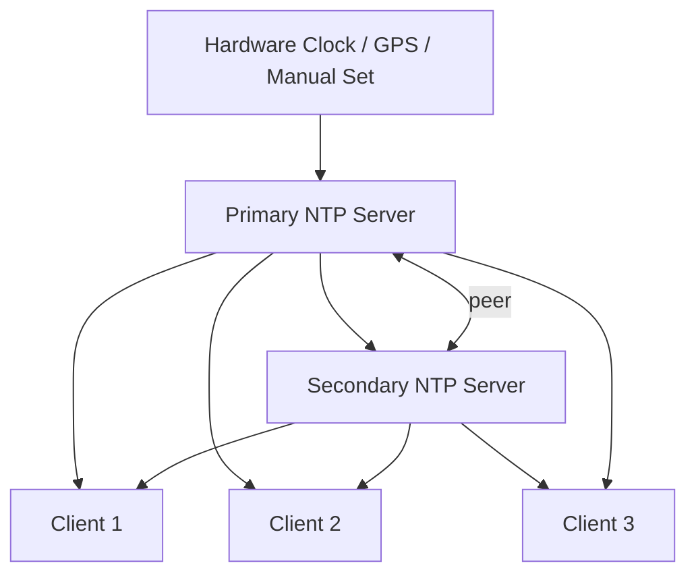

# How to Configure chrony for Isolated Networks Without Internet Access on RHEL

Author: [nawazdhandala](https://www.github.com/nawazdhandala)

Tags: RHEL, chrony, Isolated Network, NTP, Linux

Description: How to configure chrony for time synchronization on air-gapped or isolated RHEL networks that have no internet access.

---

Air-gapped and isolated networks are common in government, military, financial, and industrial environments. These networks have no internet access by design, which means public NTP pools are not an option. You still need consistent time across all systems, though, because everything from log correlation to Kerberos authentication depends on it.

This guide covers how to set up chrony for time synchronization in environments where the network never touches the internet.

## The Challenge

On a normal network, you point chrony at a public NTP pool and you are done. On an isolated network, you need to answer:

- Where does the "true" time come from?
- How do you distribute it to all systems?
- What happens when the reference drifts?



## Option 1: Local Reference Clock (Best)

If accurate time matters, invest in a GPS receiver or a dedicated time appliance. GPS receivers provide stratum 0 time from satellites, which works even without internet access.

chrony supports several hardware reference clocks through shared memory (SHM) or the SOCK driver. If you have a GPS device with PPS (pulse per second) output:

```
# In /etc/chrony.conf on the primary NTP server
# SHM reference clock from gpsd
refclock SHM 0 offset 0.0 delay 0.2 refid GPS
refclock SHM 1 offset 0.0 delay 0.0 refid PPS prefer

# Allow local network clients
allow 10.0.0.0/8

# Logging
driftfile /var/lib/chrony/drift
makestep 1.0 3
rtcsync
log tracking measurements statistics
logdir /var/log/chrony
```

Install gpsd to interface with the GPS hardware:

```bash
# Install gpsd for GPS receiver support
sudo dnf install gpsd gpsd-clients

# Enable and start gpsd
sudo systemctl enable --now gpsd
```

Verify the GPS is working:

```bash
# Check GPS data
gpsmon
```

## Option 2: Local Clock as Time Source (Most Common)

If you do not have GPS hardware, the next best option is to designate one server as the time authority using its own system clock. Yes, this clock will drift, but the important thing is that all systems drift together.

### Configure the Primary NTP Server

On the server that will be the time reference:

```bash
sudo vi /etc/chrony.conf
```

```
# No external NTP sources - we are the reference
# Use the local clock as the time source, stratum 8
local stratum 8

# Allow the local network to sync
allow 10.0.0.0/8
allow 192.168.0.0/16

# Drift file to maintain clock accuracy between restarts
driftfile /var/lib/chrony/drift

# Allow a large initial step
makestep 1.0 3

# Sync the hardware clock
rtcsync

# Log tracking data
log tracking measurements statistics
logdir /var/log/chrony
```

The `local stratum 8` directive tells chrony to serve time from the local clock with stratum 8. Clients will see this as a low-quality source (higher stratum means lower quality), which is honest.

```bash
# Restart chrony to apply changes
sudo systemctl restart chronyd
```

### Configure the Secondary NTP Server

For redundancy, set up a second server that syncs to the primary and can take over if the primary goes down:

```
# Sync to the primary NTP server
server 10.0.0.1 iburst

# Peer with the primary for mutual backup
peer 10.0.0.1

# If primary is unreachable, serve from local clock
local stratum 9 orphan

# Allow network clients
allow 10.0.0.0/8
allow 192.168.0.0/16

# Drift tracking
driftfile /var/lib/chrony/drift
makestep 1.0 3
rtcsync
```

The `orphan` option on the `local` directive means this server only activates its local clock source when it cannot reach any other server. This prevents two servers from both insisting on their own time.

### Configure Client Systems

On all other systems:

```
# Point to both internal NTP servers
server 10.0.0.1 iburst
server 10.0.0.2 iburst

# Drift file
driftfile /var/lib/chrony/drift

# Allow stepping on startup
makestep 1.0 3
rtcsync
```

## Firewall Configuration

On both NTP servers, open UDP 123:

```bash
# Allow NTP traffic through the firewall
sudo firewall-cmd --permanent --add-service=ntp
sudo firewall-cmd --reload
```

## Setting the Initial Time

On an isolated network, you need to set the time manually on the primary NTP server before anything else can sync:

```bash
# Set the system time manually
sudo timedatectl set-time "2026-03-04 12:00:00"
```

Or use the `date` command:

```bash
# Alternative: set time with the date command
sudo date -s "2026-03-04 12:00:00"
```

Then sync the hardware clock:

```bash
# Write the system time to the hardware clock
sudo hwclock --systohc
```

## Handling Time Drift

Without an external reference, your primary server's clock will drift. The rate depends on the hardware. Typical drift rates:

- Physical servers: 0.5 to 5 PPM (about 1.3 to 13 seconds per month)
- Virtual machines: 10 to 100 PPM (highly variable depending on hypervisor load)

To manage drift:

1. **Check drift periodically**: Compare against a known reference (even a wristwatch or phone carried into the secure area)
2. **Correct manually when needed**: Use `timedatectl set-time` on the primary server
3. **Use good hardware**: Physical servers with quality oscillators drift less

```bash
# Check the current drift rate
chronyc tracking | grep Frequency
```

## Verifying the Setup

On the primary server:

```bash
# Verify the local reference is active
chronyc sources

# Check that clients are connecting
chronyc clients
```

On client systems:

```bash
# Verify synchronization to the internal servers
chronyc sources -v

# Check the offset
chronyc tracking | grep "System time"
```

All clients should show the primary (or secondary) server with a `*` in the sources list.

## Maintaining Consistency Across the Network

The goal on an isolated network is not perfect accuracy to UTC (that is impossible without an external reference). The goal is consistency. All systems should agree on what time it is.

```bash
# Quick check across multiple hosts using SSH
for host in 10.0.0.{10..20}; do
    echo -n "$host: "
    ssh $host "chronyc tracking | grep 'System time'" 2>/dev/null
done
```

If all offsets are within a few milliseconds of zero (relative to the primary server), you are in good shape.

## Periodic Manual Corrections

Establish a procedure for periodically correcting the primary server's time. On many isolated networks, this is done during maintenance windows:

```bash
# On the primary NTP server, step the time to the correct value
sudo chronyc makestep
# Or set it explicitly
sudo timedatectl set-time "2026-03-04 15:30:00"
```

Clients will track the correction through normal chrony slewing.

## Wrapping Up

Time synchronization on isolated networks comes down to picking a reference (GPS if you can, local clock if you cannot), distributing it through a redundant pair of NTP servers, and keeping all clients pointed at those servers. The setup is not complicated, but you do need a maintenance process for correcting drift over time. Build that into your standard operating procedures and your time will stay consistent enough for everything from log analysis to Kerberos authentication.
