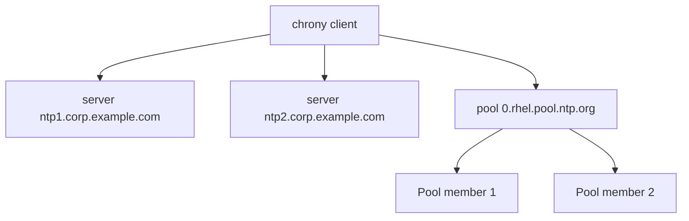

# How to Configure chrony as an NTP Client on RHEL 9

Author: [nawazdhandala](https://www.github.com/nawazdhandala)

Tags: RHEL, chrony, NTP, Time Sync, Linux

Description: Step-by-step guide to configuring chrony as an NTP client on RHEL 9 to keep your system clock accurate and synchronized.

---

Accurate time is one of those things you never think about until it breaks. Then Kerberos authentication fails, log timestamps are meaningless, distributed database replicas start arguing with each other, and your TLS certificates look expired when they are not. On RHEL 9, chrony is the default NTP implementation, and getting it right takes about five minutes.

## Why chrony Instead of ntpd

RHEL 9 ships with chrony, not ntpd. Red Hat deprecated ntpd starting with RHEL 8, and it is not available in the default repos on RHEL 9. chrony is faster at initial synchronization, handles intermittent network connectivity better (great for laptops and VMs), and uses less memory.

## Checking the Current Time Configuration

Before changing anything, see where you stand:

```bash
# Check the current time synchronization status
timedatectl
```

This shows whether NTP is active, the current timezone, and whether the system clock is synchronized.

```bash
# Check if chrony is installed and running
systemctl status chronyd
```

On a standard RHEL 9 install, chronyd should already be running.

## Understanding the Default Configuration

The main configuration file is `/etc/chrony.conf`. Look at what ships by default:

```bash
# View the default chrony configuration
cat /etc/chrony.conf
```

The default config typically includes:

```
# Use Red Hat's NTP pool servers
pool 2.rhel.pool.ntp.org iburst

# Record the rate at which the system clock gains/loses time
driftfile /var/lib/chrony/drift

# Allow the system clock to be stepped in the first three updates
makestep 1.0 3

# Enable kernel synchronization of the real-time clock
rtcsync

# Enable logging of statistics
logdir /var/log/chrony
```

## Configuring Custom NTP Servers

If your organization runs its own NTP servers or you prefer specific public pools, edit the config:

```bash
# Edit the chrony configuration
sudo vi /etc/chrony.conf
```

Replace the default pool with your servers:

```
# Company internal NTP servers (preferred)
server ntp1.corp.example.com iburst
server ntp2.corp.example.com iburst

# Public fallback pools
pool 0.rhel.pool.ntp.org iburst maxsources 2
pool 1.rhel.pool.ntp.org iburst maxsources 2
```

The `iburst` option sends a burst of requests on startup for faster initial synchronization. The `maxsources` limits how many servers from a pool are used.

### Server vs Pool

- `server` specifies a single NTP server by hostname or IP
- `pool` specifies a pool of servers; chrony will resolve multiple addresses and use several



## Key Configuration Options

Here are the most important options for a client configuration:

```
# Step the clock if the offset exceeds 1 second, but only during the first 3 updates
makestep 1.0 3

# Specify the drift file location
driftfile /var/lib/chrony/drift

# Sync the hardware clock (RTC) every 11 minutes
rtcsync

# Log clock tracking data for analysis
log tracking measurements statistics
logdir /var/log/chrony
```

The `makestep` directive is critical. It allows chrony to make large jumps in the clock during initial sync (the first 3 updates), but after that it slews the clock gradually. This prevents applications from seeing time jumps during normal operation.

## Applying the Configuration

After editing, restart chronyd:

```bash
# Restart chrony to apply changes
sudo systemctl restart chronyd
```

Make sure it starts on boot:

```bash
# Enable chrony to start at boot
sudo systemctl enable chronyd
```

## Verifying Synchronization

Check that chrony is talking to the configured servers:

```bash
# Show the current NTP sources
chronyc sources -v
```

The output shows each source with status indicators:

- `^*` - the currently selected source (best)
- `^+` - an acceptable source that could be selected
- `^-` - an acceptable source that is not being used
- `^?` - a source whose connectivity has not been established yet
- `^x` - a source that chrony considers a falseticker

Check tracking information:

```bash
# Show detailed tracking info
chronyc tracking
```

Key fields to check:

- **Reference ID**: The server chrony is currently syncing to
- **System time**: How far off the system clock is from NTP time
- **Last offset**: The measured offset of the last clock update
- **RMS offset**: The long-term average offset
- **Frequency**: How fast or slow the system clock runs

## Firewall Configuration

NTP uses UDP port 123. As a client, outbound traffic is usually allowed, but if you have strict egress rules:

```bash
# Allow outbound NTP traffic (usually not needed with default firewall)
sudo firewall-cmd --permanent --add-service=ntp
sudo firewall-cmd --reload
```

## Handling Offline/Disconnected Periods

If your system loses network connectivity (common with laptops or VMs that get suspended), chrony handles this gracefully. The `driftfile` records the clock drift rate, so chrony can maintain reasonable accuracy even without network access.

You can also configure chrony to use the `offline` option and manually tell it when the network is available:

```
# Mark sources as offline by default
server ntp1.corp.example.com iburst offline
```

Then bring them online when the network is up:

```bash
# Tell chrony the network is available
chronyc online
```

And mark them offline when disconnected:

```bash
# Tell chrony the network is down
chronyc offline
```

## Configuring NTP Authentication

For security, you can authenticate NTP traffic using symmetric keys:

```bash
# Create or edit the chrony key file
sudo vi /etc/chrony.keys
```

Add a key:

```
1 SHA1 HEX:A1B2C3D4E5F6A1B2C3D4E5F6A1B2C3D4E5F6A1B2
```

Reference it in `/etc/chrony.conf`:

```
server ntp1.corp.example.com iburst key 1
```

The NTP server must have the same key configured.

## Troubleshooting

**Clock not synchronizing**: Check if the NTP servers are reachable:

```bash
# Test connectivity to an NTP server
chronyc ntpdata ntp1.corp.example.com
```

**Large initial offset**: If the clock is way off, chrony may refuse to sync. Force a step:

```bash
# Force an immediate time step
sudo chronyc makestep
```

**Check for errors in the journal**:

```bash
# View chrony-related log entries
sudo journalctl -u chronyd --since "1 hour ago"
```

## Wrapping Up

chrony is reliable, lightweight, and sensible about defaults. For most RHEL 9 systems, the only thing you need to change is the NTP server list to point to your organization's servers. Verify with `chronyc sources` and `chronyc tracking`, and you are done. Just make sure it is running and enabled before you move on to the next task.
