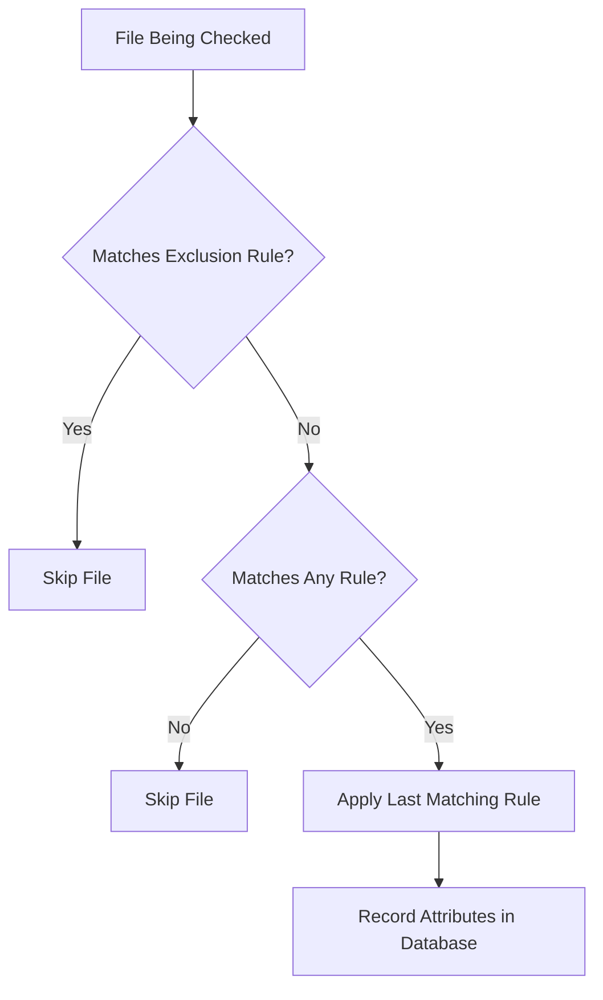

# How to Configure Custom AIDE Rules in /etc/aide.conf on RHEL 9

Author: [nawazdhandala](https://www.github.com/nawazdhandala)

Tags: RHEL, AIDE, Custom Rules, Security, Linux

Description: Learn how to write custom AIDE rules in /etc/aide.conf on RHEL 9 to monitor specific files and directories with tailored attribute checks.

---

The default AIDE configuration on RHEL 9 does a reasonable job of monitoring system files, but most production environments need custom rules. Maybe you want to track changes to application config files, monitor a web root for unauthorized modifications, or exclude directories that produce too much noise. This guide covers how to write and organize custom AIDE rules.

## How AIDE Rules Work

AIDE rules in `/etc/aide.conf` follow a straightforward pattern. Each rule is a path followed by an attribute group that defines what to check. Lines starting with `!` are exclusions, and lines starting with `=` match only the directory itself (not its contents).

The basic syntax looks like this:

```
/path/to/monitor   ATTRIBUTE_GROUP
!/path/to/exclude
=/path/to/dir/only
```

## Built-in Attribute Groups

RHEL 9 ships with several predefined attribute groups in `/etc/aide.conf`. Here are the most commonly used ones:

```bash
# View the predefined groups in the config
sudo grep "^[A-Z].*=" /etc/aide.conf | head -20
```

Key groups include:

- `CONTENT_EX` - full content checks with extended attributes
- `DATAONLY` - focuses on data integrity without timestamp checks
- `PERMS` - permission, ownership, and SELinux context only
- `LOG` - suitable for log files (checks permissions but not content)

## Creating Custom Attribute Groups

You can define your own attribute groups by combining individual selectors. Place these definitions before the rule lines in `/etc/aide.conf`:

```bash
# Edit the AIDE configuration
sudo vi /etc/aide.conf
```

Add custom groups near the top of the file, after the existing group definitions:

```
# Custom group for web application files - check content and permissions
WEBAPP = sha512+p+u+g+s+acl+selinux+xattrs

# Custom group for config files - check everything including timestamps
FULLCHECK = sha512+sha256+p+u+g+s+m+c+acl+selinux+xattrs+ftype

# Custom group for data directories - content only, skip metadata churn
DATAFILES = sha512+n+u+g+ftype

# Custom group for binaries - check content and all security attributes
BINARIES = sha512+p+u+g+s+b+n+acl+selinux+xattrs+ftype
```

The individual selectors you can use include:

| Selector | Meaning |
|----------|---------|
| `p` | Permissions |
| `u` | User ownership |
| `g` | Group ownership |
| `s` | File size |
| `m` | Modification time |
| `c` | Change time (inode) |
| `b` | Block count |
| `n` | Number of hard links |
| `sha256` | SHA-256 checksum |
| `sha512` | SHA-512 checksum |
| `acl` | POSIX ACLs |
| `selinux` | SELinux context |
| `xattrs` | Extended attributes |
| `ftype` | File type |

## Adding Monitoring Rules

Now add rules that use your custom groups. Place these after the group definitions:

```
# Monitor web application files
/var/www/html WEBAPP

# Monitor custom application configs
/opt/myapp/config FULLCHECK

# Monitor application data
/opt/myapp/data DATAFILES

# Monitor custom scripts
/usr/local/bin BINARIES
/usr/local/sbin BINARIES
```

## Excluding Noisy Paths

Some directories change too frequently to monitor effectively. Use exclusion rules to reduce false positives:

```
# Exclude temporary and cache directories
!/var/cache
!/var/tmp
!/tmp

# Exclude application-specific runtime files
!/var/www/html/cache
!/opt/myapp/logs
!/opt/myapp/tmp

# Exclude package manager databases (they change on every update)
!/var/lib/rpm
!/var/lib/dnf
```

## Using Regular Expressions

AIDE supports regular expressions for more flexible matching. Prefix the path with `@@` to use regex:

```
# Monitor all .conf files in /etc using regex
@@/etc/.*\.conf$ FULLCHECK

# Monitor PHP files in the web root
@@/var/www/html/.*\.php$ WEBAPP

# Exclude all .log files everywhere
!@@/.*\.log$
```

## Directory-Only Rules

Sometimes you only want to monitor a directory entry itself, not its contents. Use `=` for this:

```
# Only check the /data directory attributes, not files inside it
=/data PERMS
```

## Organizing Rules with Separate Config Files

For complex environments, split your rules into separate files. AIDE supports an include directive:

```
# In /etc/aide.conf, add includes at the bottom
@@include /etc/aide.conf.d/webapp.conf
@@include /etc/aide.conf.d/custom.conf
```

Create the directory and add your custom configs:

```bash
# Create a directory for additional AIDE configs
sudo mkdir -p /etc/aide.conf.d

# Create a config for web application monitoring
sudo tee /etc/aide.conf.d/webapp.conf << 'EOF'
# Web application file integrity rules
/var/www/html WEBAPP
!/var/www/html/cache
!/var/www/html/uploads
!/var/www/html/sessions
EOF
```

## Validating Your Configuration

After making changes, validate the configuration before re-initializing:

```bash
# Check the config for syntax errors by doing a dry run
sudo aide --config-check
```

If there are no errors, re-initialize the database:

```bash
# Rebuild the database with new rules
sudo aide --init

# Activate the new database
sudo cp /var/lib/aide/aide.db.new.gz /var/lib/aide/aide.db.gz
```

## Testing Your Custom Rules

Verify that your custom rules work as expected:

```bash
# Create a test file in a monitored directory
sudo touch /var/www/html/test-aide.txt

# Run a check
sudo aide --check

# Clean up
sudo rm /var/www/html/test-aide.txt
```

## Rule Precedence

AIDE processes rules in order from top to bottom. More specific rules should come after general ones. If a file matches multiple rules, the last match wins. Exclusion rules (`!`) take effect regardless of order when placed appropriately.



## Practical Example: Complete Custom Config

Here is a complete example for a server running a Java application:

```
# Custom attribute groups
APPCONFIG = sha512+p+u+g+acl+selinux+xattrs
APPBIN = sha512+p+u+g+s+n+acl+selinux+xattrs+ftype
APPDATA = sha512+u+g+ftype

# Application directories
/opt/tomcat/conf APPCONFIG
/opt/tomcat/bin APPBIN
/opt/tomcat/lib APPBIN
/opt/tomcat/webapps APPBIN

# Exclude runtime directories
!/opt/tomcat/logs
!/opt/tomcat/temp
!/opt/tomcat/work

# System customizations
/etc/sysconfig FULLCHECK
/etc/systemd/system FULLCHECK
```

After saving, always re-initialize and activate the database to apply your changes. Custom rules are only useful if the database reflects them.
