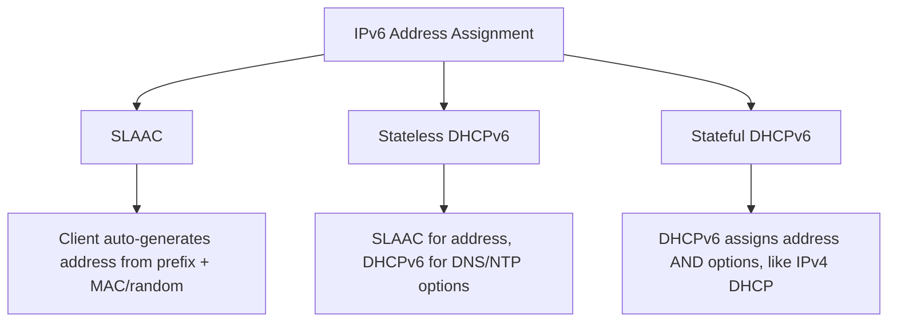

# How to Configure DHCPv6 for IPv6 Address Assignment on RHEL

Author: [nawazdhandala](https://www.github.com/nawazdhandala)

Tags: RHEL, DHCPv6, IPv6, DHCP, Linux

Description: Set up DHCPv6 on RHEL to assign IPv6 addresses and options to clients, covering both stateful and stateless modes.

---

IPv6 address assignment works differently from IPv4. There are multiple methods: SLAAC (Stateless Address Autoconfiguration), stateless DHCPv6, and stateful DHCPv6. Each has its use case. This guide covers setting up the ISC DHCPv6 server on RHEL for both stateful address assignment and stateless option delivery.

## IPv6 Address Assignment Methods



**SLAAC** - Clients generate their own address using the router-advertised prefix. No DHCP server needed, but no control over which address a client gets.

**Stateless DHCPv6** - Clients use SLAAC for addresses but ask DHCPv6 for other options like DNS servers. The server doesn't track leases.

**Stateful DHCPv6** - The server assigns addresses and tracks leases, similar to IPv4 DHCP. Gives you full control.

## Installing DHCPv6

The DHCPv6 server is part of the same package as DHCPv4:

```bash
dnf install dhcp-server -y
```

The daemon for IPv6 is `dhcpd6`, which uses the configuration file `/etc/dhcp/dhcpd6.conf`.

## Configuring Stateful DHCPv6

Create the DHCPv6 configuration:

```bash
cat > /etc/dhcp/dhcpd6.conf << 'EOF'
# DHCPv6 server configuration

# Global options
default-lease-time 3600;
max-lease-time 7200;
log-facility local7;

# DNS servers
option dhcp6.name-servers 2001:db8::10, 2001:4860:4860::8888;

# Domain search list
option dhcp6.domain-search "example.com";

# NTP server
option dhcp6.sntp-servers 2001:db8::10;

# Subnet declaration
subnet6 2001:db8::/64 {
    # Address range to assign
    range6 2001:db8::100 2001:db8::200;

    # Prefix delegation (for routers requesting a prefix)
    # prefix6 2001:db8:1:: 2001:db8:1:ffff:: /64;
}
EOF
```

## Configuring Stateless DHCPv6

For stateless mode, clients get addresses via SLAAC and only use DHCPv6 for options:

```bash
cat > /etc/dhcp/dhcpd6.conf << 'EOF'
# Stateless DHCPv6 - options only, no address assignment

default-lease-time 3600;
max-lease-time 7200;
log-facility local7;

option dhcp6.name-servers 2001:db8::10, 2001:4860:4860::8888;
option dhcp6.domain-search "example.com";

# Subnet declaration without a range
subnet6 2001:db8::/64 {
    # No range6 = stateless mode
}
EOF
```

## Setting Up the Interface

Make sure your server interface has an IPv6 address in the subnet you're serving:

```bash
ip -6 addr show eth1
```

If you need to add one:

```bash
nmcli connection modify "System eth1" ipv6.addresses "2001:db8::10/64" ipv6.method manual
nmcli connection up "System eth1"
```

## Router Advertisements

DHCPv6 works in conjunction with Router Advertisements (RA). The router tells clients how to get their configuration through RA flags.

For stateful DHCPv6, the router needs to set the Managed (M) flag. If you're using your RHEL server as the router, install radvd:

```bash
dnf install radvd -y
```

Configure radvd for stateful DHCPv6:

```bash
cat > /etc/radvd.conf << 'EOF'
interface eth1 {
    AdvSendAdvert on;
    MinRtrAdvInterval 30;
    MaxRtrAdvInterval 100;

    # M flag - tells clients to use DHCPv6 for addresses
    AdvManagedFlag on;

    # O flag - tells clients to use DHCPv6 for other options
    AdvOtherConfigFlag on;

    prefix 2001:db8::/64 {
        AdvOnLink on;
        # Don't let clients autoconfigure addresses
        AdvAutonomous off;
    };
};
EOF
```

For stateless DHCPv6:

```bash
cat > /etc/radvd.conf << 'EOF'
interface eth1 {
    AdvSendAdvert on;
    MinRtrAdvInterval 30;
    MaxRtrAdvInterval 100;

    # M flag off - clients use SLAAC for addresses
    AdvManagedFlag off;

    # O flag on - clients use DHCPv6 for DNS, NTP, etc.
    AdvOtherConfigFlag on;

    prefix 2001:db8::/64 {
        AdvOnLink on;
        AdvAutonomous on;
    };
};
EOF
```

Start radvd:

```bash
systemctl enable --now radvd
```

## Starting DHCPv6

Validate the configuration:

```bash
dhcpd -6 -t -cf /etc/dhcp/dhcpd6.conf
```

Enable and start the DHCPv6 service:

```bash
systemctl enable --now dhcpd6
```

Check it's running:

```bash
systemctl status dhcpd6
```

## Firewall Configuration

Allow DHCPv6 traffic:

```bash
firewall-cmd --permanent --add-service=dhcpv6
firewall-cmd --reload
```

DHCPv6 uses UDP ports 546 (client) and 547 (server).

## Adding Reservations

DHCPv6 reservations use the DUID (DHCP Unique Identifier) instead of MAC addresses:

```bash
# Find a client's DUID in the lease file
cat /var/lib/dhcpd/dhcpd6.leases

# Add a reservation
cat >> /etc/dhcp/dhcpd6.conf << 'EOF'

host server1 {
    # DUID from the client
    host-identifier option dhcp6.client-id 00:01:00:01:xx:xx:xx:xx:xx:xx:xx:xx:xx:xx;
    fixed-address6 2001:db8::50;
}
EOF
```

## Testing

On a client machine, request a DHCPv6 lease:

```bash
# Using dhclient for IPv6
dhclient -6 eth0
```

Check the assigned address:

```bash
ip -6 addr show eth0
```

Verify DNS options were received:

```bash
cat /etc/resolv.conf
```

From the server, check leases:

```bash
cat /var/lib/dhcpd/dhcpd6.leases
```

## Monitoring

Watch DHCPv6 transactions in real time:

```bash
journalctl -u dhcpd6 -f
```

Capture DHCPv6 traffic:

```bash
tcpdump -i eth1 'port 546 or port 547' -n
```

## Troubleshooting

**Clients not getting addresses:** Check that router advertisements are being sent with the correct flags:

```bash
radvdump
```

**DUID mismatch for reservations:** DUIDs can change if the client's network stack is reinstalled. Check the current DUID from the lease file.

**Client ignoring DHCPv6:** Some clients need explicit configuration to use DHCPv6. On RHEL clients:

```bash
nmcli connection modify "System eth0" ipv6.method dhcp
nmcli connection up "System eth0"
```

**IPv6 forwarding breaking SLAAC:** Enabling IPv6 forwarding on a Linux box disables processing of router advertisements on that box. If your DHCPv6 server is also a router, you need to configure its own IPv6 address statically.

DHCPv6 is more complex than DHCPv4 because of the interplay with SLAAC and router advertisements. The key is getting the RA flags right so clients know whether to use DHCPv6 for addresses, just options, or both. Once that's sorted, the DHCPv6 server configuration itself is very similar to what you're used to with IPv4.
