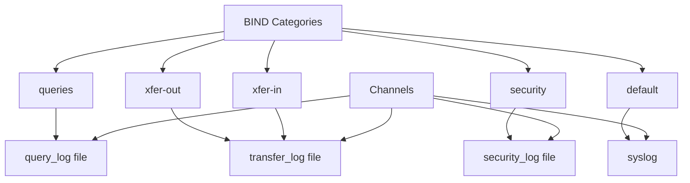

# How to Configure DNS Logging and Diagnostics with BIND on RHEL

Author: [nawazdhandala](https://www.github.com/nawazdhandala)

Tags: RHEL, BIND, DNS Logging, Linux

Description: Set up comprehensive DNS logging and diagnostic tools in BIND on RHEL to monitor queries, troubleshoot issues, and maintain visibility into your DNS infrastructure.

---

DNS problems are notoriously hard to diagnose without good logging. BIND has a flexible logging system that lets you control exactly what gets logged and where it goes. This guide covers setting up useful logging channels, understanding BIND's log categories, and using built-in diagnostics to keep your DNS server healthy.

## BIND's Logging Architecture

BIND separates logging into channels (where logs go) and categories (what gets logged). You can direct different categories to different channels.



## Basic Logging Configuration

Here's a comprehensive logging setup for a production BIND server:

```bash
cat > /etc/named.conf << 'EOF'
options {
    listen-on port 53 { any; };
    listen-on-v6 port 53 { any; };
    directory "/var/named";
    allow-query { any; };
    recursion yes;
    allow-recursion { 10.0.0.0/8; 192.168.0.0/16; localhost; };
    dnssec-validation auto;
    pid-file "/run/named/named.pid";
};

logging {
    // Channel for general BIND messages
    channel default_log {
        file "/var/log/named/default.log" versions 5 size 10m;
        severity info;
        print-time yes;
        print-severity yes;
        print-category yes;
    };

    // Channel for DNS queries
    channel query_log {
        file "/var/log/named/queries.log" versions 10 size 50m;
        severity info;
        print-time yes;
    };

    // Channel for zone transfer activity
    channel transfer_log {
        file "/var/log/named/transfers.log" versions 3 size 5m;
        severity info;
        print-time yes;
        print-severity yes;
    };

    // Channel for security events
    channel security_log {
        file "/var/log/named/security.log" versions 5 size 10m;
        severity info;
        print-time yes;
        print-severity yes;
    };

    // Channel for DNSSEC validation
    channel dnssec_log {
        file "/var/log/named/dnssec.log" versions 3 size 5m;
        severity info;
        print-time yes;
        print-severity yes;
    };

    // Channel for rate limiting events
    channel rate_limit_log {
        file "/var/log/named/rate-limit.log" versions 3 size 5m;
        severity info;
        print-time yes;
    };

    // Map categories to channels
    category default { default_log; };
    category queries { query_log; };
    category query-errors { query_log; };
    category xfer-in { transfer_log; };
    category xfer-out { transfer_log; };
    category security { security_log; };
    category dnssec { dnssec_log; };
    category rate-limit { rate_limit_log; };
};

zone "." IN {
    type hint;
    file "named.ca";
};
EOF
```

## Creating Log Directories

Set up the log directory with proper permissions:

```bash
mkdir -p /var/log/named
chown named:named /var/log/named
chmod 750 /var/log/named
```

## Enabling Query Logging

Query logging is disabled by default because it generates a lot of output. Enable it when you need to debug resolution issues.

Enable query logging at runtime:

```bash
rndc querylog on
```

Disable it when you're done:

```bash
rndc querylog off
```

Check the current state:

```bash
rndc status | grep "query logging"
```

## Understanding Log Categories

BIND has many log categories. Here are the most useful ones:

| Category | What it logs |
|----------|-------------|
| `queries` | Every DNS query received |
| `query-errors` | Queries that resulted in errors |
| `security` | Denied queries, blocked transfers |
| `xfer-in` | Incoming zone transfers (secondary) |
| `xfer-out` | Outgoing zone transfers (primary) |
| `dnssec` | DNSSEC validation activity |
| `default` | Anything not covered by other categories |
| `lame-servers` | Lame delegation responses |
| `rate-limit` | Response rate limiting events |
| `update` | Dynamic DNS updates |

## Reading Query Logs

Query log entries look like this:

```
04-Mar-2026 10:15:23.456 client @0x7f9a12345678 192.168.1.50#43210 (www.example.com): query: www.example.com IN A +E(0)K (192.168.1.10)
```

Breaking it down:
- `192.168.1.50#43210` - Client IP and port
- `www.example.com IN A` - The query (name, class, type)
- `+E(0)K` - Query flags (+ = recursion desired, E = EDNS, K = cookie)

## Using rndc for Diagnostics

BIND's `rndc` tool provides several diagnostic commands.

View server status:

```bash
rndc status
```

Dump the cache to a file:

```bash
rndc dumpdb -cache
less /var/named/data/cache_dump.db
```

Dump server statistics:

```bash
rndc stats
less /var/named/data/named_stats.txt
```

View recursion depth:

```bash
rndc recursing
```

Trace a specific query (increase debug level):

```bash
# Set debug level
rndc trace 3

# Watch the logs
tail -f /var/log/named/default.log

# Turn off debug when done
rndc notrace
```

## Setting Up Log Rotation

Create a logrotate configuration to manage log file sizes:

```bash
cat > /etc/logrotate.d/named << 'EOF'
/var/log/named/*.log {
    daily
    missingok
    rotate 14
    compress
    delaycompress
    notifempty
    create 0640 named named
    sharedscripts
    postrotate
        /usr/sbin/rndc reopen 2>/dev/null || true
    endscript
}
EOF
```

The `rndc reopen` command tells BIND to close and reopen its log files after rotation.

## Monitoring with Statistics Channel

BIND can serve statistics via HTTP. Add this to your options:

```
statistics-channels {
    inet 127.0.0.1 port 8053 allow { 127.0.0.1; };
};
```

Access the statistics page:

```bash
curl http://127.0.0.1:8053/
```

This gives you XML output with detailed server metrics. You can also get JSON:

```bash
curl http://127.0.0.1:8053/json
```

## Checking Zone Health

Validate a zone file:

```bash
named-checkzone example.com /var/named/example.com.zone
```

Check for configuration syntax errors:

```bash
named-checkconf /etc/named.conf
```

Verify zone serial consistency between primary and secondary:

```bash
dig @ns1.example.com example.com SOA +short
dig @ns2.example.com example.com SOA +short
```

## Performance Diagnostics

Check how many queries BIND is handling:

```bash
rndc stats
grep "queries resulted" /var/named/data/named_stats.txt
```

Monitor cache efficiency:

```bash
grep "cache" /var/named/data/named_stats.txt
```

A healthy resolver should have a high cache hit ratio. If most queries result in cache misses, your cache TTLs might be too short or the cache size too small.

Good logging and diagnostics make the difference between spending five minutes on a DNS issue and spending five hours. Set up your logging before you need it, and you'll thank yourself later.
