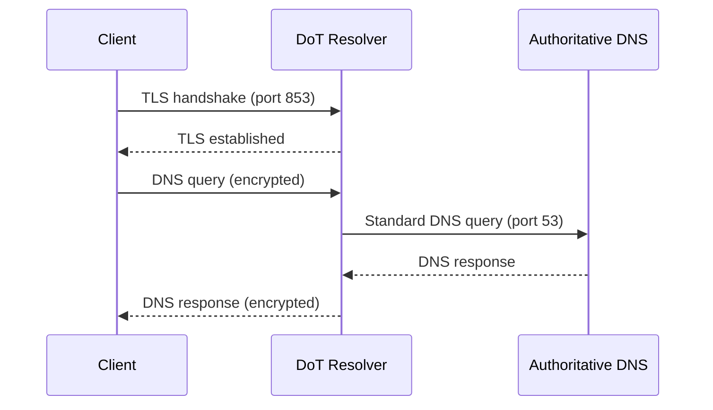

# How to Configure DNS-over-TLS (DoT) on RHEL 9

Author: [nawazdhandala](https://www.github.com/nawazdhandala)

Tags: RHEL, DNS-over-TLS, DoT, DNS Security, Linux

Description: Set up DNS-over-TLS on RHEL 9 using Unbound or systemd-resolved to encrypt DNS queries and prevent eavesdropping on your DNS traffic.

---

Standard DNS sends queries in plain text. Anyone on the network path, your ISP, a rogue wifi hotspot, a compromised router, can see every domain you look up. DNS-over-TLS (DoT) encrypts the DNS conversation between your client and the resolver, running DNS inside a TLS session on port 853. RHEL 9 supports this through both systemd-resolved and Unbound.

## How DNS-over-TLS Works



The encryption is between the client and the resolver. The resolver still makes standard DNS queries to authoritative servers. This protects the "last mile" between your machines and your resolver.

## Option 1: Configure systemd-resolved for DoT

systemd-resolved on RHEL 9 supports DoT natively. This is the simplest approach for individual machines.

Enable systemd-resolved if not already running:

```bash
systemctl enable --now systemd-resolved
```

Configure DoT with a public resolver:

```bash
mkdir -p /etc/systemd/resolved.conf.d

cat > /etc/systemd/resolved.conf.d/dot.conf << 'EOF'
[Resolve]
DNS=1.1.1.1#cloudflare-dns.com 9.9.9.9#dns.quad9.net
DNSOverTLS=yes
Domains=~.
EOF
```

The `#` after the IP is the hostname used for TLS certificate verification. This is important for security, as it prevents man-in-the-middle attacks.

Restart the service:

```bash
systemctl restart systemd-resolved
```

Verify DoT is active:

```bash
resolvectl status
```

Look for `DNSOverTLS` showing `yes` in the output.

Make sure resolv.conf points to systemd-resolved:

```bash
ln -sf /run/systemd/resolve/stub-resolv.conf /etc/resolv.conf
```

Test resolution:

```bash
resolvectl query google.com
```

## Option 2: Configure Unbound as a DoT Client

If you're running Unbound as your local resolver, you can configure it to forward queries over TLS to upstream resolvers.

Install Unbound:

```bash
dnf install unbound -y
```

Configure Unbound for DoT forwarding:

```bash
cat > /etc/unbound/unbound.conf << 'EOF'
server:
    interface: 127.0.0.1
    interface: ::1
    port: 53

    access-control: 127.0.0.0/8 allow
    access-control: ::1/128 allow

    # Enable TLS for upstream queries
    tls-cert-bundle: "/etc/pki/tls/certs/ca-bundle.crt"

    # DNSSEC
    auto-trust-anchor-file: "/var/lib/unbound/root.key"

    # Logging
    verbosity: 1
    logfile: "/var/log/unbound/unbound.log"
    use-syslog: no

    # Performance
    prefetch: yes
    num-threads: 2
    msg-cache-size: 64m
    rrset-cache-size: 128m

forward-zone:
    name: "."
    # Cloudflare DoT
    forward-tls-upstream: yes
    forward-addr: 1.1.1.1@853#cloudflare-dns.com
    forward-addr: 1.0.0.1@853#cloudflare-dns.com
    # Quad9 DoT
    forward-addr: 9.9.9.9@853#dns.quad9.net
    forward-addr: 149.112.112.112@853#dns.quad9.net
EOF
```

The key settings:
- `tls-cert-bundle` tells Unbound where to find the CA certificates for TLS validation
- `forward-tls-upstream: yes` enables TLS for all forwarded queries
- `@853#hostname` specifies the port and the hostname for TLS certificate verification

Create the log directory and start:

```bash
mkdir -p /var/log/unbound && chown unbound:unbound /var/log/unbound
unbound-anchor -a /var/lib/unbound/root.key
unbound-checkconf
systemctl enable --now unbound
```

Point your system to use Unbound:

```bash
cat > /etc/resolv.conf << 'EOF'
nameserver 127.0.0.1
EOF
```

## Option 3: Set Up a DoT Server with Unbound

If you want to run your own DoT server for your network, Unbound can serve queries over TLS.

First, get a TLS certificate. You can use Let's Encrypt or a self-signed cert for internal use.

Generate a self-signed certificate for testing:

```bash
mkdir -p /etc/unbound/tls

openssl req -x509 -nodes -days 365 -newkey ec -pkeyopt ec_paramgen_curve:prime256v1 \
    -keyout /etc/unbound/tls/server.key \
    -out /etc/unbound/tls/server.crt \
    -subj "/CN=dns.example.com"

chown unbound:unbound /etc/unbound/tls/server.key /etc/unbound/tls/server.crt
chmod 600 /etc/unbound/tls/server.key
```

Configure Unbound to serve DoT:

```bash
cat > /etc/unbound/unbound.conf << 'EOF'
server:
    # Listen on standard DNS port
    interface: 0.0.0.0@53
    interface: ::0@53

    # Listen on DoT port
    interface: 0.0.0.0@853
    interface: ::0@853

    # TLS certificate and key
    tls-service-key: "/etc/unbound/tls/server.key"
    tls-service-pem: "/etc/unbound/tls/server.crt"

    # Access control
    access-control: 10.0.0.0/8 allow
    access-control: 192.168.0.0/16 allow
    access-control: 127.0.0.0/8 allow

    # Standard resolver options
    auto-trust-anchor-file: "/var/lib/unbound/root.key"
    prefetch: yes
    hide-identity: yes
    hide-version: yes
    harden-glue: yes
    harden-dnssec-stripped: yes

    verbosity: 1
    logfile: "/var/log/unbound/unbound.log"
    use-syslog: no
EOF
```

Open the firewall for DoT:

```bash
firewall-cmd --permanent --add-port=853/tcp
firewall-cmd --permanent --add-service=dns
firewall-cmd --reload
```

Start the server:

```bash
systemctl enable --now unbound
```

## Verifying DoT is Working

Test from a client that supports DoT. You can use `kdig` from the `knot-utils` package:

```bash
dnf install knot-utils -y

# Test DoT connection
kdig @192.168.1.10 +tls google.com
```

Or verify with openssl that the TLS connection works:

```bash
openssl s_client -connect 192.168.1.10:853 -servername dns.example.com
```

## Monitoring DoT

Check Unbound's TLS statistics:

```bash
unbound-control stats | grep tls
```

Watch the log for TLS-related messages:

```bash
tail -f /var/log/unbound/unbound.log
```

## Troubleshooting

**TLS handshake failures:** Check that the certificate is valid and the CA bundle is accessible:

```bash
openssl verify -CAfile /etc/pki/tls/certs/ca-bundle.crt /etc/unbound/tls/server.crt
```

**Connection refused on port 853:** Verify the firewall and that Unbound is listening:

```bash
ss -tlnp | grep 853
```

**Slow resolution:** DoT adds latency from the TLS handshake. Unbound mitigates this by keeping TLS connections open for reuse. Make sure `tcp-upstream` is not set to `no`.

**Certificate verification failures in systemd-resolved:** Make sure the hostname after `#` matches the certificate's CN or SAN.

DNS-over-TLS is a straightforward way to add privacy to your DNS queries. For a network-wide deployment, run an Unbound DoT server internally and point all clients to it. This way, only the resolver talks to external DNS, and that single connection can be encrypted.
