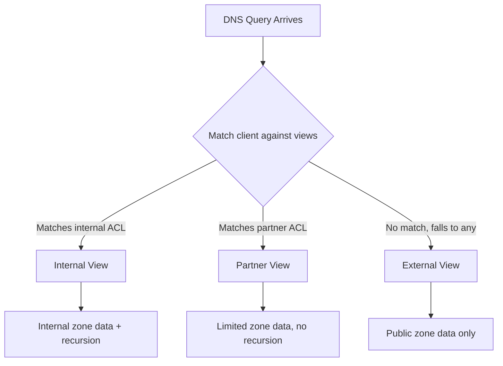

# How to Configure DNS Views and ACLs on RHEL with BIND

Author: [nawazdhandala](https://www.github.com/nawazdhandala)

Tags: RHEL, BIND, DNS Views, ACL, Linux

Description: Master BIND's view and ACL features on RHEL to control DNS access and serve different responses based on client identity.

---

BIND's view and ACL features give you fine-grained control over who can query your DNS server and what answers they get. ACLs define groups of clients. Views use those ACLs to serve different zone data or behavior to different groups. Together, they're one of the most powerful features in BIND.

## Understanding ACLs

An ACL (Access Control List) is a named list of IP addresses or networks. You define them once and reference them throughout your configuration.

```bash
acl "internal" {
    10.0.0.0/8;
    192.168.0.0/16;
    172.16.0.0/12;
    localhost;
};

acl "dmz" {
    10.10.10.0/24;
};

acl "trusted_partners" {
    203.0.113.50;
    203.0.113.51;
    198.51.100.0/24;
};
```

## Where ACLs Can Be Used

ACLs control access to various BIND functions:

| Directive | Purpose |
|-----------|---------|
| `allow-query` | Who can send queries |
| `allow-recursion` | Who can use recursive resolution |
| `allow-transfer` | Who can do zone transfers |
| `allow-update` | Who can send dynamic updates |
| `allow-notify` | Who can send NOTIFY messages |
| `blackhole` | Completely ignore these clients |

## Basic ACL Configuration

Here's a named.conf using ACLs without views:

```bash
cat > /etc/named.conf << 'EOF'
acl "internal" {
    10.0.0.0/8;
    192.168.0.0/16;
    localhost;
};

acl "secondary_servers" {
    192.168.1.11;
    192.168.1.12;
};

options {
    listen-on port 53 { any; };
    directory "/var/named";

    // Only internal clients can query
    allow-query { internal; };

    // Only internal clients can recurse
    recursion yes;
    allow-recursion { internal; };

    // Only secondaries can transfer zones
    allow-transfer { secondary_servers; };

    // Blackhole known bad actors
    blackhole {
        203.0.113.0/24;
    };

    dnssec-validation auto;
    pid-file "/run/named/named.pid";
};

logging {
    channel default_log {
        file "/var/log/named/default.log" versions 3 size 5m;
        severity info;
        print-time yes;
    };
    category default { default_log; };
};

zone "." IN {
    type hint;
    file "named.ca";
};

zone "example.com" IN {
    type primary;
    file "example.com.zone";
    allow-transfer { secondary_servers; };
};
EOF
```

## Understanding Views

Views let you present different DNS data to different clients. Each view is essentially a separate DNS server that only responds to matching clients.



## Configuring Multiple Views

Here's a setup with three views for different client groups:

```bash
cat > /etc/named.conf << 'EOF'
// ACL definitions
acl "internal" {
    10.0.0.0/8;
    192.168.0.0/16;
    localhost;
};

acl "partners" {
    203.0.113.50;
    198.51.100.0/24;
};

options {
    listen-on port 53 { any; };
    listen-on-v6 port 53 { any; };
    directory "/var/named";
    dnssec-validation auto;
    pid-file "/run/named/named.pid";
};

logging {
    channel default_log {
        file "/var/log/named/default.log" versions 3 size 5m;
        severity info;
        print-time yes;
        print-category yes;
    };
    category default { default_log; };
};

// Internal view - full access with recursion
view "internal" {
    match-clients { internal; };

    recursion yes;
    allow-recursion { internal; };

    zone "." IN {
        type hint;
        file "named.ca";
    };

    zone "example.com" IN {
        type primary;
        file "views/internal/example.com.zone";
        allow-update { none; };
    };

    zone "1.168.192.in-addr.arpa" IN {
        type primary;
        file "views/internal/192.168.1.rev";
    };

    // Internal-only zone
    zone "internal.corp" IN {
        type primary;
        file "views/internal/internal.corp.zone";
    };
};

// Partner view - limited access, no recursion
view "partners" {
    match-clients { partners; };

    recursion no;

    zone "example.com" IN {
        type primary;
        file "views/partner/example.com.zone";
        allow-transfer { none; };
    };
};

// External view - public access, no recursion
view "external" {
    match-clients { any; };

    recursion no;

    zone "example.com" IN {
        type primary;
        file "views/external/example.com.zone";
        allow-transfer { none; };
    };
};
EOF
```

## Creating View-Specific Zone Files

Set up the directory structure:

```bash
mkdir -p /var/named/views/{internal,partner,external}
```

Internal view zone file (full internal details):

```bash
cat > /var/named/views/internal/example.com.zone << 'EOF'
$TTL 86400
@   IN  SOA ns1.example.com. admin.example.com. (
            2026030401 3600 1800 604800 86400 )
@       IN  NS  ns1.example.com.
ns1     IN  A   192.168.1.10
www     IN  A   192.168.1.100
app     IN  A   192.168.1.101
db      IN  A   192.168.1.40
monitoring IN A  192.168.1.50
jenkins IN  A   192.168.1.60
@       IN  MX 10 mail.example.com.
mail    IN  A   192.168.1.20
EOF
```

Partner view (limited records):

```bash
cat > /var/named/views/partner/example.com.zone << 'EOF'
$TTL 86400
@   IN  SOA ns1.example.com. admin.example.com. (
            2026030401 3600 1800 604800 86400 )
@       IN  NS  ns1.example.com.
ns1     IN  A   203.0.113.10
www     IN  A   203.0.113.50
api     IN  A   203.0.113.51
EOF
```

External view (public records only):

```bash
cat > /var/named/views/external/example.com.zone << 'EOF'
$TTL 86400
@   IN  SOA ns1.example.com. admin.example.com. (
            2026030401 3600 1800 604800 86400 )
@       IN  NS  ns1.example.com.
@       IN  NS  ns2.example.com.
ns1     IN  A   203.0.113.10
ns2     IN  A   203.0.113.11
www     IN  A   203.0.113.50
@       IN  MX 10 mail.example.com.
mail    IN  A   203.0.113.20
@       IN  A   203.0.113.50
EOF
```

Create the internal-only zone:

```bash
cat > /var/named/views/internal/internal.corp.zone << 'EOF'
$TTL 86400
@   IN  SOA ns1.internal.corp. admin.internal.corp. (
            2026030401 3600 1800 604800 86400 )
@       IN  NS  ns1.internal.corp.
ns1     IN  A   192.168.1.10
gitlab  IN  A   192.168.1.70
wiki    IN  A   192.168.1.71
vault   IN  A   192.168.1.72
EOF
```

Set permissions:

```bash
chown -R named:named /var/named/views
mkdir -p /var/log/named && chown named:named /var/log/named
```

## Validating and Starting

```bash
named-checkconf /etc/named.conf
named-checkzone example.com /var/named/views/internal/example.com.zone
named-checkzone example.com /var/named/views/external/example.com.zone

systemctl restart named
```

## Testing Views

Test the internal view from an internal IP:

```bash
dig @localhost www.example.com A +short
# Should return 192.168.1.100

dig @localhost db.example.com A +short
# Should return 192.168.1.40

dig @localhost gitlab.internal.corp A +short
# Should return 192.168.1.70
```

Test external view from an external client:

```bash
dig @203.0.113.10 www.example.com A +short
# Should return 203.0.113.50

dig @203.0.113.10 db.example.com A +short
# Should return nothing (not in external view)
```

## Important Rules for Views

1. **Every zone must exist in every view that needs it.** If a client matches a view that doesn't have the zone, it gets REFUSED.

2. **Views are evaluated in order.** Put the most specific view first and the catch-all (`match-clients { any; }`) last.

3. **Root hints must be in every view that does recursion.** Don't forget to include the root zone.

4. **TSIG keys in views.** If you use TSIG for zone transfers, the key and server statements must be within the appropriate view.

5. **ACL names are case-sensitive.** Keep your naming consistent.

Views and ACLs together give you a security model for DNS that's both flexible and precise. The initial setup takes some thought, but it pays off by keeping internal infrastructure hidden from the outside while serving the right data to the right clients.
