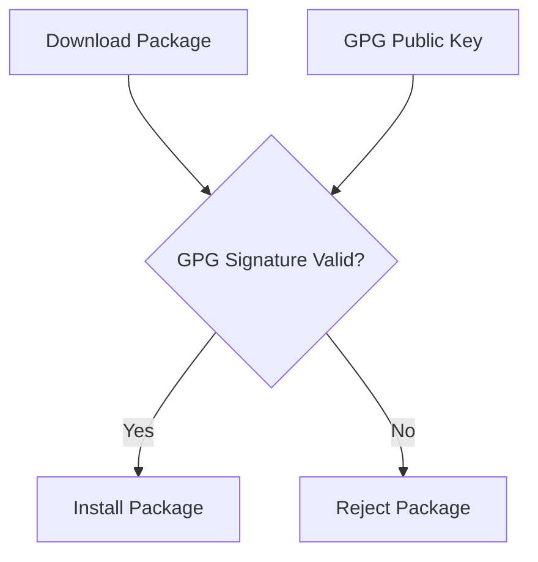

# How to Configure Third-Party Repositories (EPEL) on RHEL 9

Author: [nawazdhandala](https://www.github.com/nawazdhandala)

Tags: RHEL, EPEL, Third-Party Repositories, DNF, Linux

Description: Learn how to safely enable EPEL and other third-party repositories on RHEL 9, including GPG key management, repository priorities, and enabling CodeReady Builder for build dependencies.

---

The default RHEL 9 repositories cover a lot of ground, but sooner or later you will need a package that Red Hat does not ship. That is where third-party repositories come in, and EPEL (Extra Packages for Enterprise Linux) is the most widely used one. This guide covers how to set up EPEL and other third-party repos safely, without turning your system into a dependency mess.

## What Is EPEL?

EPEL stands for Extra Packages for Enterprise Linux. It is maintained by the Fedora project and provides high-quality add-on packages for RHEL and its rebuilds. EPEL packages are built from Fedora sources and follow Fedora packaging guidelines, but they are compiled against RHEL libraries.

Key points about EPEL:

- It never replaces or conflicts with packages in BaseOS or AppStream
- Packages are community-maintained, not supported by Red Hat
- It is the safest third-party repository for RHEL systems
- It follows RHEL major version lifecycles

## Prerequisites: Enable CodeReady Builder

Many EPEL packages depend on build libraries that live in the CodeReady Builder (CRB) repository. This repo is disabled by default on RHEL 9, but EPEL needs it. Enable it first:

```bash
# Enable the CodeReady Builder repository
sudo subscription-manager repos --enable codeready-builder-for-rhel-9-x86_64-rpms
```

Alternatively, using DNF config-manager:

```bash
# Enable CRB using dnf config-manager
sudo dnf config-manager --set-enabled crb
```

Verify it is enabled:

```bash
# Confirm CRB is in the enabled repo list
dnf repolist | grep -i crb
```

## Installing EPEL on RHEL 9

The cleanest way to install EPEL is from the official Fedora package:

```bash
# Install EPEL release package
sudo dnf install -y https://dl.fedoraproject.org/pub/epel/epel-release-latest-9.noarch.rpm
```

This installs the repo configuration files and the GPG key used to sign EPEL packages.

Verify the installation:

```bash
# Check that the EPEL repo is enabled
dnf repolist | grep epel
```

You should see `epel` in the output.

### Test EPEL Access

Try searching for a package that only exists in EPEL:

```bash
# htop is a popular EPEL package not in base RHEL repos
dnf info htop
```

If the output shows the package with `Repository: epel`, you are good to go.

## Understanding GPG Key Management

When you add a third-party repository, GPG key verification is your primary defense against tampered packages.

### How GPG Verification Works



### Checking Imported Keys

```bash
# List all imported RPM GPG keys
rpm -qa gpg-pubkey*

# Show details of a specific GPG key
rpm -qi gpg-pubkey-fd431d51-4ae0493b
```

### Manually Importing a GPG Key

If you need to import a key manually (for a repo that does not auto-import):

```bash
# Import a GPG key from a URL
sudo rpm --import https://example.com/RPM-GPG-KEY-example
```

### GPG Settings in Repo Files

In your `.repo` files, these settings control GPG behavior:

```ini
# Enable GPG checking for packages (always recommended)
gpgcheck=1

# Path to the GPG key for this repo
gpgkey=file:///etc/pki/rpm-gpg/RPM-GPG-KEY-EPEL-9

# Also verify the repository metadata itself
repo_gpgcheck=1
```

Setting `gpgcheck=0` is tempting when you just want something installed quickly. Do not do it in production. Ever.

## Setting Repository Priorities

When multiple repos provide the same package, you want to control which one wins. The `priority` plugin is built into DNF on RHEL 9.

### How Priority Works

Lower numbers mean higher priority. The default priority is 99. If you want RHEL base repos to always win over EPEL:

```bash
# Edit the EPEL repo to set a lower priority (higher number)
sudo vi /etc/yum.repos.d/epel.repo
```

Add or modify the `priority` setting in the `[epel]` section:

```ini
[epel]
name=Extra Packages for Enterprise Linux 9 - $basearch
metalink=https://mirrors.fedoraproject.org/metalink?repo=epel-9&arch=$basearch
enabled=1
gpgcheck=1
gpgkey=file:///etc/pki/rpm-gpg/RPM-GPG-KEY-EPEL-9
priority=90
```

Since RHEL repos default to priority 99, setting EPEL to 90 would actually give it higher priority, which is not what you want. Instead, either lower the RHEL repos' priority or raise EPEL's:

```ini
# Give EPEL a lower priority than default (higher number = lower priority)
priority=110
```

## Excluding Packages from a Repository

Sometimes a third-party repo ships a package you want to keep from the official RHEL repos. Use the `exclude` directive:

```bash
# Exclude specific packages from the EPEL repo
# Add this to the [epel] section in /etc/yum.repos.d/epel.repo
exclude=kernel* httpd*
```

Or exclude packages at the DNF configuration level for all repos:

```bash
# Add to /etc/dnf/dnf.conf under [main] to exclude globally
excludepkgs=some-dangerous-package
```

## Temporarily Enabling or Disabling Repos

You do not always want every repo enabled for every operation. DNF lets you toggle repos per-command:

```bash
# Install a package from EPEL while disabling all other repos
sudo dnf install --disablerepo="*" --enablerepo="epel" htop

# Run an update but skip EPEL packages
sudo dnf update --disablerepo="epel"
```

To permanently disable a repo without removing it:

```bash
# Disable the EPEL repo
sudo dnf config-manager --set-disabled epel

# Re-enable it later
sudo dnf config-manager --set-enabled epel
```

## Adding Other Third-Party Repositories

Beyond EPEL, you might need vendor-specific repos. Here is the general process:

### Example: Adding a Custom Vendor Repository

```bash
# Create a repo file for the vendor
sudo tee /etc/yum.repos.d/vendor-app.repo << 'EOF'
[vendor-app]
name=Vendor Application Repository
baseurl=https://packages.vendor.com/rhel/9/$basearch/
enabled=1
gpgcheck=1
gpgkey=https://packages.vendor.com/RPM-GPG-KEY-vendor
priority=110
EOF
```

### Verify the New Repository

```bash
# Clean metadata and refresh
sudo dnf clean metadata
sudo dnf makecache

# List packages from the new repo
dnf repo-pkgs vendor-app list
```

## Safety Considerations for Third-Party Repos

Not all third-party repos are created equal. Here is what to watch out for:

1. **Only use trusted sources.** EPEL is safe because it is run by the Fedora project. Random repos you found on a blog post? Proceed with caution.

2. **Always enable GPG checking.** If a repo does not provide GPG-signed packages, think hard about whether you really need it.

3. **Set appropriate priorities.** RHEL packages should generally win over third-party alternatives.

4. **Test in a non-production environment first.** A new repo can introduce dependency conflicts that break updates.

5. **Keep the number of repos minimal.** Each additional repo is a potential source of problems. Only add what you actually need.

6. **Monitor for conflicts.** After adding a new repo, run `dnf check` to look for dependency issues:

```bash
# Check for broken dependencies
dnf check
```

7. **Document every repo you add.** Note why it was added, who requested it, and when. This helps during audits and troubleshooting.

## Listing and Managing All Repositories

Keep track of what repos are configured on your system:

```bash
# List all enabled repositories
dnf repolist

# List all repositories including disabled ones
dnf repolist --all

# Show detailed info about a specific repo
dnf repoinfo epel
```

## Summary

EPEL is the go-to third-party repository for RHEL, and setting it up is straightforward. The key is to do it safely: enable GPG checks, set priorities, and only add repos you genuinely need. Remember to enable CodeReady Builder first, since many EPEL packages depend on it. Take the same cautious approach with any other third-party repos, and your system will stay stable and predictable.
