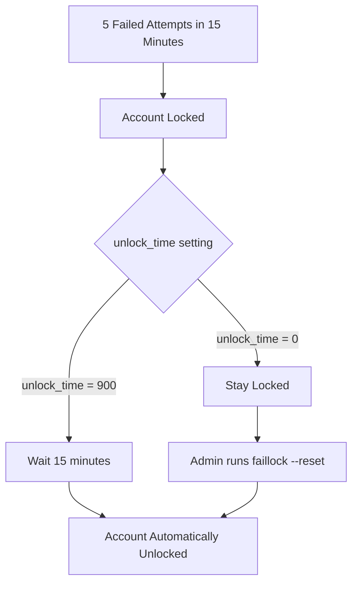

# How to Configure faillock.conf for Account Lockout Policies on RHEL 9

Author: [nawazdhandala](https://www.github.com/nawazdhandala)

Tags: RHEL, faillock, Account Lockout, Security, Linux

Description: A detailed guide to configuring /etc/security/faillock.conf on RHEL 9 for precise account lockout behavior, including all available options and compliance examples.

---

The `/etc/security/faillock.conf` file is the central place to configure account lockout behavior on RHEL 9. Rather than scattering options across PAM files, RHEL 9 consolidates faillock settings into this single configuration file. This guide covers every option and shows how to tune lockout policies for different environments.

## The faillock.conf File

```bash
sudo vi /etc/security/faillock.conf
```

Here is a fully documented configuration:

```
# Directory where failure records are stored
# Default: /var/run/faillock (cleared on reboot)
# Use /var/lib/faillock for persistent storage
dir = /var/run/faillock

# Audit failed attempts to syslog
audit

# Display failure information to the user during authentication
# Comment out 'silent' to show failure details
silent

# Do not log informational messages (only errors)
# no_log_info

# Number of failed attempts before locking
deny = 5

# Time window (seconds) in which failures are counted
# Failures older than this are ignored
fail_interval = 900

# Seconds until a locked account is automatically unlocked
# Set to 0 for permanent lock (admin must manually unlock)
unlock_time = 900

# Also apply lockout to the root account
# even_deny_root

# Separate unlock time for root (only used with even_deny_root)
# root_unlock_time = 60

# Only apply to local users (not LDAP/AD users managed by SSSD)
# local_users_only

# Admin group whose members are never locked
# admin_group = wheel
```

## Understanding Each Option

### deny

The number of consecutive failed attempts before the account is locked.

```
deny = 5
```

Setting this too low causes accidental lockouts (fat fingers on the keyboard). Setting it too high gives attackers more attempts. Five is a reasonable default.

### fail_interval

The time window in seconds during which failures are counted:

```
fail_interval = 900
```

With `fail_interval = 900` and `deny = 5`, a user must fail 5 times within 15 minutes to get locked. One failure today and another next week will not trigger a lockout.

### unlock_time

How long the account stays locked:

```
# Auto-unlock after 15 minutes
unlock_time = 900

# Stay locked until admin intervenes
unlock_time = 0
```



### even_deny_root

By default, root is immune to lockout. Enable this for compliance:

```
even_deny_root
root_unlock_time = 60
```

Always set a shorter `root_unlock_time` if you enable this. Locking root for 15 minutes on a production server is painful.

### silent

Controls whether failure information is shown during authentication:

```
# Suppress failure messages (recommended for security)
silent
```

Without `silent`, a locked user sees something like "Account locked due to 5 failed logins." This tells an attacker that the account exists and is locked.

### audit

Sends failure events to syslog:

```
audit
```

Always enable this. Without it, you have no visibility into lockout events.

### local_users_only

Restrict faillock to local accounts only:

```
local_users_only
```

Use this when LDAP or AD users have their own lockout policies managed by the directory service.

### admin_group

Exempt members of a specific group from lockout:

```
admin_group = wheel
```

This is a safety net to prevent admins from getting locked out during legitimate troubleshooting.

## Compliance Configurations

### CIS Benchmark

```
deny = 5
fail_interval = 900
unlock_time = 900
even_deny_root
root_unlock_time = 60
audit
silent
```

### PCI DSS

```
deny = 6
fail_interval = 900
unlock_time = 1800
audit
silent
```

### DISA STIG

```
deny = 3
fail_interval = 900
unlock_time = 0
even_deny_root
root_unlock_time = 60
audit
silent
```

STIG is the strictest, requiring only 3 attempts and permanent lockout.

## Verifying the Configuration

### Check that faillock is active in PAM

```bash
# Verify pam_faillock appears in the authentication stack
grep pam_faillock /etc/pam.d/system-auth
grep pam_faillock /etc/pam.d/password-auth
```

You should see both `preauth` and `authfail` entries.

### Test the lockout

```bash
# Create a test user
sudo useradd flocktest
sudo passwd flocktest

# Attempt to log in with wrong password (repeat deny+1 times)
ssh flocktest@localhost

# Check lockout status
sudo faillock --user flocktest

# Unlock the user
sudo faillock --user flocktest --reset

# Clean up
sudo userdel -r flocktest
```

## Persistent vs Volatile Failure Records

By default, failure records are stored in `/var/run/faillock/`, which is a tmpfs and gets cleared on reboot. This means a reboot resets all lockouts.

For environments where lockouts should survive reboots:

```
dir = /var/lib/faillock
```

```bash
# Create the directory
sudo mkdir -p /var/lib/faillock
sudo chmod 755 /var/lib/faillock
```

## Monitoring Lockouts

### Check current lockouts

```bash
# View all failure records
sudo faillock

# View a specific user
sudo faillock --user jsmith
```

### Search logs for lockout events

```bash
# Find lockout-related entries in secure log
sudo grep -E "faillock|locked" /var/log/secure | tail -20

# Count lockouts per user in the last 24 hours
sudo journalctl --since "24 hours ago" | grep "pam_faillock" | sort | uniq -c | sort -rn
```

### Bulk unlock all accounts

In an emergency (like after a widespread brute-force attack):

```bash
# Reset all failure records
for f in /var/run/faillock/*; do
    user=$(basename "$f")
    sudo faillock --user "$user" --reset
    echo "Unlocked: $user"
done
```

## Troubleshooting

### Accounts are not locking

1. Check that faillock is enabled via authselect:

```bash
sudo authselect current | grep faillock
```

2. If not enabled:

```bash
sudo authselect enable-feature with-faillock
```

3. Verify the PAM stack has not been manually edited in a way that bypasses faillock.

### Accounts lock immediately (on first attempt)

Check the `deny` value. If it is set to 0, accounts lock on the first failure:

```bash
grep "^deny" /etc/security/faillock.conf
```

### Root keeps getting locked out

Either disable `even_deny_root` or set `admin_group = wheel`:

```
# admin_group exempts wheel members from lockout
admin_group = wheel
```

## Wrapping Up

faillock.conf is the single source of truth for account lockout policy on RHEL 9. Configure it once, and it applies across all PAM services that use the system-auth and password-auth stacks. The main decisions are the lockout threshold, timeout period, and whether to lock root. Test your settings, enable audit logging, and make sure your operations team knows how to unlock accounts when users inevitably call in.
