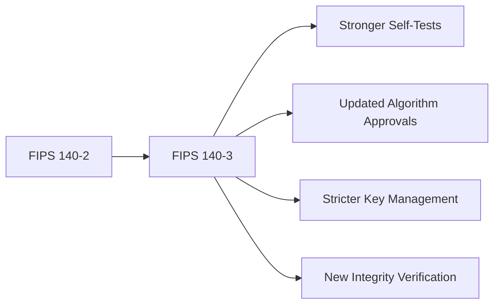

# How to Configure FIPS 140-3 Compliant Cryptography on RHEL 9

Author: [nawazdhandala](https://www.github.com/nawazdhandala)

Tags: RHEL, FIPS 140-3, Cryptography, Security, Linux

Description: Configure RHEL 9 for FIPS 140-3 compliant cryptography, understanding the differences from FIPS 140-2 and ensuring all cryptographic modules meet the latest standard.

---

RHEL 9 is the first major Red Hat release to ship with FIPS 140-3 validated cryptographic modules. This is a significant upgrade from FIPS 140-2 that was used in RHEL 8. If your organization requires FIPS compliance, understanding what changed and how to properly configure it on RHEL 9 matters.

## FIPS 140-3 vs FIPS 140-2

FIPS 140-3 replaces FIPS 140-2 and aligns with ISO/IEC 19790. The key differences that affect RHEL 9 configuration:



- **Algorithm changes**: Some algorithms approved under FIPS 140-2 are deprecated under 140-3
- **Self-test requirements**: More comprehensive self-tests at module initialization
- **Key management**: Stricter requirements for key generation and storage
- **Module boundaries**: Clearer definition of what constitutes the cryptographic boundary

## Check RHEL 9 FIPS Module Validation Status

```bash
# Check the OpenSSL FIPS module version
openssl version -a | head -5

# Check the FIPS module status
openssl list -providers

# View the FIPS module configuration
cat /etc/pki/tls/fips_local.cnf 2>/dev/null

# Check the kernel crypto module
cat /proc/crypto | grep -A5 "name.*aes"
```

## Enable FIPS 140-3 Mode

```bash
# Enable FIPS mode (this uses FIPS 140-3 modules on RHEL 9)
fips-mode-setup --enable
systemctl reboot

# Verify after reboot
fips-mode-setup --check
cat /proc/sys/crypto/fips_enabled
```

## Approved Algorithms Under FIPS 140-3

### Symmetric encryption

```bash
# Check available symmetric ciphers in FIPS mode
openssl list -cipher-algorithms 2>/dev/null | sort

# Approved:
# - AES (128, 192, 256) in ECB, CBC, CTR, GCM, CCM modes
# - AES-XTS for storage encryption

# Not approved:
# - DES, 3DES (deprecated)
# - RC4, Blowfish, Camellia
```

### Hash functions

```bash
# Approved hash functions
# - SHA-256, SHA-384, SHA-512
# - SHA3-256, SHA3-384, SHA3-512
# - SHAKE128, SHAKE256

# Not approved for most uses:
# - MD5 (never approved)
# - SHA-1 (deprecated for digital signatures)

# Test hash functions
openssl dgst -sha256 /etc/hostname    # Works
openssl dgst -sha3-256 /etc/hostname  # Works
openssl dgst -md5 /etc/hostname 2>&1  # Rejected
```

### Key exchange and digital signatures

```bash
# Check available signature algorithms
openssl list -signature-algorithms 2>/dev/null

# Approved:
# - RSA (2048+ bits)
# - ECDSA (P-256, P-384, P-521)
# - EdDSA (Ed25519, Ed448) - new in FIPS 140-3

# Key exchange:
# - ECDH (P-256, P-384, P-521)
# - DH (2048+ bits)
```

## Configure TLS for FIPS 140-3

```bash
# The FIPS crypto policy automatically configures TLS
update-crypto-policies --show
# Should output: FIPS

# Check what TLS protocols are available
openssl s_client -help 2>&1 | grep -E "tls1|ssl"

# Only TLS 1.2 and 1.3 are available in FIPS mode
# Verify by testing a connection
openssl s_client -connect example.com:443 -tls1_2 </dev/null 2>/dev/null | grep "Protocol"
```

## Configure SSH for FIPS 140-3

```bash
# SSH is automatically configured by the crypto policy
# Verify available algorithms
ssh -Q cipher
# Expected: aes128-ctr, aes192-ctr, aes256-ctr, aes128-gcm@openssh.com, aes256-gcm@openssh.com

ssh -Q mac
# Expected: hmac-sha2-256, hmac-sha2-512, hmac-sha2-256-etm@openssh.com, hmac-sha2-512-etm@openssh.com

ssh -Q kex
# Expected: ecdh-sha2-nistp256, ecdh-sha2-nistp384, ecdh-sha2-nistp521,
#           diffie-hellman-group14-sha256, diffie-hellman-group16-sha512,
#           diffie-hellman-group18-sha512
```

## Configure Disk Encryption for FIPS 140-3

```bash
# LUKS2 with AES-XTS is FIPS 140-3 approved
# When creating encrypted volumes, use approved ciphers

# Check existing LUKS configuration
cryptsetup luksDump /dev/sda3 2>/dev/null | grep -E "Cipher|Hash"

# Create a new LUKS2 volume with FIPS-approved settings
# cryptsetup luksFormat --type luks2 --cipher aes-xts-plain64 \
#   --key-size 512 --hash sha256 /dev/sdX
```

## Verify Module Integrity

FIPS 140-3 requires integrity verification of cryptographic modules:

```bash
# Check that FIPS module integrity is verified at boot
journalctl -b | grep -i "fips.*integrity\|fips.*self.test"

# Verify the OpenSSL FIPS module checksum
# The module performs self-tests automatically
# If self-tests fail, the module refuses to operate
openssl list -providers 2>&1 | grep -A3 "fips"
```

## Application-Level FIPS 140-3 Configuration

### GnuTLS

```bash
# GnuTLS on RHEL 9 follows the system crypto policy
# Verify GnuTLS FIPS status
gnutls-cli --list | grep -i fips
```

### NSS (Network Security Services)

```bash
# NSS is used by many applications including Firefox and curl
# Check NSS FIPS mode
modutil -dbdir /etc/pki/nssdb -chkfips true 2>/dev/null
```

### Libgcrypt

```bash
# Used by GnuPG and other applications
# Check libgcrypt FIPS status
# Libgcrypt automatically enters FIPS mode when the kernel FIPS flag is set
```

## Monitoring FIPS Compliance

Set up ongoing monitoring to ensure FIPS stays active:

```bash
# Create a monitoring script
cat > /usr/local/bin/fips-monitor.sh << 'SCRIPT'
#!/bin/bash
# Check FIPS status and alert if disabled

FIPS_STATUS=$(cat /proc/sys/crypto/fips_enabled)
if [ "$FIPS_STATUS" != "1" ]; then
    echo "CRITICAL: FIPS mode is disabled on $(hostname)" | \
      mail -s "FIPS Alert - $(hostname)" security@example.com
    logger -p security.crit "FIPS mode is not enabled"
fi
SCRIPT
chmod +x /usr/local/bin/fips-monitor.sh

# Run hourly via cron
echo "0 * * * * root /usr/local/bin/fips-monitor.sh" >> /etc/crontab
```

## Document Your FIPS Configuration

For audit purposes, create a record of your FIPS configuration:

```bash
# Generate a FIPS configuration report
echo "=== FIPS 140-3 Configuration Report ===" > /var/log/compliance/fips-config.txt
echo "Date: $(date)" >> /var/log/compliance/fips-config.txt
echo "Hostname: $(hostname)" >> /var/log/compliance/fips-config.txt
echo "RHEL Version: $(cat /etc/redhat-release)" >> /var/log/compliance/fips-config.txt
echo "Kernel: $(uname -r)" >> /var/log/compliance/fips-config.txt
echo "FIPS Status: $(fips-mode-setup --check)" >> /var/log/compliance/fips-config.txt
echo "Crypto Policy: $(update-crypto-policies --show)" >> /var/log/compliance/fips-config.txt
echo "OpenSSL: $(openssl version)" >> /var/log/compliance/fips-config.txt
rpm -qa | grep -E "openssl|gnutls|nss|libgcrypt" >> /var/log/compliance/fips-config.txt
```

FIPS 140-3 on RHEL 9 is more robust than FIPS 140-2 was on RHEL 8. The system-wide crypto policy does most of the heavy lifting, but you still need to verify that every application on the system is using the right algorithms. Test thoroughly, document everything, and monitor continuously.
