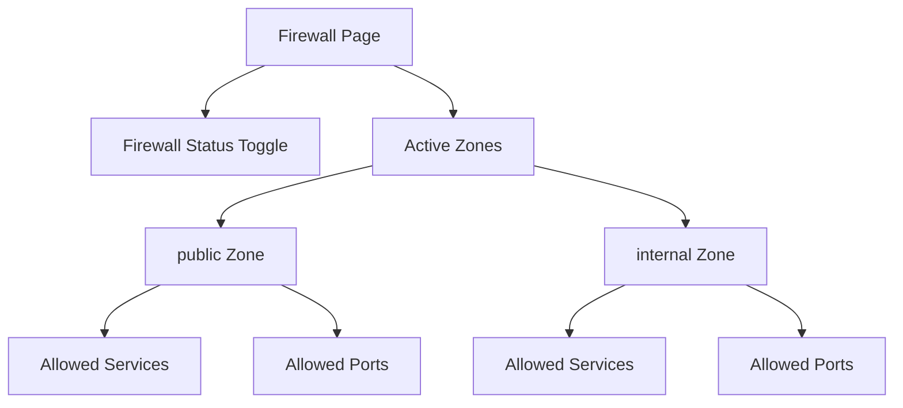

# How to Configure Firewall Rules Using the Cockpit Web Console on RHEL 9

Author: [nawazdhandala](https://www.github.com/nawazdhandala)

Tags: RHEL, Cockpit, Firewall, firewalld, Linux

Description: A practical guide to managing firewall zones, services, and port rules through the Cockpit web console on RHEL 9.

---

Firewall management on RHEL 9 uses firewalld, which is powerful but has a lot of moving parts - zones, services, rich rules, and runtime vs permanent configurations. Cockpit's firewall page simplifies this by showing you exactly what's open on each zone and letting you make changes that stick across reboots.

## Accessing the Firewall Page

The firewall management is integrated into the Networking section of Cockpit. Click "Networking" and you'll see a "Firewall" section, or it may appear as a separate "Firewall" link depending on your Cockpit version.

The page shows:

- Whether the firewall is active
- Active zones and which interfaces belong to each
- Allowed services and ports for each zone



## Understanding Firewall Zones

Zones are a core concept in firewalld. Each zone has a trust level and a set of rules. Network interfaces are assigned to zones, and traffic on that interface follows the zone's rules.

Common zones:

- **public** - the default zone, minimal trust
- **internal** - for internal networks, more permissive
- **trusted** - all traffic is accepted
- **drop** - all incoming traffic is silently dropped
- **dmz** - for servers in a DMZ

Check the current zone configuration from the CLI:

```bash
# Show the default zone
firewall-cmd --get-default-zone

# List all active zones and their interfaces
firewall-cmd --get-active-zones

# Show all configuration for a zone
firewall-cmd --zone=public --list-all
```

## Adding Allowed Services

In Cockpit, click on a zone to see its details, then click "Add services." You'll see a list of predefined services like:

- http (port 80)
- https (port 443)
- ssh (port 22)
- cockpit (port 9090)
- dns (port 53)
- nfs
- samba

Select the services you want to allow and click "Add services." Cockpit applies the changes permanently.

The CLI equivalent:

```bash
# Allow HTTP and HTTPS traffic in the public zone
sudo firewall-cmd --zone=public --add-service=http --permanent
sudo firewall-cmd --zone=public --add-service=https --permanent

# Reload to apply
sudo firewall-cmd --reload

# Verify
firewall-cmd --zone=public --list-services
```

## Adding Custom Port Rules

If the predefined service doesn't exist for your application, you can add a port directly. In Cockpit, click "Add ports" within a zone and specify:

- **Port number** or range (e.g., 8080 or 3000-3010)
- **Protocol** - TCP or UDP

```bash
# Allow a custom port
sudo firewall-cmd --zone=public --add-port=8080/tcp --permanent
sudo firewall-cmd --reload

# Allow a range of ports
sudo firewall-cmd --zone=public --add-port=3000-3010/tcp --permanent
sudo firewall-cmd --reload

# Verify
firewall-cmd --zone=public --list-ports
```

## Removing Services and Ports

In Cockpit, click the "X" or remove button next to a service or port to remove it from the allowed list.

```bash
# Remove a service
sudo firewall-cmd --zone=public --remove-service=http --permanent
sudo firewall-cmd --reload

# Remove a port
sudo firewall-cmd --zone=public --remove-port=8080/tcp --permanent
sudo firewall-cmd --reload
```

## Changing the Zone for an Interface

In Cockpit's Networking section, you can see which zone each interface belongs to and change it. This controls which firewall rules apply to traffic on that interface.

```bash
# Move an interface to a different zone
sudo firewall-cmd --zone=internal --change-interface=ens224 --permanent
sudo firewall-cmd --reload

# Verify the change
firewall-cmd --get-zone-of-interface=ens224
```

## Enabling and Disabling the Firewall

Cockpit shows a toggle to enable or disable the firewall entirely. Use this cautiously - disabling the firewall exposes all services on all ports.

```bash
# Stop the firewall (not recommended for production)
sudo systemctl stop firewalld

# Disable it from starting on boot
sudo systemctl disable firewalld

# Re-enable and start
sudo systemctl enable --now firewalld
```

## Creating Custom Service Definitions

If you need to create a reusable service definition for a custom application, you can create an XML file.

Create a custom service definition:

```bash
# Create a new service definition file
sudo tee /etc/firewalld/services/myapp.xml << 'EOF'
<?xml version="1.0" encoding="utf-8"?>
<service>
  <short>MyApp</short>
  <description>My custom application</description>
  <port protocol="tcp" port="8443"/>
  <port protocol="tcp" port="8444"/>
</service>
EOF

# Reload firewalld to pick up the new service
sudo firewall-cmd --reload

# Now you can use it like any built-in service
sudo firewall-cmd --zone=public --add-service=myapp --permanent
sudo firewall-cmd --reload
```

After creating the service definition, it appears in Cockpit's service list alongside the built-in services.

## Practical Example: Web Server Firewall Setup

Here's a typical configuration for a web server:

```bash
# Allow web traffic
sudo firewall-cmd --zone=public --add-service=http --permanent
sudo firewall-cmd --zone=public --add-service=https --permanent

# Allow SSH for management
sudo firewall-cmd --zone=public --add-service=ssh --permanent

# Allow Cockpit for web console access
sudo firewall-cmd --zone=public --add-service=cockpit --permanent

# Apply all changes
sudo firewall-cmd --reload

# Verify the complete configuration
firewall-cmd --zone=public --list-all
```

Expected output:

```
public (active)
  target: default
  icmp-block-inversion: no
  interfaces: ens192
  sources:
  services: cockpit dhcpv6-client http https ssh
  ports:
  protocols:
  ...
```

## Practical Example: Database Server Firewall Setup

For a database server, you want to restrict access to specific source IPs:

```bash
# Allow PostgreSQL only from the application subnet
sudo firewall-cmd --zone=public --add-rich-rule='rule family="ipv4" source address="10.0.1.0/24" port port="5432" protocol="tcp" accept' --permanent

# Allow MySQL from a specific host
sudo firewall-cmd --zone=public --add-rich-rule='rule family="ipv4" source address="10.0.1.100" port port="3306" protocol="tcp" accept' --permanent

sudo firewall-cmd --reload
```

Rich rules are more advanced and may not be fully manageable through Cockpit's UI, but you can see them listed once they're created.

## Checking Firewall Status

A quick way to verify your firewall configuration:

```bash
# Full status dump
sudo firewall-cmd --state

# List everything in the active zone
sudo firewall-cmd --list-all

# List all zones with their rules
sudo firewall-cmd --list-all-zones

# Check if a specific service is allowed
sudo firewall-cmd --query-service=http
```

## Logging Dropped Packets

Enable logging to track what the firewall is blocking:

```bash
# Enable logging for denied packets
sudo firewall-cmd --set-log-denied=all --permanent
sudo firewall-cmd --reload

# Check the logs
journalctl -k --no-pager | grep "FINAL_REJECT"
```

In Cockpit, you can view these entries in the Logs page by filtering for kernel messages.

## Wrapping Up

Cockpit's firewall interface gives you a clear view of what's allowed on each zone and makes adding or removing rules quick and safe. For standard configurations involving services and ports, it covers everything. For advanced use cases like rich rules, source-based filtering, and IP masquerading, you'll still need the command line. But for day-to-day firewall management, having a visual overview of your rules reduces the chance of misconfiguration.
