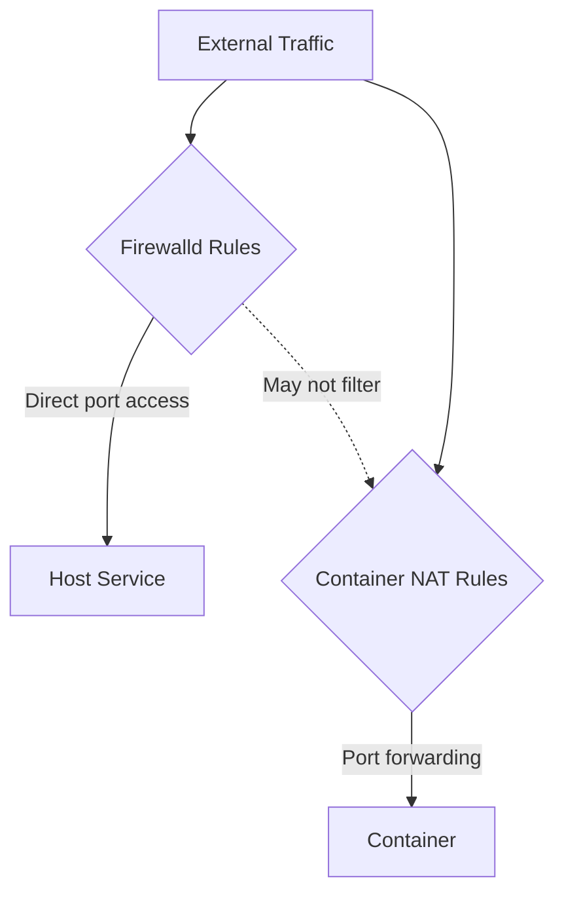

# How to Configure Firewalld for Docker and Podman Containers on RHEL 9

Author: [nawazdhandala](https://www.github.com/nawazdhandala)

Tags: RHEL, Firewalld, Docker, Podman, Containers, Linux

Description: How to make firewalld work correctly with Docker and Podman on RHEL 9, covering port publishing, network conflicts, and zone configurations for container workloads.

---

Containers and firewalld have a complicated relationship. Docker and Podman both need to manipulate networking rules to expose container ports, and this can conflict with firewalld's rule management. Getting them to cooperate requires understanding how each tool interacts with the kernel's packet filtering.

## The Problem

When you run a container with a published port, the container runtime sets up NAT rules to forward traffic from the host port to the container. Docker does this by directly modifying iptables/nftables, which can bypass or conflict with firewalld.



The result: firewalld rules might not actually block traffic to published container ports, because the container NAT rules are processed before firewalld's filter rules.

## Docker and Firewalld

### The Default Conflict

Docker modifies iptables directly. On RHEL 9, Docker can add its own chains that bypass firewalld. A published port like `-p 8080:80` might be accessible from anywhere, regardless of your firewalld rules.

### Option 1: Let Docker Manage Its Own Rules

The simplest approach is to accept that Docker manages its own port publishing and focus on controlling which ports you publish:

```bash
# Only publish ports on localhost (not externally accessible)
docker run -d -p 127.0.0.1:8080:80 nginx

# Or bind to a specific interface
docker run -d -p 10.0.1.50:8080:80 nginx
```

This way, firewalld handles external access and Docker handles container traffic.

### Option 2: Disable Docker's iptables Management

You can tell Docker to stop managing iptables, but then you need to handle all container networking rules yourself:

```bash
# Edit the Docker daemon configuration
cat > /etc/docker/daemon.json << 'EOF'
{
  "iptables": false
}
EOF

# Restart Docker
systemctl restart docker
```

After this, published ports will not work until you manually add forwarding rules. This approach is complex and not recommended unless you have a specific reason.

### Option 3: Use Firewalld Docker Zone

Create a dedicated zone for the Docker bridge:

```bash
# Create a zone for Docker
firewall-cmd --permanent --new-zone=docker
firewall-cmd --permanent --zone=docker --set-target=ACCEPT
firewall-cmd --reload

# Assign the Docker bridge to this zone
firewall-cmd --zone=docker --change-interface=docker0 --permanent
firewall-cmd --reload
```

Then control external access through the public zone on your physical interface:

```bash
# Only allow port 8080 from external
firewall-cmd --zone=public --add-port=8080/tcp --permanent
firewall-cmd --reload
```

## Podman and Firewalld

Podman on RHEL 9 works differently from Docker in significant ways:

### Rootless Podman

Rootless Podman (running as a regular user) uses slirp4netns or pasta for networking. It does not modify firewall rules at all. Published ports work through user-space proxying:

```bash
# Rootless Podman - no firewall conflicts
podman run -d -p 8080:80 nginx
```

Firewalld rules on the host still apply. If you block port 8080 in firewalld, rootless Podman containers on that port will not be reachable from outside.

```bash
# Allow the port in firewalld for rootless Podman
firewall-cmd --zone=public --add-port=8080/tcp --permanent
firewall-cmd --reload
```

### Rootful Podman

Rootful Podman (running as root) uses CNI or netavark for networking and creates bridge interfaces similar to Docker:

```bash
# Check Podman's network backend
podman info | grep networkBackend
```

For rootful Podman with netavark:

```bash
# Podman creates a podman bridge by default
# Assign it to a trusted zone
firewall-cmd --zone=trusted --change-interface=podman0 --permanent
firewall-cmd --reload
```

## Practical Setup: Web App with Firewalld

Here is a complete example for running a web application in a container with proper firewall rules:

```bash
# Allow HTTP and HTTPS on the public zone
firewall-cmd --zone=public --add-service=http --permanent
firewall-cmd --zone=public --add-service=https --permanent
firewall-cmd --reload

# Run the container, publishing on standard ports
podman run -d --name webapp -p 80:8080 -p 443:8443 my-web-app

# Verify firewall allows traffic
firewall-cmd --zone=public --list-all
```

## Handling Container-to-Container Communication

Containers on the same bridge network can communicate directly. For containers on different networks:

```bash
# Create a custom Podman network
podman network create app-network

# Run containers on the same network
podman run -d --name frontend --network app-network nginx
podman run -d --name backend --network app-network my-api
```

Firewalld does not need special rules for container-to-container communication on the same network.

## Firewalld with Podman Pods

When using Podman pods, ports are published at the pod level:

```bash
# Create a pod with published ports
podman pod create --name my-pod -p 8080:80 -p 3306:3306

# Add containers to the pod
podman run -d --pod my-pod --name web nginx
podman run -d --pod my-pod --name db mariadb

# Allow those ports in firewalld
firewall-cmd --zone=public --add-port=8080/tcp --permanent
firewall-cmd --zone=public --add-port=3306/tcp --permanent
firewall-cmd --reload
```

## Masquerading for Container Networks

If containers need outbound internet access through the host:

```bash
# Enable masquerading on the public zone
firewall-cmd --zone=public --add-masquerade --permanent
firewall-cmd --reload

# Verify
firewall-cmd --zone=public --query-masquerade
```

## Troubleshooting

**Container port not reachable externally**:

```bash
# Check if firewalld is blocking the port
firewall-cmd --zone=public --list-ports

# Check if the container is actually listening
ss -tlnp | grep 8080

# Check the container's published ports
podman port webapp
```

**Firewalld rules not affecting Docker ports**:

This is the NAT bypass issue. Docker's NAT rules are processed before firewalld's filter rules. Use Docker's `-p 127.0.0.1:port:port` syntax to limit access, or use the firewalld docker zone approach.

**Container cannot reach the internet**:

```bash
# Check masquerading
firewall-cmd --zone=public --query-masquerade

# Check IP forwarding
sysctl net.ipv4.ip_forward
```

## Summary

Podman on RHEL 9, especially rootless Podman, works well with firewalld because it does not bypass firewall rules. Docker is more problematic because it modifies iptables directly. For Docker, either accept its rule management and control access through which ports you publish, or create a dedicated firewalld zone for the Docker bridge. For Podman, standard firewalld port rules work as expected. Always test from an external machine to verify that only the intended ports are reachable.
