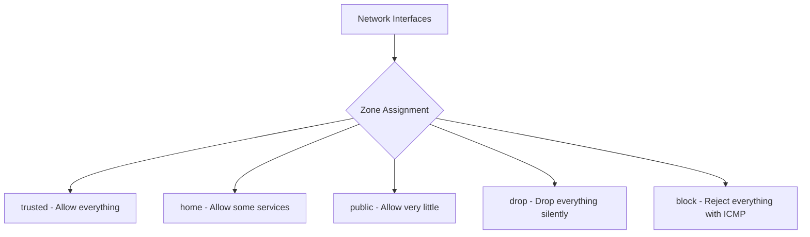

# How to Configure Firewalld Zones on RHEL 9 for Beginners

Author: [nawazdhandala](https://www.github.com/nawazdhandala)

Tags: RHEL, Firewalld, Zones, Security, Linux

Description: A beginner-friendly guide to understanding and configuring firewalld zones on RHEL 9, covering zone concepts, interface assignment, and basic service management.

---

Firewalld is the default firewall management tool on RHEL 9. If you have worked with raw iptables before, firewalld feels different because it is organized around the concept of zones. Instead of writing individual packet filter rules, you assign network interfaces to zones, and each zone defines what traffic is allowed.

## What Are Zones?

A zone is a set of rules that defines the level of trust for a network connection. Think of it like this: your office network might be "trusted" while a public WiFi network should be "public" with strict filtering.



## Default Zones

RHEL 9 ships with several predefined zones:

| Zone | Default Behavior |
|---|---|
| trusted | Accept all traffic |
| home | Allow SSH, mDNS, Samba, DHCP client |
| internal | Same as home |
| work | Allow SSH, DHCP client |
| public | Allow SSH, DHCP client (default zone) |
| external | Allow SSH, masquerading enabled |
| dmz | Allow SSH only |
| block | Reject all incoming with ICMP message |
| drop | Drop all incoming silently |

## Checking the Current Configuration

```bash
# See which zone is the default
firewall-cmd --get-default-zone

# List all active zones and their interfaces
firewall-cmd --get-active-zones

# List all available zones
firewall-cmd --get-zones

# Show everything about the current default zone
firewall-cmd --list-all
```

## Assigning Interfaces to Zones

```bash
# Move eth0 to the trusted zone
firewall-cmd --zone=trusted --change-interface=eth0 --permanent

# Move eth1 to the public zone
firewall-cmd --zone=public --change-interface=eth1 --permanent

# Apply changes
firewall-cmd --reload
```

## Changing the Default Zone

The default zone applies to any interface not explicitly assigned to a zone:

```bash
# Set the default zone to "internal"
firewall-cmd --set-default-zone=internal
```

## Adding Services to a Zone

Services are predefined sets of ports. Instead of remembering port numbers, you use service names:

```bash
# Allow HTTP in the public zone
firewall-cmd --zone=public --add-service=http --permanent

# Allow HTTPS
firewall-cmd --zone=public --add-service=https --permanent

# Apply changes
firewall-cmd --reload

# Verify
firewall-cmd --zone=public --list-services
```

## Listing Available Services

```bash
# Show all predefined services
firewall-cmd --get-services

# Show details of a specific service
firewall-cmd --info-service=http
```

## Adding Ports Directly

If there is no predefined service for your application:

```bash
# Allow TCP port 8080
firewall-cmd --zone=public --add-port=8080/tcp --permanent

# Allow a range of UDP ports
firewall-cmd --zone=public --add-port=5000-5100/udp --permanent

# Apply and verify
firewall-cmd --reload
firewall-cmd --zone=public --list-ports
```

## Removing Services and Ports

```bash
# Remove HTTP from the public zone
firewall-cmd --zone=public --remove-service=http --permanent

# Remove a port
firewall-cmd --zone=public --remove-port=8080/tcp --permanent

firewall-cmd --reload
```

## Viewing Zone Details

```bash
# Show complete configuration for a specific zone
firewall-cmd --zone=public --list-all

# Show all zones with their configurations
firewall-cmd --list-all-zones
```

## Practical Example: Web Server

Here is a typical setup for a web server with a public and management interface:

```bash
# Public interface - only allow web traffic
firewall-cmd --zone=public --change-interface=eth0 --permanent
firewall-cmd --zone=public --add-service=http --permanent
firewall-cmd --zone=public --add-service=https --permanent

# Management interface - allow SSH and monitoring
firewall-cmd --zone=internal --change-interface=eth1 --permanent
firewall-cmd --zone=internal --add-service=ssh --permanent
firewall-cmd --zone=internal --add-port=9090/tcp --permanent

# Remove SSH from the public zone (we only want it on management)
firewall-cmd --zone=public --remove-service=ssh --permanent

# Apply everything
firewall-cmd --reload

# Verify
firewall-cmd --zone=public --list-all
firewall-cmd --zone=internal --list-all
```

## Runtime vs Permanent

Notice the `--permanent` flag. Without it, changes only apply until the next reload or reboot:

```bash
# Runtime only (testing) - no --permanent flag
firewall-cmd --zone=public --add-service=http

# Make it permanent
firewall-cmd --zone=public --add-service=http --permanent

# Or apply all runtime changes permanently
firewall-cmd --runtime-to-permanent
```

This is actually a nice safety net. Test your changes without `--permanent` first. If you lock yourself out, a reboot reverts to the permanent config.

## Checking Firewalld Status

```bash
# Is firewalld running?
systemctl status firewalld

# Firewalld state
firewall-cmd --state
```

## Summary

Firewalld zones are a clean way to organize your firewall rules by network trust level. Assign each interface to a zone that matches its trust level, add the services you need, and use the `--permanent` flag to persist changes. For most servers, you will use the public zone for untrusted traffic and internal or trusted for management networks. Start with the default zones and customize from there - you rarely need to create custom zones for basic setups.
