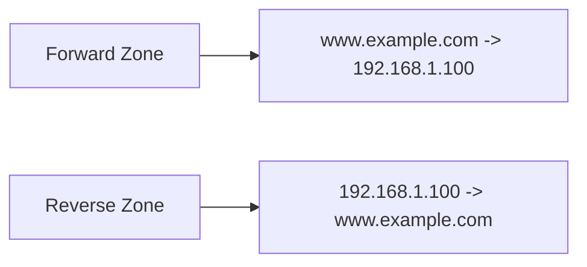

# How to Configure Forward and Reverse DNS Zones with BIND on RHEL

Author: [nawazdhandala](https://www.github.com/nawazdhandala)

Tags: RHEL, BIND, DNS Zones, Linux

Description: A complete guide to setting up both forward and reverse DNS zones in BIND on RHEL, with proper record types and validation.

---

Forward DNS maps names to IP addresses. Reverse DNS maps IP addresses back to names. Both are essential for a properly functioning DNS infrastructure. Many services, including mail servers and SSH, use reverse DNS lookups for verification. If you only set up forward zones, you're missing half the picture.

## Forward vs Reverse Zones



Forward zones use standard A (IPv4) and AAAA (IPv6) records. Reverse zones use PTR records and live under the special `in-addr.arpa` domain for IPv4 and `ip6.arpa` for IPv6.

## Setting Up the Forward Zone

Install BIND if not already present:

```bash
dnf install bind bind-utils -y
```

Add the forward zone to named.conf:

```bash
cat >> /etc/named.conf << 'EOF'

zone "example.com" IN {
    type primary;
    file "example.com.zone";
    allow-update { none; };
    allow-transfer { 192.168.1.11; };
};
EOF
```

Create the zone file:

```bash
cat > /var/named/example.com.zone << 'EOF'
$TTL 86400
@   IN  SOA ns1.example.com. admin.example.com. (
            2026030401  ; Serial
            3600        ; Refresh
            1800        ; Retry
            604800      ; Expire
            86400       ; Minimum TTL
)

; Name servers
@       IN  NS      ns1.example.com.
@       IN  NS      ns2.example.com.

; Name server addresses
ns1     IN  A       192.168.1.10
ns2     IN  A       192.168.1.11

; Mail
@       IN  MX  10  mail.example.com.
@       IN  MX  20  backup-mail.example.com.

; A records - IPv4
@       IN  A       192.168.1.100
www     IN  A       192.168.1.100
mail    IN  A       192.168.1.20
backup-mail IN  A   192.168.1.21
ftp     IN  A       192.168.1.30
db-primary  IN  A   192.168.1.40
db-replica  IN  A   192.168.1.41
monitoring  IN  A   192.168.1.50
vpn     IN  A       192.168.1.5

; AAAA records - IPv6
www     IN  AAAA    2001:db8::100
mail    IN  AAAA    2001:db8::20

; CNAME records - aliases
webmail IN  CNAME   mail.example.com.
docs    IN  CNAME   www.example.com.
api     IN  CNAME   www.example.com.

; TXT records
@       IN  TXT     "v=spf1 mx ~all"

; SRV records
_sip._tcp   IN  SRV 10 60 5060 sip.example.com.
sip     IN  A       192.168.1.70
EOF
```

## Record Types Quick Reference

| Type | Purpose | Example |
|------|---------|---------|
| A | Maps name to IPv4 address | `www IN A 192.168.1.100` |
| AAAA | Maps name to IPv6 address | `www IN AAAA 2001:db8::100` |
| CNAME | Alias for another name | `docs IN CNAME www.example.com.` |
| MX | Mail exchange server | `@ IN MX 10 mail.example.com.` |
| NS | Name server for the zone | `@ IN NS ns1.example.com.` |
| TXT | Text record (SPF, DKIM, etc.) | `@ IN TXT "v=spf1 mx ~all"` |
| SRV | Service location | `_sip._tcp IN SRV 10 60 5060 sip` |
| PTR | Reverse lookup (IP to name) | `100 IN PTR www.example.com.` |

## Setting Up Reverse Zones

For a /24 network (192.168.1.0/24), the reverse zone name is `1.168.192.in-addr.arpa`:

Add the reverse zone to named.conf:

```bash
cat >> /etc/named.conf << 'EOF'

zone "1.168.192.in-addr.arpa" IN {
    type primary;
    file "192.168.1.rev";
    allow-update { none; };
    allow-transfer { 192.168.1.11; };
};
EOF
```

Create the reverse zone file:

```bash
cat > /var/named/192.168.1.rev << 'EOF'
$TTL 86400
@   IN  SOA ns1.example.com. admin.example.com. (
            2026030401  ; Serial
            3600        ; Refresh
            1800        ; Retry
            604800      ; Expire
            86400       ; Minimum TTL
)

@       IN  NS  ns1.example.com.
@       IN  NS  ns2.example.com.

; PTR records - map IP to hostname
; Only the last octet is used (the rest is in the zone name)
5       IN  PTR vpn.example.com.
10      IN  PTR ns1.example.com.
11      IN  PTR ns2.example.com.
20      IN  PTR mail.example.com.
21      IN  PTR backup-mail.example.com.
30      IN  PTR ftp.example.com.
40      IN  PTR db-primary.example.com.
41      IN  PTR db-replica.example.com.
50      IN  PTR monitoring.example.com.
70      IN  PTR sip.example.com.
100     IN  PTR www.example.com.
EOF
```

## Reverse Zones for IPv6

IPv6 reverse zones use `ip6.arpa` and the address is written in nibble format (each hex digit separated by dots, reversed).

For the prefix `2001:db8::/48`:

```bash
cat >> /etc/named.conf << 'EOF'

zone "8.b.d.0.1.0.0.2.ip6.arpa" IN {
    type primary;
    file "2001-db8.ip6.rev";
    allow-update { none; };
};
EOF
```

Create the IPv6 reverse zone file:

```bash
cat > /var/named/2001-db8.ip6.rev << 'EOF'
$TTL 86400
@   IN  SOA ns1.example.com. admin.example.com. (
            2026030401 3600 1800 604800 86400 )

@   IN  NS  ns1.example.com.

; 2001:db8::100 reversed
0.0.1.0.0.0.0.0.0.0.0.0.0.0.0.0.0.0.0.0.0.0.0.0   IN  PTR  www.example.com.

; 2001:db8::20 reversed
0.2.0.0.0.0.0.0.0.0.0.0.0.0.0.0.0.0.0.0.0.0.0.0    IN  PTR  mail.example.com.
EOF
```

## Reverse Zones for Non-/24 Networks

If you have a /16 network (10.5.0.0/16), the zone covers a broader range:

```bash
zone "5.10.in-addr.arpa" IN {
    type primary;
    file "10.5.rev";
};
```

In this zone, PTR records use two octets:

```bash
1.10    IN  PTR  server1.example.com.    ; 10.5.10.1
2.10    IN  PTR  server2.example.com.    ; 10.5.10.2
```

## Setting Permissions and Validating

```bash
chown named:named /var/named/example.com.zone
chown named:named /var/named/192.168.1.rev
chown named:named /var/named/2001-db8.ip6.rev

# Validate
named-checkconf /etc/named.conf
named-checkzone example.com /var/named/example.com.zone
named-checkzone 1.168.192.in-addr.arpa /var/named/192.168.1.rev
```

## Starting and Testing

```bash
systemctl enable --now named
firewall-cmd --permanent --add-service=dns && firewall-cmd --reload
```

Test forward lookup:

```bash
dig @localhost www.example.com A +short
# Expected: 192.168.1.100
```

Test reverse lookup:

```bash
dig @localhost -x 192.168.1.100 +short
# Expected: www.example.com.
```

Test MX lookup:

```bash
dig @localhost example.com MX +short
```

## Keeping Zones Consistent

The most important thing with forward and reverse zones is consistency. Every A record should have a corresponding PTR record, and vice versa. When you add a new host, update both zones. When you remove one, remove it from both.

A quick consistency check:

```bash
# List all A records
dig @localhost example.com AXFR | grep "IN\sA\s"

# List all PTR records
dig @localhost 1.168.192.in-addr.arpa AXFR | grep PTR
```

Compare the two lists and make sure they match. This kind of audit should be part of your regular DNS maintenance routine.
