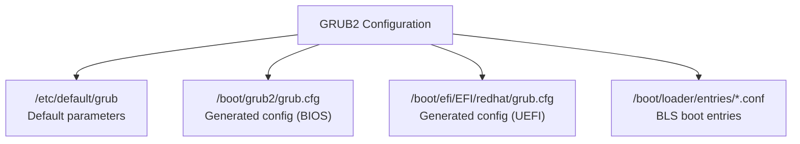

# How to Configure GRUB2 Boot Loader Parameters on RHEL 9

Author: [nawazdhandala](https://www.github.com/nawazdhandala)

Tags: RHEL, GRUB2, Boot Loader, Linux

Description: A practical guide to configuring GRUB2 boot loader parameters on RHEL 9 using grubby, grub2-mkconfig, and direct configuration file editing.

---

## GRUB2 on RHEL 9

GRUB2 (GRand Unified Bootloader version 2) is the default boot loader on RHEL 9. It loads the kernel and initramfs into memory, passes kernel command-line parameters, and hands off control to the kernel. Understanding how to configure GRUB2 is essential for any sysadmin managing RHEL systems.

RHEL 9 uses the Boot Loader Specification (BLS) by default, which means individual boot entries are stored as separate snippet files rather than being embedded in the main GRUB configuration.

## Key Configuration Files



| File | Purpose |
|------|---------|
| /etc/default/grub | Default parameters for grub2-mkconfig |
| /boot/grub2/grub.cfg | Generated GRUB configuration (BIOS systems) |
| /boot/efi/EFI/redhat/grub.cfg | Generated GRUB configuration (UEFI systems) |
| /boot/loader/entries/*.conf | Individual boot entry files (BLS) |

## Viewing Current Configuration

```bash
# View the default GRUB settings
cat /etc/default/grub

# List all boot entries
sudo grubby --info=ALL

# Show the default boot entry
sudo grubby --default-kernel
sudo grubby --default-index

# Check GRUB environment variables
sudo grub2-editenv list
```

## Modifying Parameters with /etc/default/grub

The `/etc/default/grub` file contains default settings that `grub2-mkconfig` uses when regenerating the GRUB configuration.

```bash
# View current defaults
cat /etc/default/grub
```

Common parameters you might modify:

```bash
# Timeout before auto-booting the default entry (in seconds)
GRUB_TIMEOUT=5

# Default kernel command-line parameters
GRUB_CMDLINE_LINUX="crashkernel=1G-4G:192M,4G-64G:256M,64G-:512M resume=/dev/mapper/rhel-swap rd.lvm.lv=rhel/root rd.lvm.lv=rhel/swap"

# Distribution-specific settings
GRUB_DISABLE_SUBMENU=true
GRUB_TERMINAL_OUTPUT="console"
GRUB_ENABLE_BLSCFG=true
```

After editing `/etc/default/grub`, regenerate the GRUB configuration:

```bash
# For BIOS systems
sudo grub2-mkconfig -o /boot/grub2/grub.cfg

# For UEFI systems
sudo grub2-mkconfig -o /boot/efi/EFI/redhat/grub.cfg
```

## Using grubby for Parameter Changes

`grubby` is the preferred tool on RHEL 9 for modifying boot loader settings. It directly updates BLS entries without needing to regenerate the full GRUB configuration.

```bash
# Add a parameter to all kernels
sudo grubby --update-kernel=ALL --args="net.ifnames=0"

# Add a parameter to the default kernel only
sudo grubby --update-kernel=DEFAULT --args="intel_iommu=on"

# Remove a parameter from all kernels
sudo grubby --update-kernel=ALL --remove-args="quiet"

# Add multiple parameters at once
sudo grubby --update-kernel=ALL --args="transparent_hugepage=never numa_balancing=0"
```

## Working with BLS Entries

RHEL 9 uses the Boot Loader Specification. Each kernel has its own entry file.

```bash
# List BLS entry files
ls /boot/loader/entries/

# View a specific entry
cat /boot/loader/entries/*.conf | head -20

# Each entry contains fields like:
# title, version, linux, initrd, options
```

You can edit these files directly, but `grubby` is the safer option.

## Common GRUB2 Parameter Changes

### Enable Serial Console

```bash
# Configure serial console access
sudo grubby --update-kernel=ALL --args="console=ttyS0,115200n8 console=tty0"

# Also update /etc/default/grub for serial terminal
# Add: GRUB_TERMINAL="serial console"
# Add: GRUB_SERIAL_COMMAND="serial --speed=115200 --unit=0 --word=8 --parity=no --stop=1"

sudo grub2-mkconfig -o /boot/grub2/grub.cfg
```

### Disable Predictable Network Interface Names

```bash
# Revert to traditional eth0, eth1 naming
sudo grubby --update-kernel=ALL --args="net.ifnames=0 biosdevname=0"
```

### Enable IOMMU for Device Passthrough

```bash
# Enable Intel IOMMU
sudo grubby --update-kernel=ALL --args="intel_iommu=on iommu=pt"

# Enable AMD IOMMU
sudo grubby --update-kernel=ALL --args="amd_iommu=on iommu=pt"
```

## Verifying Changes

```bash
# Check the current command line of the running kernel
cat /proc/cmdline

# Check what parameters are set for the default kernel
sudo grubby --info=DEFAULT

# List parameters for all kernels
sudo grubby --info=ALL
```

## GRUB2 Environment Block

GRUB2 maintains an environment block that stores variables like the saved default entry.

```bash
# List environment variables
sudo grub2-editenv list

# Set a variable
sudo grub2-editenv set saved_entry=0

# Unset a variable
sudo grub2-editenv unset next_entry
```

## Troubleshooting GRUB2

```bash
# Check for syntax errors in the GRUB config
sudo grub2-script-check /boot/grub2/grub.cfg

# View GRUB-related boot messages
journalctl -b | grep -i grub

# If GRUB is not showing the menu, check the timeout
grep GRUB_TIMEOUT /etc/default/grub
```

## Wrapping Up

GRUB2 configuration on RHEL 9 is split between the `/etc/default/grub` defaults file and the BLS entries in `/boot/loader/entries/`. Use `grubby` for kernel parameter changes because it handles the BLS entries correctly. Use `grub2-mkconfig` only when you need to regenerate the entire configuration, such as after changing `/etc/default/grub`. Always verify your changes with `grubby --info=DEFAULT` before rebooting, and keep a known-good kernel available in case something goes wrong.
