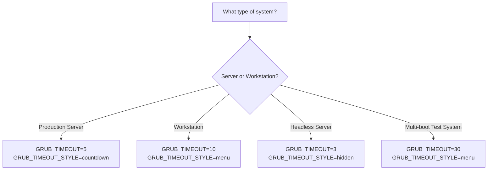

# How to Configure the GRUB2 Boot Menu Timeout on RHEL

Author: [nawazdhandala](https://www.github.com/nawazdhandala)

Tags: RHEL, GRUB2, Timeout, Boot, Linux

Description: Learn how to configure the GRUB2 boot menu timeout on RHEL, including setting, extending, and disabling the timeout for different server and workstation scenarios.

---

## What the GRUB2 Timeout Controls

The GRUB2 timeout determines how long the boot menu is displayed before automatically booting the default entry. On servers, you typically want a short timeout or no menu at all to minimize boot time. On workstations or systems where you might need to select a different kernel, a longer timeout gives you time to intervene.

RHEL defaults to a 5-second timeout, which is a reasonable middle ground.

## Checking the Current Timeout

```bash
# View the current GRUB timeout setting
grep GRUB_TIMEOUT /etc/default/grub

# Check what the running GRUB config says
sudo grub2-editenv list | grep menu_auto_hide
```

## Changing the Timeout

### Setting a Specific Timeout

```bash
# Edit the GRUB defaults file
sudo vi /etc/default/grub

# Change the timeout value (in seconds)
GRUB_TIMEOUT=10
```

```bash
# Or use sed for a quick change
sudo sed -i 's/GRUB_TIMEOUT=.*/GRUB_TIMEOUT=10/' /etc/default/grub

# Regenerate the GRUB configuration
# For BIOS systems:
sudo grub2-mkconfig -o /boot/grub2/grub.cfg

# For UEFI systems:
sudo grub2-mkconfig -o /boot/efi/EFI/redhat/grub.cfg
```

### Setting the Timeout to Zero (Instant Boot)

```bash
# Boot immediately with no menu display
sudo sed -i 's/GRUB_TIMEOUT=.*/GRUB_TIMEOUT=0/' /etc/default/grub

# Also set the hidden timeout style
echo 'GRUB_TIMEOUT_STYLE=hidden' | sudo tee -a /etc/default/grub

# Regenerate config
sudo grub2-mkconfig -o /boot/grub2/grub.cfg
```

With `GRUB_TIMEOUT=0` and `GRUB_TIMEOUT_STYLE=hidden`, the menu does not appear at all. You can still access it by holding `Shift` during boot on BIOS systems or pressing `Esc` on UEFI systems.

### Setting an Infinite Timeout (Wait Forever)

```bash
# Wait indefinitely for user selection
sudo sed -i 's/GRUB_TIMEOUT=.*/GRUB_TIMEOUT=-1/' /etc/default/grub

# Regenerate config
sudo grub2-mkconfig -o /boot/grub2/grub.cfg
```

This requires manual selection every boot. Useful for multi-boot systems or test environments, but not recommended for unattended servers.

## GRUB_TIMEOUT_STYLE Options

RHEL supports three timeout styles:

| Style | Behavior |
|-------|----------|
| menu | Always show the menu during the timeout period |
| countdown | Show a countdown but no menu (press a key to see the menu) |
| hidden | Hide the menu entirely (press Shift or Esc to access) |

```bash
# Show a countdown instead of the full menu
sudo sed -i '/GRUB_TIMEOUT_STYLE/d' /etc/default/grub
echo 'GRUB_TIMEOUT_STYLE=countdown' | sudo tee -a /etc/default/grub

sudo grub2-mkconfig -o /boot/grub2/grub.cfg
```

## The Menu Auto-Hide Feature

RHEL has a menu auto-hide feature that skips the GRUB menu if there is only one boot entry and the previous boot was successful.

```bash
# Check the auto-hide status
sudo grub2-editenv list

# Disable auto-hide (always show the menu)
sudo grub2-editenv - unset menu_auto_hide

# Enable auto-hide
sudo grub2-editenv - set menu_auto_hide=1
```

## Practical Recommendations



## Wrapping Up

The GRUB2 timeout is a small setting that matters more than you might think. Too short and you cannot catch a bad boot in time. Too long and every reboot wastes time staring at a menu. For most production RHEL servers, a 5-second countdown is the sweet spot. Set it, regenerate the GRUB config, and move on to more interesting problems.
