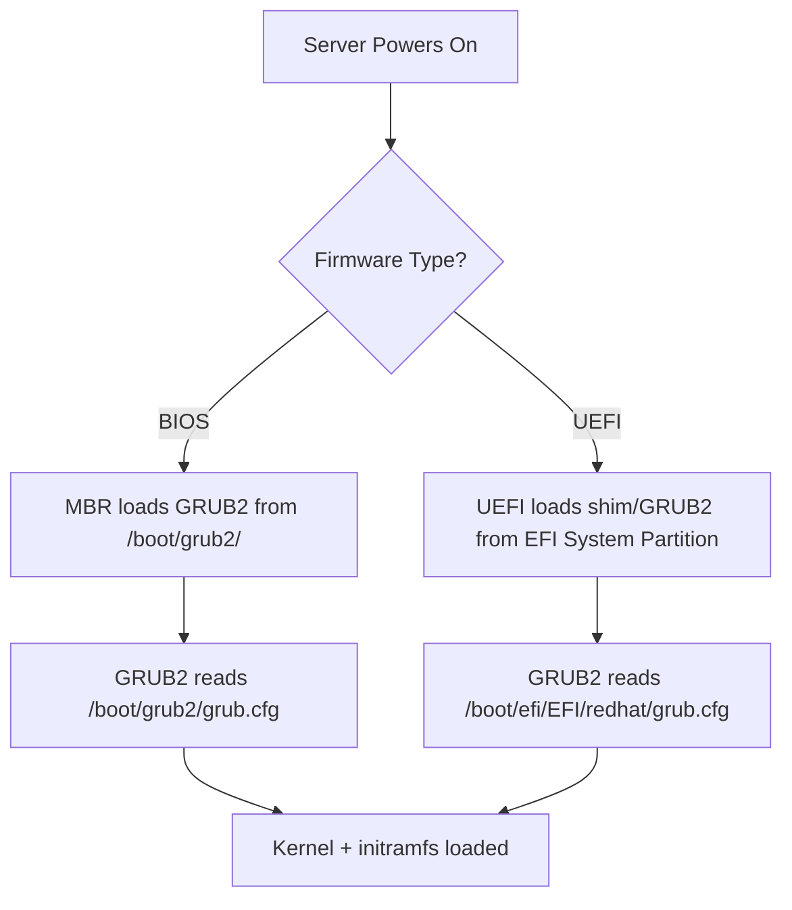

# How to Configure GRUB2 for UEFI and Legacy BIOS Systems on RHEL

Author: [nawazdhandala](https://www.github.com/nawazdhandala)

Tags: RHEL, GRUB2, UEFI, BIOS, Linux

Description: A guide to understanding and configuring GRUB2 on both UEFI and legacy BIOS systems running RHEL, covering the key differences, file locations, and management commands for each.

---

## UEFI vs Legacy BIOS Boot

Modern servers support two firmware types: the older BIOS (Basic Input/Output System) and the newer UEFI (Unified Extensible Firmware Interface). RHEL supports both, but the GRUB2 configuration differs significantly between them.



## Identifying Your Boot Mode

```bash
# Check if the system booted in UEFI or BIOS mode
ls /sys/firmware/efi 2>/dev/null && echo "UEFI" || echo "BIOS"

# Another way to check
dmesg | grep -i "efi:" && echo "UEFI boot" || echo "BIOS boot"

# Check the EFI variables directory
ls /sys/firmware/efi/efivars/ 2>/dev/null | head -5
```

## Key Differences

| Feature | BIOS | UEFI |
|---------|------|------|
| GRUB install location | MBR of boot disk | EFI System Partition (ESP) |
| GRUB config path | /boot/grub2/grub.cfg | /boot/efi/EFI/redhat/grub.cfg |
| Boot partition | /boot (ext4 or xfs) | /boot/efi (FAT32, vfat) |
| Partition scheme | MBR | GPT (recommended) |
| Secure Boot | Not supported | Supported via shim |
| GRUB packages | grub2-pc | grub2-efi-x64, shim-x64 |
| Max disk size | 2 TB (MBR limit) | No practical limit (GPT) |

## BIOS Configuration

### Checking the BIOS GRUB Installation

```bash
# Verify GRUB2 packages for BIOS
rpm -qa | grep grub2-pc

# Check the GRUB installation on the disk
grub2-install --version

# View the MBR (first 512 bytes of the disk)
sudo dd if=/dev/sda bs=512 count=1 2>/dev/null | strings | head
```

### Reinstalling GRUB2 for BIOS

```bash
# Reinstall GRUB to the MBR
sudo grub2-install /dev/sda

# Regenerate configuration
sudo grub2-mkconfig -o /boot/grub2/grub.cfg
```

### Checking the /boot Partition (BIOS)

```bash
# View /boot partition details
df -hT /boot
lsblk -f | grep boot
```

## UEFI Configuration

### Checking the UEFI GRUB Installation

```bash
# Verify GRUB2 packages for UEFI
rpm -qa | grep -E "grub2-efi|shim"

# Check the EFI System Partition
df -hT /boot/efi
ls -la /boot/efi/EFI/redhat/

# View EFI boot entries
efibootmgr -v
```

### Managing EFI Boot Entries

```bash
# List all EFI boot entries
sudo efibootmgr

# Set the boot order
sudo efibootmgr -o 0001,0002,0003

# Delete an old or duplicate boot entry
sudo efibootmgr -b 0003 -B

# Create a new EFI boot entry
sudo efibootmgr -c -d /dev/sda -p 1 -L "RHEL" -l '\EFI\redhat\shimx64.efi'
```

### Reinstalling GRUB2 for UEFI

```bash
# Reinstall the UEFI GRUB packages
sudo dnf reinstall grub2-efi-x64 shim-x64 -y

# Regenerate configuration
sudo grub2-mkconfig -o /boot/efi/EFI/redhat/grub.cfg
```

## UEFI Secure Boot

RHEL supports UEFI Secure Boot through the shim boot loader, which is signed by Microsoft and in turn loads the Red Hat-signed GRUB2.

```bash
# Check if Secure Boot is enabled
mokutil --sb-state

# List enrolled keys
mokutil --list-enrolled

# If you need to enroll a custom key (for custom kernel modules)
sudo mokutil --import /path/to/public-key.der
```


## Common Configuration Tasks for Both Modes

### Updating Kernel Parameters

```bash
# Works the same on both BIOS and UEFI
sudo grubby --update-kernel=ALL --args="transparent_hugepage=never"
```

### Changing the Timeout

```bash
# Edit /etc/default/grub (same file for both)
sudo sed -i 's/GRUB_TIMEOUT=.*/GRUB_TIMEOUT=10/' /etc/default/grub

# Regenerate config - use the right path for your system
# BIOS:
sudo grub2-mkconfig -o /boot/grub2/grub.cfg
# UEFI:
sudo grub2-mkconfig -o /boot/efi/EFI/redhat/grub.cfg
```

### Quick Script to Detect and Regenerate

```bash
# Detect boot mode and regenerate GRUB config accordingly
if [ -d /sys/firmware/efi ]; then
    echo "UEFI system detected"
    sudo grub2-mkconfig -o /boot/efi/EFI/redhat/grub.cfg
else
    echo "BIOS system detected"
    sudo grub2-mkconfig -o /boot/grub2/grub.cfg
fi
```

## Troubleshooting

### UEFI System Not Booting

```bash
# Boot from installation media, enter rescue mode, then:

# Check the EFI System Partition
mount /boot/efi
ls -la /boot/efi/EFI/redhat/

# Verify the boot entry exists
efibootmgr -v

# Reinstall shim and GRUB
dnf reinstall grub2-efi-x64 shim-x64 -y
grub2-mkconfig -o /boot/efi/EFI/redhat/grub.cfg
```

### BIOS System Not Booting

```bash
# Boot from installation media, enter rescue mode, then:

# Reinstall GRUB to the MBR
grub2-install /dev/sda
grub2-mkconfig -o /boot/grub2/grub.cfg
```

## Wrapping Up

The main thing to remember is which configuration file path to use: `/boot/grub2/grub.cfg` for BIOS and `/boot/efi/EFI/redhat/grub.cfg` for UEFI. Beyond that, most day-to-day operations like changing kernel parameters with `grubby` work identically on both. Check your boot mode with `ls /sys/firmware/efi`, use the right path for `grub2-mkconfig`, and you will be fine. If you are deploying new servers, UEFI is the way to go for its GPT support, Secure Boot capability, and lack of the 2 TB disk limitation.
