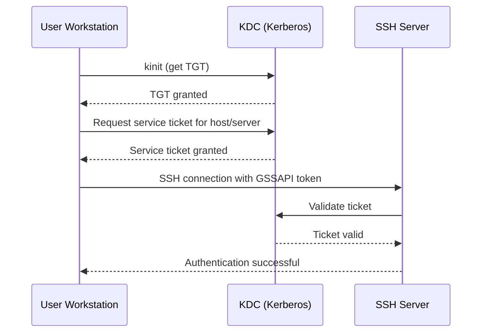

# How to Configure GSSAPI Authentication for SSH on RHEL

Author: [nawazdhandala](https://www.github.com/nawazdhandala)

Tags: RHEL, SSH, GSSAPI, Kerberos, Authentication, Linux

Description: Set up GSSAPI authentication for SSH on RHEL to enable single sign-on with Kerberos, eliminating the need for passwords or SSH keys.

---

GSSAPI (Generic Security Services Application Program Interface) authentication allows SSH to use Kerberos tickets for authentication. This enables single sign-on where users who have already authenticated to a Kerberos realm can SSH into systems without entering a password or managing SSH keys. This guide covers the complete setup on RHEL.

## How GSSAPI SSH Authentication Works



## Prerequisites

Before configuring GSSAPI SSH authentication, you need:

1. A working Kerberos realm (MIT Kerberos or Active Directory)
2. The SSH server enrolled in the Kerberos realm
3. Proper DNS configuration (forward and reverse lookups must work)
4. Synchronized time across all systems (Kerberos is time-sensitive)

## Step 1: Install Required Packages

```bash
# Install Kerberos client packages
sudo dnf install krb5-workstation krb5-libs

# Verify installation
rpm -qa | grep krb5
```

## Step 2: Configure Kerberos Client

Edit the Kerberos configuration:

```bash
sudo tee /etc/krb5.conf << 'EOF'
# Kerberos configuration for GSSAPI SSH

[libdefaults]
    default_realm = EXAMPLE.COM
    dns_lookup_realm = false
    dns_lookup_kdc = true
    ticket_lifetime = 24h
    renew_lifetime = 7d
    forwardable = true
    rdns = false

[realms]
    EXAMPLE.COM = {
        kdc = kdc.example.com
        admin_server = kdc.example.com
    }

[domain_realm]
    .example.com = EXAMPLE.COM
    example.com = EXAMPLE.COM
EOF
```

If you are using Active Directory as the KDC, adjust the realm to match your AD domain (in uppercase).

## Step 3: Create a Host Keytab

The SSH server needs a keytab file containing the host principal's key:

### For MIT Kerberos

```bash
# On the KDC, create the host principal
sudo kadmin.local -q "addprinc -randkey host/server.example.com"

# Extract the keytab
sudo kadmin.local -q "ktadd -k /etc/krb5.keytab host/server.example.com"

# Copy the keytab to the SSH server
sudo scp /etc/krb5.keytab root@server.example.com:/etc/krb5.keytab
```

### For Active Directory (using adcli)

```bash
# Join the system to the AD domain
sudo dnf install adcli
sudo adcli join example.com

# Verify the keytab was created
sudo klist -k /etc/krb5.keytab
```

### For IdM/FreeIPA

```bash
# Install the IPA client
sudo dnf install ipa-client

# Enroll the system
sudo ipa-client-install --mkhomedir

# The keytab is created automatically during enrollment
sudo klist -k /etc/krb5.keytab
```

## Step 4: Verify the Keytab

```bash
# List principals in the keytab
sudo klist -k /etc/krb5.keytab

# Expected output should include:
# host/server.example.com@EXAMPLE.COM
```

Set proper permissions:

```bash
sudo chmod 600 /etc/krb5.keytab
sudo chown root:root /etc/krb5.keytab
```

## Step 5: Configure the SSH Server

Edit the SSH server configuration to enable GSSAPI:

```bash
sudo vi /etc/ssh/sshd_config
```

Add or modify these settings:

```
# Enable GSSAPI authentication
GSSAPIAuthentication yes

# Enable GSSAPI key exchange for stronger security
GSSAPIKeyExchange yes

# Clean up credentials on logout
GSSAPICleanupCredentials yes

# Allow GSSAPI to be used for authentication
GSSAPIStrictAcceptorCheck yes

# Store delegated credentials
GSSAPIStoreCredentialsOnRekey yes
```

Restart the SSH service:

```bash
sudo systemctl restart sshd
```

## Step 6: Configure the SSH Client

On the client machine, enable GSSAPI in the SSH client configuration:

```bash
# Edit the user's SSH config
cat >> ~/.ssh/config << 'EOF'

Host *.example.com
    GSSAPIAuthentication yes
    GSSAPIDelegateCredentials yes
    GSSAPIKeyExchange yes
EOF
```

Or edit the system-wide client configuration:

```bash
sudo vi /etc/ssh/ssh_config.d/gssapi.conf
```

```
Host *.example.com
    GSSAPIAuthentication yes
    GSSAPIDelegateCredentials yes
```

## Step 7: Test the Configuration

### On the client machine:

```bash
# Obtain a Kerberos ticket
kinit username@EXAMPLE.COM
# Enter your Kerberos password

# Verify the ticket
klist

# Test SSH with GSSAPI (verbose mode to see authentication details)
ssh -vvv server.example.com
```

In the verbose output, look for:

```
debug1: Authentications that can continue: publickey,gssapi-with-mic,password
debug1: Next authentication method: gssapi-with-mic
debug1: Authentication succeeded (gssapi-with-mic).
```

## Troubleshooting

### DNS Issues

GSSAPI relies on proper DNS resolution. Verify both forward and reverse lookups:

```bash
# Forward lookup
dig server.example.com +short

# Reverse lookup
dig -x 192.168.1.100 +short

# The reverse lookup must match the forward lookup
```

### Time Synchronization

Kerberos requires clocks to be synchronized within 5 minutes:

```bash
# Check current time
date

# Verify chrony is running
sudo systemctl status chronyd

# Check time sync status
chronyc tracking
```

### Keytab Issues

```bash
# Verify the keytab is valid
sudo klist -k /etc/krb5.keytab

# Test authentication with the keytab
sudo kinit -k -t /etc/krb5.keytab host/server.example.com@EXAMPLE.COM
sudo klist
sudo kdestroy
```

### Common Error Messages

| Error | Cause | Fix |
|-------|-------|-----|
| "No Kerberos credentials available" | No TGT on client | Run `kinit username@REALM` |
| "Server not found in Kerberos database" | Missing host principal | Create the host principal and keytab |
| "Clock skew too great" | Time difference > 5 minutes | Synchronize clocks with chrony/NTP |
| "Encryption type not supported" | Mismatched encryption types | Update krb5.conf or keytab |

### Enable Debug Logging

For detailed troubleshooting, enable Kerberos debug logging:

```bash
# Set the Kerberos debug environment variable
export KRB5_TRACE=/tmp/krb5_trace.log

# Run the SSH connection
ssh server.example.com

# Review the trace log
cat /tmp/krb5_trace.log
```

## Security Considerations

1. **Credential delegation**: Setting `GSSAPIDelegateCredentials yes` forwards your Kerberos ticket to the remote server. Only enable this for trusted servers.

2. **Strict acceptor check**: Keep `GSSAPIStrictAcceptorCheck yes` to ensure the server's principal matches what is expected.

3. **Keytab protection**: The keytab file is equivalent to a password. Protect it with strict file permissions (600, owned by root).

4. **Fallback methods**: Consider what authentication methods to allow as fallbacks if GSSAPI fails.

## Summary

GSSAPI authentication for SSH on RHEL provides seamless single sign-on using Kerberos tickets. The setup involves configuring the Kerberos client, creating a host keytab, enabling GSSAPI in both the SSH server and client configurations, and ensuring DNS and time synchronization are correct. Once configured, users with valid Kerberos tickets can SSH into systems without entering passwords.
