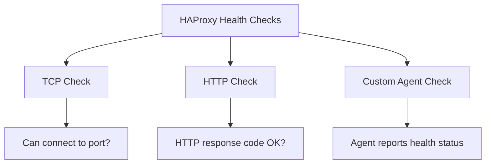

# How to Configure HAProxy Health Checks on RHEL

Author: [nawazdhandala](https://www.github.com/nawazdhandala)

Tags: RHEL, HAProxy, Health Checks, Load Balancing, Linux

Description: Learn how to set up TCP, HTTP, and custom health checks in HAProxy on RHEL to automatically detect and route around failed backend servers.

---

Health checks let HAProxy detect failed backend servers and stop sending traffic to them. When a server recovers, HAProxy automatically adds it back to the pool. This guide covers TCP, HTTP, and custom health checks on RHEL.

## Prerequisites

- A RHEL system with HAProxy installed and configured
- Backend servers to monitor
- Root or sudo access

## Health Check Types



## Step 1: Basic TCP Health Checks

The simplest check verifies that a TCP connection can be established:

```haproxy
backend web_servers
    balance roundrobin

    # Enable TCP health checks
    # check - enable health checking
    # inter 5s - check every 5 seconds
    # fall 3 - mark as down after 3 consecutive failures
    # rise 2 - mark as up after 2 consecutive successes
    server web1 192.168.1.10:80 check inter 5s fall 3 rise 2
    server web2 192.168.1.11:80 check inter 5s fall 3 rise 2
    server web3 192.168.1.12:80 check inter 5s fall 3 rise 2
```

## Step 2: HTTP Health Checks

HTTP checks verify the application is actually working, not just that the port is open:

```haproxy
backend web_servers
    balance roundrobin

    # Use HTTP health checks
    option httpchk

    # Send a GET request to /health and expect a 200 response
    http-check send meth GET uri /health

    # Expect a 200-299 status code
    http-check expect status 200-299

    server web1 192.168.1.10:80 check inter 10s fall 3 rise 2
    server web2 192.168.1.11:80 check inter 10s fall 3 rise 2
```

## Step 3: Advanced HTTP Health Checks

```haproxy
backend api_servers
    balance roundrobin
    option httpchk

    # Send a specific HTTP request with custom headers
    http-check send meth GET uri /api/health hdr Host api.example.com hdr Accept application/json

    # Check for a specific string in the response body
    http-check expect string "status":"healthy"

    # Alternative: check for specific status codes
    # http-check expect status 200

    server api1 192.168.1.20:3000 check inter 5s fall 2 rise 3
    server api2 192.168.1.21:3000 check inter 5s fall 2 rise 3
```

## Step 4: Multiple Health Check Conditions

```haproxy
backend app_servers
    balance roundrobin
    option httpchk

    # Send the health check request
    http-check send meth GET uri /health

    # Multiple expect rules (all must pass)
    http-check expect status 200
    http-check expect header Content-Type contains application/json
    http-check expect string "ok"

    server app1 192.168.1.10:8080 check
    server app2 192.168.1.11:8080 check
```

## Step 5: Health Check on a Different Port

Sometimes the health endpoint runs on a separate port:

```haproxy
backend web_servers
    balance roundrobin
    option httpchk
    http-check send meth GET uri /health

    # The 'port 8081' parameter checks health on port 8081
    # but routes traffic to port 80
    server web1 192.168.1.10:80 check port 8081 inter 10s
    server web2 192.168.1.11:80 check port 8081 inter 10s
```

## Step 6: Slow Start for Recovered Servers

Gradually increase traffic to a server that just came back online:

```haproxy
backend web_servers
    balance roundrobin

    # slowstart 30s - ramp up traffic over 30 seconds after recovery
    server web1 192.168.1.10:80 check slowstart 30s
    server web2 192.168.1.11:80 check slowstart 30s
```

## Step 7: Monitor Health Check Status

```bash
# Check server states via the stats socket
echo "show servers state" | sudo socat stdio /var/lib/haproxy/stats

# Show backend status
echo "show stat" | sudo socat stdio /var/lib/haproxy/stats | cut -d',' -f1,2,18

# Watch health check results in the log
sudo journalctl -u haproxy -f | grep -i "health\|UP\|DOWN"

# Manually disable a server for maintenance
echo "disable server web_servers/web1" | sudo socat stdio /var/lib/haproxy/stats

# Re-enable it
echo "enable server web_servers/web1" | sudo socat stdio /var/lib/haproxy/stats
```

## Step 8: Email Notifications on State Changes

Create a script that runs when servers change state:

```bash
#!/bin/bash
# /usr/local/bin/haproxy-notify.sh
# This script can be used with external monitoring to alert on state changes

while true; do
    echo "show servers state" | sudo socat stdio /var/lib/haproxy/stats
    sleep 10
done
```

A better approach is to use HAProxy's mailers section:

```haproxy
mailers alert_mailers
    mailer smtp1 smtp.example.com:587

backend web_servers
    balance roundrobin
    option httpchk
    http-check send meth GET uri /health

    # Send email on server state changes
    email-alert mailers alert_mailers
    email-alert from haproxy@example.com
    email-alert to admin@example.com
    email-alert level alert

    server web1 192.168.1.10:80 check
    server web2 192.168.1.11:80 check
```

## Troubleshooting

```bash
# View detailed health check information
echo "show servers state" | sudo socat stdio /var/lib/haproxy/stats

# Check HAProxy logs for health check failures
sudo journalctl -u haproxy | grep -i "down\|fail\|check"

# Test the health endpoint manually
curl -v http://192.168.1.10:80/health

# Validate configuration
haproxy -c -f /etc/haproxy/haproxy.cfg
```

## Summary

HAProxy health checks on RHEL ensure traffic only goes to healthy backend servers. Use TCP checks for basic port verification, HTTP checks for application-level validation, and combine them with slow start to protect recently recovered servers from traffic spikes. The stats socket provides real-time visibility into server health status.
