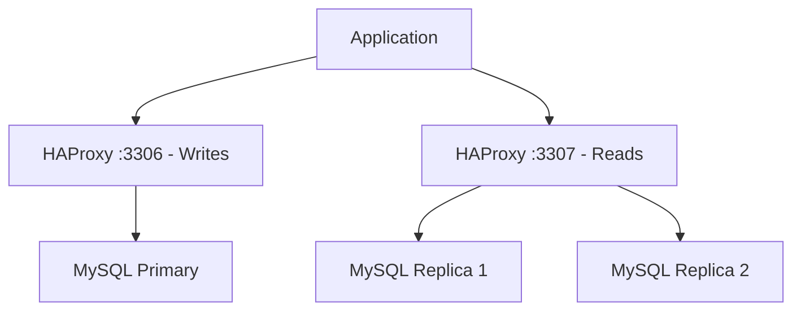

# How to Configure HAProxy for MySQL/MariaDB Load Balancing on RHEL

Author: [nawazdhandala](https://www.github.com/nawazdhandala)

Tags: RHEL, HAProxy, MySQL, MariaDB, Load Balancing, Linux

Description: Set up HAProxy to load balance MySQL and MariaDB database connections on RHEL with read/write splitting and health checks.

---

HAProxy can load balance MySQL and MariaDB connections to distribute read queries across multiple replicas while directing writes to the primary server. This guide covers setting up TCP-mode load balancing for MySQL/MariaDB on RHEL.

## Prerequisites

- A RHEL system with HAProxy installed
- A MySQL/MariaDB primary and one or more replicas
- A MySQL user for health checks
- Root or sudo access

## Architecture Overview



## Step 1: Create a Health Check User on MySQL

```sql
-- Run this on the MySQL primary (it will replicate to replicas)
CREATE USER 'haproxy_check'@'192.168.1.%' IDENTIFIED BY '';
GRANT USAGE ON *.* TO 'haproxy_check'@'192.168.1.%';
FLUSH PRIVILEGES;
```

## Step 2: Configure HAProxy

```haproxy
# /etc/haproxy/haproxy.cfg

global
    user        haproxy
    group       haproxy
    maxconn     4096
    log         /dev/log local0
    stats socket /var/lib/haproxy/stats mode 660 level admin

defaults
    log         global
    retries     3
    timeout connect     5s
    timeout client      30s
    timeout server      30s

# Stats page
listen stats
    bind *:8404
    mode http
    stats enable
    stats uri /stats
    stats auth admin:SecurePass123

# Write traffic - goes to the primary server only
listen mysql_write
    bind *:3306
    mode tcp
    option tcplog

    # MySQL health check
    option mysql-check user haproxy_check

    # Only the primary server handles writes
    server mysql-primary 192.168.1.10:3306 check inter 5s fall 3 rise 2

    # Backup server in case primary fails (manual failover)
    server mysql-standby 192.168.1.11:3306 check backup

# Read traffic - distributed across replicas
listen mysql_read
    bind *:3307
    mode tcp
    option tcplog
    balance leastconn

    # MySQL health check
    option mysql-check user haproxy_check

    # Read replicas
    server mysql-replica1 192.168.1.11:3306 check inter 5s fall 3 rise 2
    server mysql-replica2 192.168.1.12:3306 check inter 5s fall 3 rise 2

    # Primary as fallback for reads (if all replicas are down)
    server mysql-primary 192.168.1.10:3306 check backup
```

## Step 3: Open Firewall Ports

```bash
# Allow MySQL ports through the firewall
sudo firewall-cmd --permanent --add-port=3306/tcp
sudo firewall-cmd --permanent --add-port=3307/tcp
sudo firewall-cmd --permanent --add-port=8404/tcp
sudo firewall-cmd --reload

# Allow HAProxy to connect to MySQL ports via SELinux
sudo setsebool -P haproxy_connect_any on
```

## Step 4: Test and Start

```bash
# Validate configuration
haproxy -c -f /etc/haproxy/haproxy.cfg

# Restart HAProxy
sudo systemctl restart haproxy

# Test write connection (goes to primary)
mysql -h 127.0.0.1 -P 3306 -u appuser -p -e "SELECT @@hostname;"

# Test read connection (goes to a replica)
mysql -h 127.0.0.1 -P 3307 -u appuser -p -e "SELECT @@hostname;"

# Run multiple read queries to verify load balancing
for i in $(seq 1 10); do
    mysql -h 127.0.0.1 -P 3307 -u appuser -p -e "SELECT @@hostname;" 2>/dev/null
done
```

## Step 5: Application Configuration

Configure your application to use different ports for reads and writes:

```
# Write connection (primary)
DB_WRITE_HOST=haproxy-server
DB_WRITE_PORT=3306

# Read connection (replicas)
DB_READ_HOST=haproxy-server
DB_READ_PORT=3307
```

## Step 6: Advanced Health Checks

For more thorough health checks that verify replication status:

```bash
# Create a custom health check script on each MySQL server
cat <<'SCRIPT' | sudo tee /usr/local/bin/mysql-health-check.sh
#!/bin/bash
# Check if MySQL is running and replication is healthy

MYSQL_STATUS=$(mysql -u haproxy_check -e "SHOW SLAVE STATUS\G" 2>/dev/null)

if echo "$MYSQL_STATUS" | grep -q "Slave_IO_Running: Yes"; then
    if echo "$MYSQL_STATUS" | grep -q "Slave_SQL_Running: Yes"; then
        # Replication is healthy
        exit 0
    fi
fi

# Not a replica (primary) or replication is broken
mysql -u haproxy_check -e "SELECT 1" > /dev/null 2>&1
exit $?
SCRIPT
chmod +x /usr/local/bin/mysql-health-check.sh
```

## Step 7: Monitor Database Connections

```bash
# Check server health via HAProxy stats socket
echo "show servers state" | sudo socat stdio /var/lib/haproxy/stats

# Watch connection counts
echo "show stat" | sudo socat stdio /var/lib/haproxy/stats | grep mysql

# Check the stats page
curl -u admin:SecurePass123 http://localhost:8404/stats
```

## Troubleshooting

```bash
# Verify HAProxy is listening on MySQL ports
sudo ss -tlnp | grep -E "3306|3307"

# Test MySQL connectivity directly (bypass HAProxy)
mysql -h 192.168.1.10 -P 3306 -u haproxy_check -e "SELECT 1;"

# Check HAProxy logs for health check failures
sudo journalctl -u haproxy | grep -i "mysql\|down\|check"

# Verify SELinux is not blocking connections
sudo ausearch -m avc -ts recent | grep haproxy
```

## Summary

HAProxy on RHEL provides reliable MySQL/MariaDB load balancing with read/write splitting. Direct write traffic to the primary server on one port and distribute read traffic across replicas on another port. The built-in MySQL health check verifies database connectivity, and the stats page gives you real-time visibility into connection distribution and server health.
