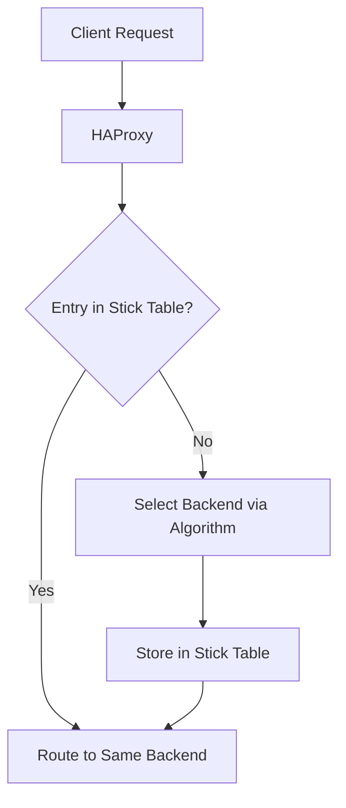

# How to Configure HAProxy Stick Tables for Session Persistence on RHEL

Author: [nawazdhandala](https://www.github.com/nawazdhandala)

Tags: RHEL, HAProxy, Stick Tables, Session Persistence, Linux

Description: Learn how to use HAProxy stick tables on RHEL for session persistence, rate limiting, and connection tracking without relying on cookies.

---

Stick tables are HAProxy's built-in key-value store for tracking connections, session persistence, and rate limiting. Unlike cookie-based persistence, stick tables work at the TCP layer and can track any connection attribute. This guide covers practical stick table configurations on RHEL.

## Prerequisites

- A RHEL system with HAProxy installed
- Root or sudo access

## How Stick Tables Work



## Step 1: Basic Session Persistence with Source IP

```haproxy
backend web_servers
    balance roundrobin

    # Create a stick table keyed by source IP
    # type ip - track by client IP address
    # size 100k - store up to 100,000 entries
    # expire 30m - entries expire after 30 minutes of inactivity
    stick-table type ip size 100k expire 30m

    # Stick on the source IP
    stick on src

    server web1 192.168.1.10:80 check
    server web2 192.168.1.11:80 check
    server web3 192.168.1.12:80 check
```

## Step 2: Session Persistence by Cookie Value

```haproxy
backend app_servers
    balance roundrobin

    # Track sessions by a cookie value
    stick-table type string len 64 size 100k expire 1h

    # Use the session cookie to determine which server to use
    stick on req.cook(JSESSIONID)

    # Also store the mapping when the response sets the cookie
    stick store-response res.cook(JSESSIONID)

    server app1 192.168.1.10:8080 check
    server app2 192.168.1.11:8080 check
```

## Step 3: Rate Limiting with Stick Tables

Track request rates per IP and reject clients that exceed the limit:

```haproxy
frontend http_front
    bind *:80

    # Define a stick table that tracks HTTP request rate
    stick-table type ip size 100k expire 30s store http_req_rate(10s)

    # Track the source IP in the table
    http-request track-sc0 src

    # Deny if the rate exceeds 100 requests per 10 seconds
    http-request deny deny_status 429 if { sc_http_req_rate(0) gt 100 }

    default_backend web_servers

backend web_servers
    balance roundrobin
    server web1 192.168.1.10:80 check
    server web2 192.168.1.11:80 check
```

## Step 4: Connection Rate Limiting

```haproxy
frontend http_front
    bind *:80

    # Track connection rate per source IP
    stick-table type ip size 100k expire 30s store conn_rate(10s),conn_cur

    http-request track-sc0 src

    # Reject if more than 50 new connections in 10 seconds
    http-request deny deny_status 429 if { sc_conn_rate(0) gt 50 }

    # Reject if more than 20 concurrent connections
    http-request deny deny_status 429 if { sc_conn_cur(0) gt 20 }

    default_backend web_servers
```

## Step 5: Track Multiple Counters

```haproxy
frontend http_front
    bind *:80

    # Track multiple metrics in one table
    stick-table type ip size 200k expire 5m         store http_req_rate(10s),conn_rate(10s),conn_cur,bytes_out_rate(10s)

    http-request track-sc0 src

    # Apply different limits based on the metrics
    # Block if request rate is too high
    http-request deny deny_status 429 if { sc_http_req_rate(0) gt 100 }

    # Block if connection rate is too high
    http-request deny deny_status 429 if { sc_conn_rate(0) gt 50 }

    # Block if bandwidth usage is too high (10MB/s)
    http-request deny deny_status 429 if { sc_bytes_out_rate(0) gt 10485760 }

    default_backend web_servers
```

## Step 6: View Stick Table Contents

```bash
# Show stick table entries
echo "show table http_front" | sudo socat stdio /var/lib/haproxy/stats

# Show stick table info
echo "show table" | sudo socat stdio /var/lib/haproxy/stats

# Clear a specific entry
echo "clear table http_front key 192.168.1.100" | sudo socat stdio /var/lib/haproxy/stats

# Clear the entire table
echo "clear table http_front" | sudo socat stdio /var/lib/haproxy/stats
```

## Step 7: Peer Synchronization

Sync stick tables across multiple HAProxy instances for high availability:

```haproxy
peers mycluster
    peer haproxy1 192.168.1.50:1024
    peer haproxy2 192.168.1.51:1024

backend web_servers
    balance roundrobin

    # Share this stick table with peers
    stick-table type ip size 100k expire 30m peers mycluster

    stick on src

    server web1 192.168.1.10:80 check
    server web2 192.168.1.11:80 check
```

## Step 8: Test and Apply

```bash
# Validate configuration
haproxy -c -f /etc/haproxy/haproxy.cfg

# Restart HAProxy
sudo systemctl restart haproxy

# Test session persistence - multiple requests should hit the same server
for i in $(seq 1 5); do
    curl -s http://localhost/ | grep "Server:"
done

# Test rate limiting by sending rapid requests
for i in $(seq 1 200); do
    curl -s -o /dev/null -w "%{http_code}\n" http://localhost/
done | sort | uniq -c
```

## Troubleshooting

```bash
# View stick table entries
echo "show table" | sudo socat stdio /var/lib/haproxy/stats

# Check if stick table is full
echo "show table http_front" | sudo socat stdio /var/lib/haproxy/stats | wc -l

# Check HAProxy logs for denied requests
sudo journalctl -u haproxy | grep "denied"
```

## Summary

HAProxy stick tables on RHEL provide a versatile mechanism for session persistence and rate limiting. They track client connections by IP, cookie, or any request attribute and can enforce rate limits on requests, connections, and bandwidth. For high availability setups, peer synchronization keeps stick table data consistent across multiple HAProxy instances.
